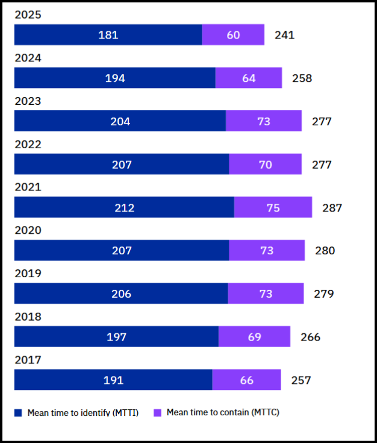
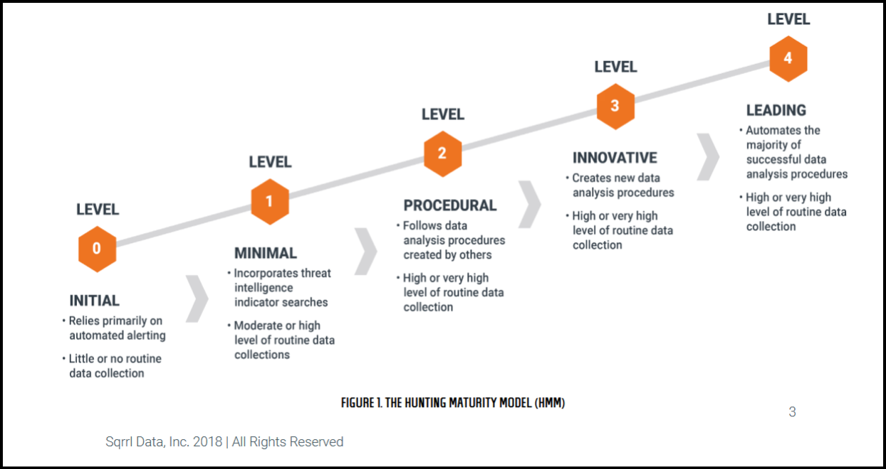
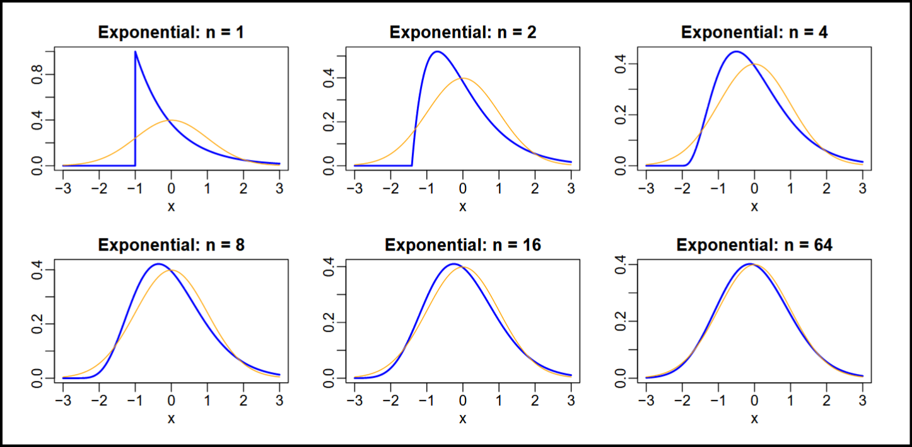

> “And it is He who has released the two seas, one fresh and sweet and one salty and bitter” — — Quran 25:53

### Introduction

Perhaps there is not a single field of knowledge originated from the intellect of man without the touch of mathematics. Its omnipresence is undeniable, but its application is questionable. While all systems involved in our everyday life hold some mathematics behind them, the application of mathematics to optimize them is not prevalent. Threat hunting is not an exception to the above. While many hunters rely on the traditional methods of hunting which vary from a simple IOC\[\[ab\_1\]\](#ab\_1) search to the sophisticated IOA\[\[ab\_5\]\](#ab\_5) hunting.

Very few, if any, use the power of mathematics during the hunt. There might be multiple reasons behind this like lack of mathematical intuition, unavailability of proper resources and questions about effectiveness.   
In this chapter, we will explore the basic concepts in threat hunting and probability theory. At the end we will try to explore the interaction of these two seas of knowledge.

### Threat Hunting A Primer

Threat hunting in its essence is an activity to detect a threat before it can do any damage or as early as possible. The general approach to cyber security is reactive, that means responders will start acting when threat actors have done some damage. This approach is not optimal as “damage has already been done!!!”.

Rather than waiting for the ransom note to appear on the desktop, we can look for signs that lead to such notes and eradicate threat before it can do much damage. This proactive approach to remediate threat is known as threat hunting.

On September 23, 2023 NIST(National Institute of Standards and Technology) released first major update to SP 800–53. This update includes the revision and inclusion of the threat hunting under RA-10\[\[1\]\](#1).As per the documentation:

> Threat hunting is an active means of cyber defense in contrast to the traditional protection measures such as firewalls, intrusion detection and prevention systems, quarantining malicious code in sandboxes, and Security Information and Event Management technologies and systems. Cyber threat hunting involves proactively searching organizational systems, networks, and infrastructure for advanced threats. \[\[2\]\](#2)

From the documentation we can say that   
1\. Threat hunting is an active cyber defense practice.  
2\. It does not totally depends on the traditional security tools such as firewalls, IDS, IPS, antivirus etc.  
3\. It leverages threat intelligence and **produces** threat intelligence.

Third point is the most important because producing threat intelligence is what advance threat hunting is supposed to do. If your threat hunting program is capable of producing threat intelligence, congratulations! your threat hunting model is mature.

#### Why Hunt for Threats?

Threats are naturally undesirable for anything or anyone. They cause reputation damages and are costly.The earlier they are detected, less is the damage to the organization. Apart from their hazardous nature they also possess the ability of performing stealthy operations.

As per the study published in IBM’s *“Cost of a Data Breach Report 2025”* the average time an attacker stays *undetected* on the network is 181 days.\[\[3\]\](#3) Another report from Verizon’s *Data Breach Investigation Report 2025* suggest similar findings. Stated mean time to identify(MTTI) is at an all time low in past 8 years, one more shocker!

*IBM’s report on dwell time*

An average time taken to contain the attack is 66 days, which makes the total engagement time 257 days. That’s a huge number specially when organizations reputation is at stake. The goal of threat hunting is to reduce this time. Earlier the attacker is interrupted, the lesser is the damage.

Attackers can remain hidden from deployed security tools due to various reasons such as:  
1\. Novel Techniques   
2\. 0-Day exploits  
3\. Previously undetected infrastructure etc …

Threat hunters have responsibility to uncover attackers earlier in the attack chain and save organizations from greater damage. Having this process incorporated in the SOC gives an upper hand to organizations in the endless battle against cyber criminals.

#### Stages of Threat Hunting Program

In the previous stage, we discussed the TH\[\[ab\_2\]\](#ab\_2) maturity model. Not every organization has the same threat hunting program. This is a process that matures with time. A great framework is provided by Sqrrl in its whitepaper\[\[4\]\](#4). The paper categorizes the threat hunting program into five stages as follows: Initial, Minimal, Procedural, Innovative, and Leading.

Let’s see them one by one,

0\. **Initial**: This is a very basic stage of TH. In this stage, the SOC\[\[ab\_3\]\](#ab\_3) relies on alert mechanisms from already deployed security tools such as SIEM\[\[ab\_4\]\](#ab\_4), which is not considered hunting at all; hence, it is referred to as the 0th stage.

1\. **Minimal**: Organizations that are just above the initial phase fall under the minimal category. Their hunting operations involve some level of data gathering from the organization, mainly through SIEM. They aspire to perform threat intelligence–driven hunting.

2\. **Procedural**: Organizations at this level are able to perform focused hunting. They are able to apply procedures to find specific types of threats in the environment. However, these organizations rely on others for creating procedures; their data collection is periodic and rich. This is the most common type of hunting available today.

3\. **Innovative**: Organizations at the innovative level are capable of creating their own procedures for hunting. These organizations understand the data and analyze it to find malicious patterns. These organizations might face scalability problems due to the number of procedures developed over time.

4\. **Leading**: At this level, the threat hunting program has automated the majority of data analysis procedures. The data collection routines are high-level, along with sophisticated methods of data analysis.

#### **Types of threat hunting**

Threat hunting can be majorly divided into three parts: structured, unstructured and entity driven hunting. Let’s see them in detail.

**1\. Structured Hunting:** This hunting process is easiest to start and there is no need for hypothesis building. Hunters follow the [MITRE ATT&CK](https://attack.mitre.org/) framework to start hunting. This approach might look systematic however it lacks the reasoning for the hunt. Most of the time hunts yields not results and hypothesis is rejected.

**2.** **Unstructured Hunting:** In this approach hunter relies on the various internal or external indicators to construct the hypothesis. Some materials state that this hunting process does not have a hypothesis, which is a half-truth. The start of the hunting is with no hypothesis; however, first part of the hunting is to choose an appropriate hypothesis to begin with. The source for building a hypothesis could be internal such that SIEM, IPS or red team report or external such as new attack in wild, zero-day or active campaign.For example a well trained hunter will and should look for the sign of possible attacks, a sudden increase in the certain alerts in monthly SIEM data could be a good indicator that everything is not good. Multiple failed communications from the single device towards C2 could be a good indicator of a rootkit or persistent malware.

**3\. Entity Driven Hunting:** This type of hunting is focused on the crown jewels of the organization. These are the cyber assets that are mission-critical for the organization. Any anomalous activity on these assets should be investigated thoroughly. Interested readers can take a look [here](https://www.mitre.org/our-impact/intellectual-property/crown-jewels-analysis) for more details

While we are discussing the types of the hunting, I will take some time to touch upon a very important concept, that is “Hypothesis” in threat hunting.

Human intelligence grants us the freedom to interpret observations according to our understanding and experience. This freedom, while powerful, introduces subjectivity. Different analysts may arrive at different conclusions from the same data, not because reality itself is relative, but because our interpretation of evidence is imperfect.

The same challenge appears in hypothesis-based threat hunting. Across organizations and teams, the term hypothesis is used inconsistently, often shaped by personal experience rather than a shared definition. When multiple interpretations collide, confusion replaces clarity.

Threat hunting, as a discipline, is still evolving and lacks universally enforced standards. In this book, we attempt to normalize the concept of hypothesis-based threat hunting by grounding it in scientific reasoning.

#### What Is a Hypothesis?

At its core, a threat hunting hypothesis is a scientific hypothesis.  
According to Encyclopaedia Britannica:

> A scientific hypothesis is an idea that proposes a tentative explanation for a phenomenon or a narrow set of phenomena observed in the natural world.

When translated into the cybersecurity domain, a threat hunting hypothesis retains this definition but acquires additional characteristics shaped by operational constraints and adversarial behavior.

#### Characteristics of a Threat Hunting Hypothesis

**1\. A Hypothesis Is an Idea — Grounded in Observation**

In cybersecurity, an idea cannot exist in isolation. A valid threat hunting hypothesis must emerge from observable signals, historical data, or well-reasoned inferences.

As described by Robert M. Lee and David Bianco in Generating Hypotheses for Successful Threat Hunting, effective hypotheses originate from:

1.  prior incident analysis,
2.  threat intelligence,
3.  adversary trade-craft,
4.  internal telemetry patterns.

Intuition alone is insufficient; it must be anchored in evidence.

**2\. A Hypothesis Must Be Testable:**  
Test-ability is a defining feature of any scientific hypothesis.  
Consider the following scenario:

> A zero-day vulnerability affecting PHP version 8.x is publicly disclosed. Bob, a newly onboarded threat hunter, initiates a hunt targeting this vulnerability. After collecting extensive telemetry, Bob discovers that all production systems run PHP version 9.x or later. Despite being theoretically sound, the hypothesis cannot be tested in the current environment.

A strong hypothesis must align with:  
\- the organization’s asset inventory,  
\- available telemetry,  
\- and data retention capabilities.

An untestable hypothesis, regardless of how compelling, cannot be operationalized.

**3\. A Hypothesis Must Be Flexible:**  
Threat hunting is a human-driven analytical process, and human cognition is subject to bias. As new evidence emerges, hypotheses must be refined, expanded, or discarded

Common cognitive biases such as:  
\- confirmation bias,  
\- anchoring,  
\- availability bias

can influence investigative decisions. A mature hunter actively revises hypotheses in response to data rather than forcing data to validate preconceived beliefs.

### Probability A Primer

Every event that we anticipate to occur in future has some degree of confidence associated with it. That confidence is a probability of the event. We use this concept in our daily life without realizing it, there will be rain tomorrow, Based on past records chances of Argentina winning football worldcup is high, these all statements are related to probability of an event. The branch of mathematics which deals with such problems is called as “Theory of Probability”

In this book we will study probability with the point of view of cyber threat hunting. We will learn concepts and their applications in the process of threat hunting. In the following we will understand this field of study in little more detail. There is no way that this chapter can do justice with probability study as volumes of books have been dedicated to this field alone. Our goal is to get familiar with some basic concepts and understand their applicability.

### History of probability

In this section we will have a look at some major developments in this field in chronological order.  
\- **Pre-probability Era:** Theory of probability as an intuition have been existed since the time when humans were able to recognize patterns in nature using numbers. However *Todhunter* argues in his classical book “A History of Mathematical Theory Of Probability”(pb 1865), earliest traces of the probability theory can be found in the famous book “Divine Comedy” of Dante. Although Divine Comedy is not mathematics book many attempted to find the patterns in this epic poem which are related to the probability \[\[5\]\](#5). This is the era where probability was not a science rather an intuition that predating to Dante.  
\- **The Gambling Problems (1650–1700):** Most of probability can be understood with the games of gamble like dice, deck or cards etc. *Chevalier de Mere* a well known gambler of its time has proposed certain questions to \_Pascal\_ who forwarded them to *Fermat* in three letters in 1654. One of the discussion around it was the *problem of points*\[\[6\]\](#6). Without going into details it is sufficient to know that this is the era where foundation of the systematic approach towards the determining the certainty of the event were started.  
**\- From Young Science to Branch Of Mathematics(1700–1800):** Many important work took place during this century including *De Moivre’s* discovery of normal distribution,in future which will be known as “Gaussian Distribution”. Work of mathematicians like Pascal, Fermat, De Moivre, Huyghens and Bernoully attempted to established the probability theory as the new branch of Mathematics. This period was also period of great debate about the fundamental understanding of the probability theory, mainly the work of *D’Alembert*.\[\[7\]\](#7)  
**\- Birth Of Bayesian Probability(1763):** This is such a big event in the theory probability that its deserve its own section. In year 1763 after the death of *Thomas Bayes* his friend and writer *Richard Price* has published his essay. This becomes the corner stone of *conditional probability* as new ideas proposed by Bayes like “belief updating”. A whole new branch within probability theory, also known as “Bayesian Probability”   
**\- Classical Probability Meets Reality (1800s):** This is century when the theory of probability was formalized. Bayesian thinking was gain popularity and multiple applications of the this theory were become visible, primarily in astronomy (Carl Gauss used the normal distribution so much in his calculations that it became “Gaussian Distribution”)  
**\- Probability In Modern Era (1900s — Present):** In 90’s probability saw multiple advancements and applications from statistics to Artificial Intelligence(AI). New terms were coined and defined such as false positive, true positive. Despite all these developments, its still at centre of research and revealing her beauty to human intellect now and then. This book is a feeble attempt to explore this field in threat hunting.

### Why Probability Works on Messy Reality

Our instinct tells us that natural phenomena are random or at least do not have any strict patterns to follow. Nevertheless, when we study nature in detail we find out that it’s not completely random. Many natural events follow some pattern, in language of probability, we loosely call it distributions. One of the most prevalent distributions in nature is “Normal Distribution”. This distribution can be seen in various samples of data, for example, height of the people in a population, IQ scores of the students etc. One may ask whether this prevalence is enough for considering the probability theory suitable for sensitive field like threat hunting? The short answer is “no”, It is not the normal distribution or any other distribution which makes probability suitable for the analysis of cyber threats. It’s a very useful and amazing property of normal distribution named under “Central Limit Theorem”. This theorem states that \_the sum of many independent copies of a random variable is approximately a normal random variable.\_\[\[8\]\](#8) In simple language, if number of events are large enough, regardless of the underlying distributions of the random variable we can approximate it to the normal distribution of finite mean and variance. Another important aspect is that the number of events does not need to be too large.\[\[8\]\](#8). The below image shows how exponential distribution converges to normal distribution with value of n=1,2,4,8,16,64

This property of the distributions enable us to calculate the probability of an event, by extension of it we can make an educated guess and make better decisions. For example, let’s say we have data of detected phishing campaigns over the past five years, such the number of phishing emails per month. If we fit that data in normal distribution we will trace a plot that tells us in which month the organization has seen the most phishing attempts. This piece of data is important in selecting our threat hunting hypothesis. Let’s say from this data we come to know that most of the phishing emails are delivered in the month of December, we can say that with high confidence that this trend would hold for upcoming December too.

The intention of discussing probability theory here is to provide a basic introduction to the reader,in the following chapter we will take a deep look in to the theory of probability to understand few basic yet important concepts.

### **Summary**

Chapter 1 establishes the conceptual foundation of threat hunting and introduces probability as a complementary analytical discipline.It begins by framing threat hunting as a proactive alternative to traditional reactive cybersecurity practices and highlights its growing recognition within industry standards such as NIST SP 800–53. The chapter explains why early detection is critical, supported by real-world breach statistics that demonstrate the long dwell time of attackers within modern networks.  
The chapter then explores threat hunting maturity models, different hunting methodologies — structured, unstructured, and entity-driven — and emphasizes the central role of hypothesis-driven investigation. By grounding hypotheses in scientific reasoning, the chapter addresses subjectivity and cognitive bias inherent in human-led analysis.

Finally, the chapter introduces probability theory as a practical tool for reasoning under uncertainty. Through a brief historical overview and discussion of foundational ideas such as distributions and the Central Limit Theorem, it demonstrates why probabilistic thinking is well-suited to analyzing noisy, real-world security data. This chapter prepares the reader to formally study probability concepts and apply them systematically to threat hunting in subsequent chapters.

### Abbreviations

\- IOC -> Indicator of compromise.  
\- TH -> Threat Hunting.  
\- SOC -> Security Operation Center.  
\- SIEM -> Security Event and Incident Management.  
\- IOA -> Indicator of Attack.

\## References   
\[1\][https://nvlpubs.nist.gov/nistpubs/SpecialPublications/NIST.SP.800-53r5.pdf](https://nvlpubs.nist.gov/nistpubs/SpecialPublications/NIST.SP.800-53r5.pdf)  
\- \[2\] [https://csrc.nist.gov/projects/cprt/catalog#/cprt/framework/version/SP\_800\_53\_5\_2\_0/home?element=RA-10](https://csrc.nist.gov/projects/cprt/catalog#/cprt/framework/version/SP_800_53_5_2_0/home?element=RA-10)  
\- \[3\] [https://www.ibm.com/reports/data-breach](https://www.ibm.com/reports/data-breach)  
\- \[4\] [https://www.threathunting.net/files/framework-for-threat-hunting-whitepaper.pdf](https://www.threathunting.net/files/framework-for-threat-hunting-whitepaper.pdf) (2018) pg 03  
\- \[5\] [https://www.jstor.org/stable/3042916](https://www.jstor.org/stable/3042916)  
\- \[6\] [https://www.usu.edu/math/schneit/StatsHistory/ProbabilityPrompts/Points](https://www.usu.edu/math/schneit/StatsHistory/ProbabilityPrompts/Points)   
\- \[7\] [https://www.sciencedirect.com/science/article/pii/0315086079901253](https://www.sciencedirect.com/science/article/pii/0315086079901253)  
\- \[8\] [https://ocw.mit.edu/courses/18-05-introduction-to-probability-and-statistics-spring-2022/mit18\_05\_s22\_class06-prep-b.pdf](https://ocw.mit.edu/courses/18-05-introduction-to-probability-and-statistics-spring-2022/mit18_05_s22_class06-prep-b.pdf) MIT Introduction to probability spring 2022 notes pg 1 & 11
