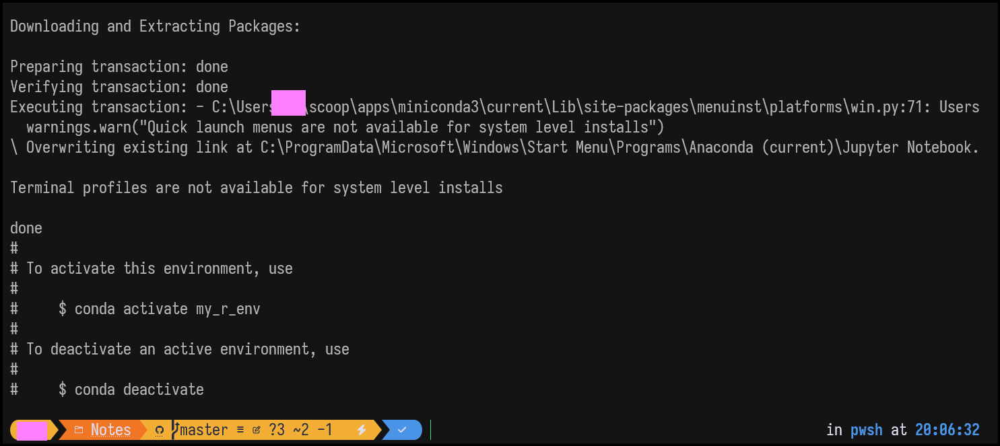
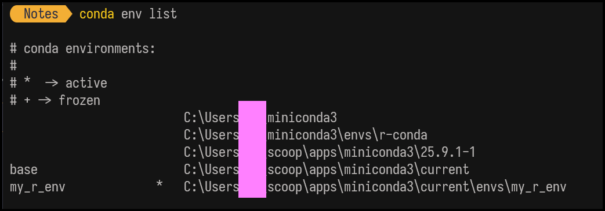
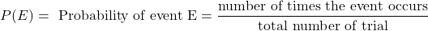
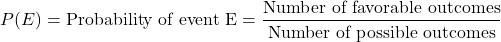
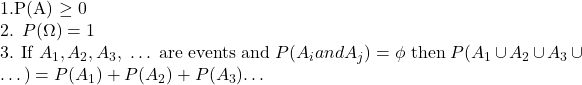
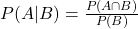
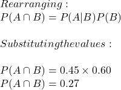

> “Indeed, all things We created with precise measure.” — Quran 54:49

### Introduction

In the previous chapter, I argued why probabilistic methods are needed to be deployed in the threat hunting landscape, along with a brief introduction to threat hunting. We also touched upon a few very basic concepts of probability theory. In this chapter, we will dive deeper into probability theory along with the setup for hands-on exercises.

### Hands On Setup

We will be using \`R\` programming language for the demonstration of the concepts. We will be using the Jupyter notebook for R, because it provides flexibility to split code into small chunks and execute them individually, called as cells.

The first step is that we need to install *Anaconda* by following steps mentioned in the official documentation as per the operating system: [https://docs.conda.io/projects/conda/en/stable/user-guide/install/windows.html](https://docs.conda.io/projects/conda/en/stable/user-guide/install/windows.html`)

Once you have Anaconda installed you now need to install the R from [https://cran.r-project.org/](https://cran.r-project.org/`).   
Next step is to install the kernel for Jupyter, you can start your conda prompt and type following command: `conda create — name my_r_env r-base r-essentials` This will create an environment for the R under as my\_r\_env (You can name it as per your wish), with all essential packages and dependencies installed.

Once its installed completely you can see success message on the screen as shown below for windows.



As you can see in the message you can now activate the environments using `conda activate <your env name>`  
You can list down all conda environments by typing `conda env list`, the `*` before the environment name indicates that environment is active.


*List of all envs*

Next, install jupyter by typing `conda install jupyter`.   
Then run following command `R -e “IRkernel::installspec(name = ‘ir_env’, displayname = ‘R (r_env)’)”`Final step in installation is to install R Kernel in jupyter`conda install ipykernel jupyter && conda install -c r r-irkernel`

We are done with the setup. Now, to test if everything is working fine, you can type `jupyter notebook` in terminal. This will open window in browser, or you can copy paste link from the terminal to open the notebook. Once opened, check if the R file option is available in file drop-down, as shown in image below.


Another way is to use the cloud solutions like Google Colab or Notebooks from Microsoft Azure. You can check official documentation for the set-up.

### Fundamentals of Probability Theory

Equipped with the R notebooks, we are ready to dive deeper in the probability theory. In this chapter, our aim is to understand the few basic concepts of probability theory to build intuition that will help us understand its application in the future chapters.

#### Sample Space, Events & Experiments

An *Experiment* is a mechanical process by which we can produce all possible outcomes, a specific outcome cannot be predicted with the certainty. Examples of an experiment include rolling a die or tossing a coin. In both cases, we know that out comes would be either a number between 1 to 6, or head or tail in case of coin.

The sample space is the set of all possible outcomes of the experiment. Sample space for rolling of die is {1,2,3,4,5,6} and for tossing a coin it is {Head,Tail}. The sample space is generally denoted by the Greek capital letter Omega

An *event* is a subset of The sample space. In case of single die roll, if Omega is number from 1 to 6, then an event would be rolling number 3 or above.


**Simulation in R**:  
`S <- sample(1:6)    E <- S[S>=3]`  
*Try yourself and see if you are able to obtain the sample space and event space.*

#### Measure of Probability

Now that we know about the sample spaces, events and experiments we can define probability of an event. Let’s stick to our previous example of a die.

In simple words, probability is a ratio of the number of elements in event set to the number of elements in the sample space. It’s generally denoted as P(A), read as the probability of event A. Where A can be any possible event.

In simplest case if we want to find the probability of die rolling to 5, we need to find how many number of events satisfy this condition from sample space Omega. As we know, there is only a single outcome in the sample space corresponding to Omega ; therefore we get probability as 1/6

Similarly, for event of die rolling to number greater than or equal to 3, the probability would be 4/6.

#### Experimental & Theoretical Probability

In the previous section, we defined probability as the ratio of the number of elements in an event set to the number of elements in the sample space. Keeping the spirit of our definition intact, we will learn two methods of calculating probability as follows:  
**1.** **Experimental Probability:** As the name suggests, the value of probability obtained from the measure of repeated experimental observations is called experimental probability. It’s also called \_empirical\_ probability. The probability is calculated as a ratio of number of an event occurs to the number of trials.



**2\. Theoretical Probability:** In the approach of theoretical probability, we don’t conduct any experiment; rather, we rely on the existing knowledge of the event, formulas, and reasoning to calculate the probability. The theoretical probability of an event is the expected probability of event in experimental trials. It’s given as:



The relationship between experimental and theoretical probability is described by **the Law of large numbers**, which states that:

> If an experiment is repeated a large number of times, the experimental or empirical probability of a particular outcome approaches a fixed number as the number of repetitions increases. This fixed number is the theoretical probability.

Let’s test above theorem in our R setup. Let’s calculate the theoretical probability of the event of getting a sum of 7 by rolling two dice. In step 1, we will calculate the probability by looking at the sample space and favorable outcomes.   
`{ (1,1), (1,2), (1,3), (1,4), (1,5), (1,6),   (2,1), (2,2), (2,3), (2,4), (2,5), (2,6),   (3,1), (3,2), (3,3), (3,4), (3,5), (3,6),   (4,1), (4,2), (4,3), (4,4), (4,5), (4,6),   (5,1), (5,2), (5,3), (5,4), (5,5), (5,6),   (6,1), (6,2), (6,3), (6,4), (6,5), (6,6)}`  
Above is a sample space of the two-dice roll,which consists of 36 possible outcomes. From this sample space, only below events produces the sum 7   
`(1,6), (2,5), (3,4), (4,3), (5,2), (6,1)`

So, our theoretical probability is 6/36, which is around `0.1667`. In Step 2, We will simulate the rolling of two dice 10,000 times to obtain the experimental probability and compare the both results.

```r
# Simulating N times two dice roll
N <- 10000
S1 <- sample(1:6, N, replace = TRUE)
S2 <- sample(1:6, N, replace = TRUE)
sum_dice <- S1 + S2 # Summing rolls
# Obtaining the desired events
count_7 <- 0
for (i in 1:N) {
    if (sum_dice[i] == 7) {
        count_7 <- count_7 + 1
         }    
    }
# Calculating probability
prob_sum_7 <- count_7 / N
prob_sum_7
```

Above program should provide the value approximating to the theoretical value of the probability.

#### Dependent & Independent Events

In order to understand further text, we first need to learn the concept of *independent* and *dependent* events in the probability theory. There are many types of events in the probability; for our discussion, we are only concerned with the above types (for now).

**1\. Independent Events:** When the events have no effect on each other in terms of determining their probability we refer to them as independent events. If we know that event “A” has occurred and that does not give us any information about probability of event “B”, then we say A and B are independent. The Probability of independent events is calculated by multiplying the probability of each event. Probability of A and B is written as:


Tossing coins and rolling dice are the examples of independent events.

**2\. Dependent Events:** By contrast, when one event influences the probability of another event, then these two events are called dependent events. In this case, knowing that event A has occurred will change the probability of B.

*The calculation of the conditional probability is beyond the scope of this chapter; we will deal with it in details in a future chapter.*

#### Axioms Of Probability

Axioms are the fundamental principles assume to be true, upon which entire branches of the mathematics stand. Probability has it’s own axioms and its important for us to know about these “Gospel truths” of the theory of probability. Axioms of probability are three, as follows:

Let’s say A is an event within the sample space Omega then,



In simple words first axiom states that every event any event in the sample state has 0 or positive probability. Second axiom states that the probability of the whole sample sample space is 1, meaning that one of the outcome in the sample space must occur with certainty. Third axiom states that for the mutually exclusive events, we can calculate the probability of their union by adding individual probabilities.

#### Conditional Probability

Conditional probability is the probability measure of an event given that some other event has occurred. This is denoted by P(A|B), and read as “Probability of event A given, the event B has occurred”. The general formula for calculating is


*Formula for calculating probability A given B has occurred.*

This can be understood as ratio of probability of both event A and B occurring to the probability of event B.

This is an important concept to grasp, and we will work on it in future. For example, let’s say you are an analyst reading a report that states:

1.  45% of successful phishing attacks against financial sector organizations result in a ransomware compromise.
2.  60% of successful phishing attacks target financial sector organizations.

From the above information, we can calculate the probability that a successful phishing attack both targets a financial organization and results in a ransomware compromise.

Let’s define:

-   (A): The organization is compromised by ransomware.
-   (B): The successful phishing attack targets a financial sector organization.

From the report:  
P(A|B) = 0.45

This means that given a successful phishing attack targeted a financial organization, there is a 45% chance that the incident results in a ransomware compromise.

The report also states:  
P(B) = 0.60

Using the conditional probability relationship:





Therefore, the probability that a successful phishing attack both targets a financial organization and results in a ransomware compromise is 27%.

#### Random variable

This is an important concept in probability theory.One thing to understand about random variables is that, they are neither random nor variable. Loosely, we can understand random variables as “functions” in mathematics. Like any other function, they take input values and produce the output values based on the rule of the functions.

In probability theory, this maps outcomes from the sample space values to measurable numerical values. Random variables are generally denoted by capital letters. Its important to understand that random variable assigns real numbers to outcomes, which then allow probability to be defined.

This topic deserves it own section; however, we will work on random variables throughout the book and gradually uncover their properties

### Summary

In this chapter, we strengthened our foundations in probability theory while setting up a practical environment for experimentation using R. We explored experiments, sample spaces, events, and how probability is formally measured. The distinction between theoretical and experimental probability was demonstrated using simulations and the law of large numbers. We then examined independent and dependent events, the axioms of probability, and conditional probability through real-world security examples. Finally, we introduced random variables as mathematical functions that map uncertainty to measurable values. These concepts will serve as the backbone for probabilistic reasoning in upcoming threat-hunting exercises.

### References

1.  **The R Project for Statistical Computing**  
    [https://www.r-project.org/](https://www.r-project.org/)
2.  **Running R in Google Colab**  
    [https://colab.research.google.com/github/FYCodeLab/coding-intro/blob/main/R/INTRO\_TO\_R\_chapter\_1\_en\_G.ipynb](https://colab.research.google.com/github/FYCodeLab/coding-intro/blob/main/R/INTRO_TO_R_chapter_1_en_G.ipynb)
3.  **Using R in Azure Notebooks**  
    [https://metudatascience.github.io/datascience/azure\_notebooks.html](https://metudatascience.github.io/datascience/azure_notebooks.html)
