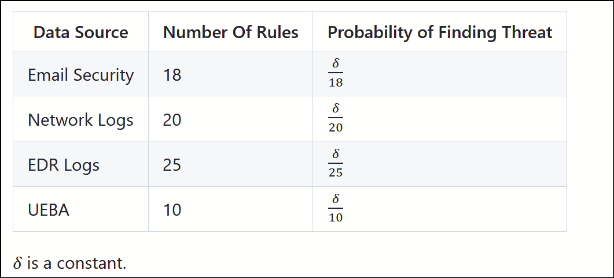
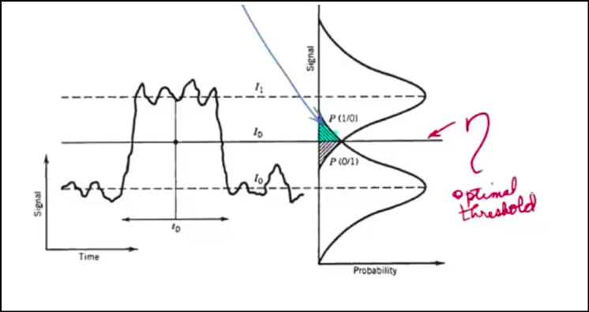
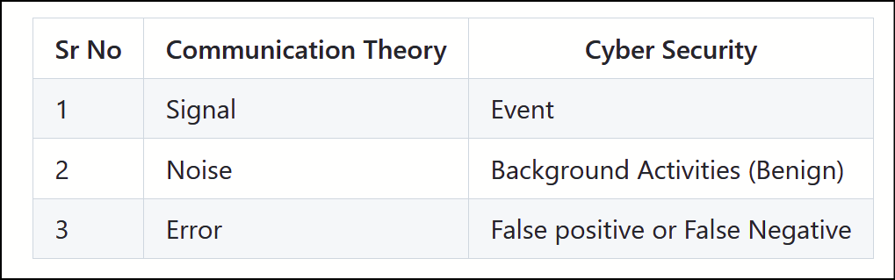
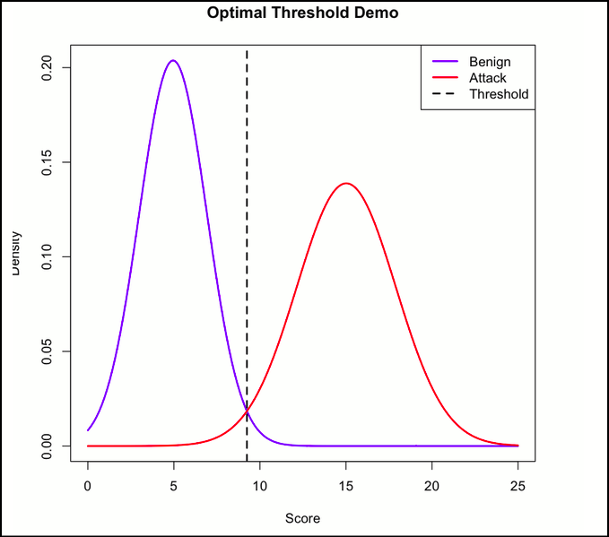
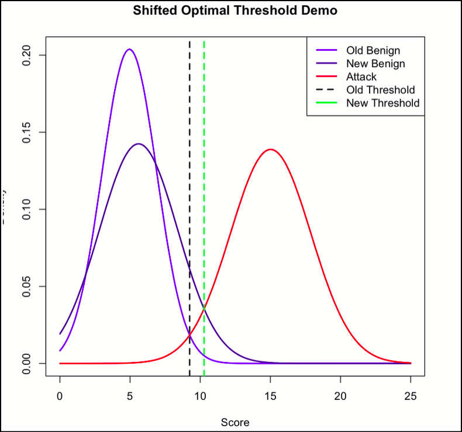
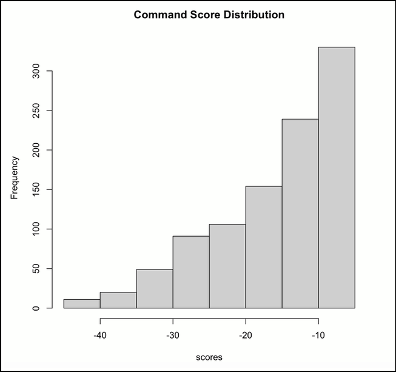
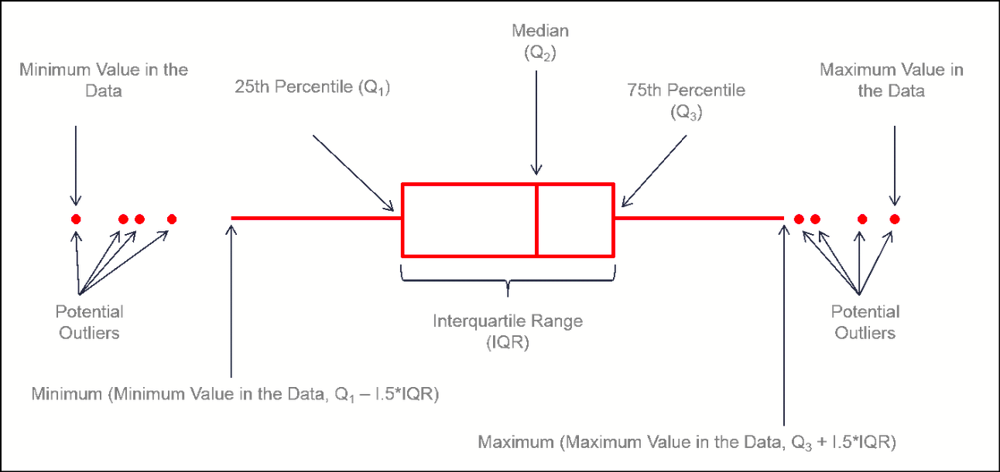
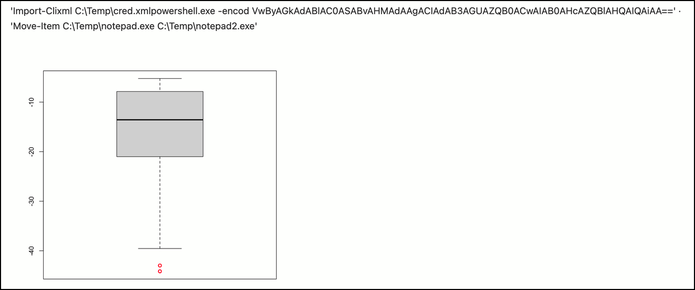

> “Say, observe what is in the heavens and the earth.”– Quran 10:101

### Introduction

In the previous two chapters, we gained an understanding of probability theory and threat hunting. Now, it is time to apply that knowledge. In this chapter, we will take that understanding onto the ground of practical realities.

### Baselining and Application of Probability

Before you begin your threat hunting practice in a new environment, you need to first understand the environment. It is like knowing a jungle before placing a trap. A skilled hunter will carefully analyze the environment before engaging in any threat hunting exercise. There are many reasons for this as follows

1.  In the plethora of logs from various sources, knowing what looks normal and what is not gives an upper hand to the hunter. Baselining helps in knowing that normal.
2.  Prioritising the hunts. By knowing the current posture of the security deployment, the hunter can align their hunts to cover the most plausible hidden threats.
3.  Baselining also helps in doing Gap Analysis, which helps the security team build proper detections to fill those gaps.

In a nutshell, baselining is an important step every hunter should take before starting the hunt.

### A Very Simple Approach To Look at Data Sources With a Probabilistic Mind

Let’s take a simple example to answer the question: which data source should the hunter look at to start the hunt?

In our example, an organization has four data sources for security monitoring:

1.  Email Security
2.  Network Logs
3.  EDR Logs
4.  UABA (User Behavior and Analytics)

The question to the threat hunter is: which log source should they choose in order to start hunting?

Our hunting philosophy tells us that our primary aim is to detect hidden threats in the environment. The less coverage a log source has, the greater the probability that our hunt would yield a positive result in terms of finding hidden threats.

This means:

P ( Probability of finding hidden threat ) ∝ 1 / Number of rules


*Table Describing Probability of Finding New Threat As per Number Rule Existing*

From this, we observe that the maximum probability of finding hidden threats would be in the **UEBA logs**.

### Dynamic Threshold Based On the BER

From our previous discussion, we now know that the principal goal of baselining is to understand what is normal and what is not. However, this assumes that normal always looks identical at all times, which is not the case. Extraordinary events can shift the landscape of normality.

What if we develop a system that adjusts itself to these changes? Sounds interesting — indeed, it is.

### Bit Error Rate

To achieve our goal of designing a self-adjusting baselining system, we will borrow an interesting concept from communication theory known as Bit Error Rate. The error rate is the probability of error per bit during transmission. While transmitting a stream of bits over a medium to a receiver, the stream is prone to errors. These errors are highly undesirable and should be avoided as much as possible.

At the end of the day, it is the receiver’s responsibility to interpret a bit as 0 or 1. To make this decision, the receiver relies on a specific threshold. This threshold is calculated by plotting the Gaussian distribution of the noise level present at the high and low signal levels. The intersection of these two plots provides the optimal threshold to decide the bit, as shown in the image below.


*BER Optimal Threshold Graph*

As we can see, the above graph provides a very important piece of information for our use case in threat hunting. If we extend this knowledge to threat hunting and translate our problem from communication theory to cyber security detection, we can find the optimal threshold for various scenarios.

#### Translating Problem

In order to apply the BER reduction analogy to threat hunting, we need to translate this problem into the realm of cyber security. We can trace the original variables used in communication theory to our domain as follows:



As we have mapped our key components to cyber security domain, in the following section we will look at one use-case to determine the optimal threshold for detection malicious SSH logon based on number of attempts. Also we will see how threshold adjust when we introduce fresh set of data to the system.

#### Use-Case: SSH Logon Failed Alert

Continuing from our previous discussion, let us examine a practical use case. Assume that an analyst is attempting to baseline the number of failed SSH logon attempts in order to determine which events are malicious and which are benign within the environment. To demonstrate this, we will simulate the situation using dummy data in R.

```r
benign <- rnorm(500,mean=5,sd=2)
attack <- rnorm(500,mean=15,sd=3)r
```

Suppose we have a dataset of one thousand events, split equally between benign and malicious activity. The benign events follow a distribution with a mean of 5 and a standard deviation of 2, meaning that most benign failed logon attempts cluster around 5. In contrast, malicious events follow a distribution with a mean of 15 and a standard deviation of 3.

> Note: *We assume that both benign and malicious events follow approximately normal distributions. The Law of Large Numbers ensures that our simulated sample statistics closely approximate the true parameters.*

To proceed, we compute the estimated parameters of both distributions:

```r
mu_b <- mean(benign); sd_b <- sd(benign)
mu_a <- mean(attack); sd_a <- sd(attack)
  
cat("Benign ~ N (", mu_b,",",sd_b,")\n")
cat("Attack ~ N (", mu_a,",",sd_a,")\n")
```

Here, we calculate the mean and standard deviation of each dataset. These values should be close to the parameters specified during simulation.

Next, we approximate the intersection of the two probability density curves. This intersection serves as a practical decision threshold. In other words, we find the value of x , where the densities of benign and malicious events are closest to each other.

```r
f_b <- function(x) dnorm(x,mu_b,sd_b)
f_a <- function(x) dnorm(x,mu_a,sd_a)
  
objective <- function(x) abs(f_b(x) - f_a(x))
threshold <- optimize (objective, interval=c(3,20)) $minimum 
cat("Optimal Threshold:",threshold,"\n")
```

We restrict the search interval between 3 and 20. Values below 3 typically represent normal user mistakes, while values above 20 are extremely unlikely to be legitimate in this environment.

The computed solution is approximately 9.24. This means that, under the current setup, a practical threshold for classifying events as malicious would be around 9 failed logon attempts.

To visualise this, we plot the two density curves along with the computed threshold:

```r
x_vals <- seq(0,25,length=500)
  
plot(x_vals, f_b(x_vals),type="l", col="blue",lwd=2, ylab="Density", xlab="Score", main="Optimal Threshold Demo")
lines(x_vals,f_a(x_vals),col="red", lwd=2)
abline(v=threshold,col="black",lty=2,lwd=2)
legend("topright",legend=c("Benign","Attack","Threshold"), col=c("blue","red","black"),lty=c(1,1,2),lwd=2)
```

this renders plot shown below:


*Graph showing Optimal Threshold to Detect SSH Brute Force Using BER*

Now, let us assume that a change occurs in the environment. For example, a new Linux SSH server is exposed to the internet to host a web application for user login. This may skew the distribution of benign login attempts.

Suppose we now observe additional benign login activity with a mean of 12 and a standard deviation of 1.

> Note: *These login attempt values may appear exaggerated, but they are used purely for demonstration purposes.*

In next section we will introduce these new datasets in our old benign event data set to calculate new threshold.

```r
new_benign <- rnorm(50,mean=12,sd=1)
benign2 <- c(benign,new_benign)

mu_b2 <- mean(benign2); sd_b2 <- sd(benign2)
f_b2 <- function(x) dnorm(x,mu_b2,sd_b2)
objective2 <- function(x) abs(f_b2(x) - f_a(x))
threshold2 <- optimize(objective2 , interval = c(3,20))$minimum

threshold2
```

What should we expect?

Since the benign distribution has shifted to the right, the intersection point — and therefore the threshold — should also shift to the right. This behavior is desirable. As higher failed login counts are now considered benign, the decision boundary must adjust accordingly.

The new threshold is approximately **10.27**, reflecting the updated baseline.

We can visualise this shift as follows:

```less
plot(x_vals, f_b(x_vals),type="l", col="blue",lwd=2, ylab="Density", xlab="Score", main="Shifted Optimal Threshold Demo")
  
lines(x_vals,f_b2(x_vals), col="darkblue",lwd=2)
lines(x_vals,f_a(x_vals),col="red", lwd=2)
abline(v=threshold,col="black",lty=2,lwd=2)
abline(v=threshold2, col="green",lty=2,lwd=2)
legend("topright",legend=c("Old Benign","New Benign","Attack","Old Threshold","New Threshold"), 
           col=c("blue","darkblue","red","black","green"),lty=c(1,1,1,2,1),lwd=2)
```


*Plot Showing How Threshold Shifted To Right*

The resulting plot clearly demonstrates how the threshold adapts as the underlying data distribution changes.

### Baselining Based On The Probability of Powershell Keywords

So far we have accomplished two objectives of baselining: identifying the log sources to hunt with in a very naive way, and second, achieving a dynamic threshold for activities that can be classified as malicious based on a specific number of events.

In this section we will find a way to identify outlier command lines by analysing the most common commands executed on the server. In order to find outliers, we first need to create a profile of what looks normal on the server. This can be achieved by simply plotting a graph of the most executed commands on the server.

One of the popular utilities among both admins and attackers is PowerShell. Admins use it for most of their daily activities such as creating accounts, checking backups, and managing other tasks. Whereas attackers can use it for malicious activities such as downloading payloads, executing obfuscated malicious commands, enumeration, etc.

On any given day, thousands of such PowerShell commands are executed on busy production servers. These are not necessarily from human activity; PowerShell is used heavily in automation, which contributes to this huge number of executions.

In all this noise, it is very difficult to pick up malicious activity and flag it, especially when it is not detected by any existing security solution. One way is to look at the command line and then make a decision based on factors such as what operation it performs, whether it is relevant for the server, the account name, and the business context.

This manual approach is tiring and requires specialists who are aware of the server operations and what routine executions look like. For us, as threat hunters, we need to develop a method that can tell us what looks normal and what does not based on some statistical or probabilistic method.

In the next section we will build a similar model based on the **principle of least occurrence.**

#### Principle of Least Occurrence

In practice, this principle is one of the methods used to hunt for malicious activity; the basic principle remains the same: know normal to find abnormal.

One characteristic feature of a cyber attack is that there has to be something unusual for the server or computer. For example, a simple AD server which is meant for authentication and authorisation suddenly starts executing remote commands on a database server. This behaviour is not aligned with the normal activity of the server, which means there must be traces of this activity in the logs.

In terms of command lines, there should be a PowerShell command executed on the server to initiate the connection to the remote server. Statistically these instances would be very few, and the probability of execution of such commands would be far lower than commands used for adding or removing users from security groups on the AD server.

We can leverage this fact to build our model.

### Model to Detect The Unusual Commands

We will build our probabilistic model as per below steps

1.  **Gather data of all commands executed on the server:** This is the easiest step. We simply need to gather all commands executed on the server from PowerShell within the desired timestamp. We can write a simple query in our SIEM and retrieve this data.
2.  **Tokenise the Command Lines:** In order to determine the probability of a command we will use the probability calculation of the independent events. The command line is consist of keywords mathematically, ∑ ( k e y w o r d s ) = C o m m a n d L i n e by assuming “naively” that each keyword is independent and P ( k e y w o r d ) represent the probability of keyword we can calculate the probability of commandline as: ∏ P ( k e y w o r d ) = P ( C o m m a n d L i n e ) . Which means that to find the probability of the command line we simply multiply the probability of each keyword. Following block of R code summaries the previous two steps

```r
data <- read.csv("powershell_commands.csv", header = T)
commands <- data$command    #Saving data

#Tokenisation of the commands
 
tokenize <- function(cmd){
tokens <- unlist(strsplit(cmd, "[^A-Za-z0-9]+"))
tokens <- tokens[tokens != ""]
return(tolower(tokens))
}
tokens <- unlist(lapply(commands, tokenize))
```

**3\. Calculating the probability of each keyword and assign score** In the following block of the code we will calculate the probability of the each keyword tokens. The *table()* function will summarise the count of the each token and then we calculate probability using count of token divided by sum of all token . as shown in following block.

```r
freq <- table(tokens)
prob <- freq / sum(freq)
```

Now we need to calculate the probability of each keyword and then assign a score to the command. We are doing this to normalise the range of probabilities and also to deal with the fact that in the future we might encounter a keyword that is not present in our set of keywords. In that case the probability of the new keyword would be zero due to no occurrence, which would make the probability of the entire command zero.

```r
score_command <- function(cmd, prob){
  tokens <- tokenize(cmd)
  score <- 0

  for (t in tokens){
   if (t %in% names(prob)){
     score <- score + log(prob[t])
   } else {
    score <- score + log(1e-6)   # unseen keyword penalty
  }}
return(score)}
```

#### **Looking at results and checking the malicious command**

Lets see how the histogram of these scores looks like

```r
scores <- sapply(commands, score_command, prob)
hist(scores, breaks=10, main="Command Score Distribution")
```


*Histogram showing keywords of frequency vs score*

histogram of the graph is natural as we know that few keywords are such *get-process*, *get-hostname* , *powershell* would be executed more frequently whereas other would appear less frequently.

### Finding Outliers Using Box Plot

Next we need to find outliers in our data. For this we can use the boxplot in R. A box plot is an easy visual representation of data that helps us understand the distribution based on the percentiles of the data. This is a good way to detect outliers on both extremes. The image below shows the components of a box plot.


*Sample Box Plot*

As we can see, the plot has minimum and maximum values plotted as lines, while the box represents the interquartile range from the 25th percentile to the 75th percentile. At both ends we have outliers represented by red dots.

In our case we are not interested in outliers on the maximum side, as those would simply represent highly prevalent commands. Instead, we are interested in outliers at the lower end. The following code will do exactly the same.

```r
bp <- boxplot(scores, plot = T, outcol="red")
outliers <- scores %in% bp$out
unique (commands[outliers])
```

Below is the result of the code


*Outliers Plotted by R*

We can clearly see here that we got two suspicious commands are outliers. These commands are represented with red circles at the bottom and we can see their score is less than 40. Thus, we have successfully demonstrated that by using the naive approach to profile the probability of the command line we can detect the outliers and from the normal executions.

> Note: This is a very simple example for demonstration purposes that assumes data is actionable, in the real-word situations analyst needs to sanitise the data. For example, while looking at the powershell logs on the server there are many benign commands executed with unique strings such as GUID’s, username and the randomly generated temporary file names. One should look at these obvious benign command and exclude them, otherwise they will create noise in outliers. Simple regex can be useful here.

### Summary

In this chapter, we moved from theoretical discussions of probability to its practical application in threat hunting. The core idea explored throughout the chapter is simple yet powerful: before detecting abnormal activity, a hunter must first understand what normal looks like.

We began by discussing the importance of baselining, emphasising how understanding an environment allows hunters to prioritise investigations, identify gaps in detection coverage, and reduce unnecessary noise during analysis. Using a simple probabilistic approach, we demonstrated how the distribution of detection rules across log sources can guide hunters toward areas where hidden threats are more likely to exist.

The chapter then introduced the concept of dynamic threshold inspired by the Bit Error Rate (BER) model from communication theory. By translating signal processing concepts into cybersecurity terms, we showed how the intersection of benign and malicious activity distributions can provide a statistically grounded detection threshold. Through simulation in R, we demonstrated how this threshold can adapt as the environment changes, ensuring that detection logic remains aligned with real-world operational behaviour.

Finally, we explored a practical hunting technique based on the principle of least occurrence. By modelling the probability of PowerShell keywords appearing in command lines, we constructed a simple probabilistic scoring system capable of identifying commands that deviate from normal operational patterns. Using tokenisation, probability distributions, and statistical visualisation, we showed how rare command patterns can be surfaced as potential anomalies worthy of investigation.

While the methods demonstrated in this chapter rely on relatively simple probabilistic assumptions, they illustrate an important lesson for threat hunters: mathematical intuition can transform overwhelming volumes of telemetry into structured signals that reveal hidden threats.

This chapter establishes a foundational approach to probabilistic baselining — one that can be extended further with more advanced statistical and machine learning techniques in later discussions.
