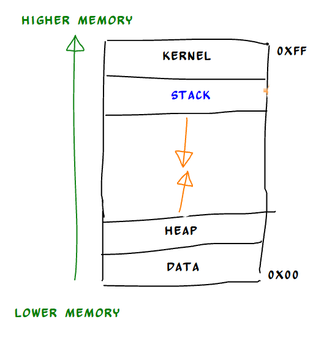
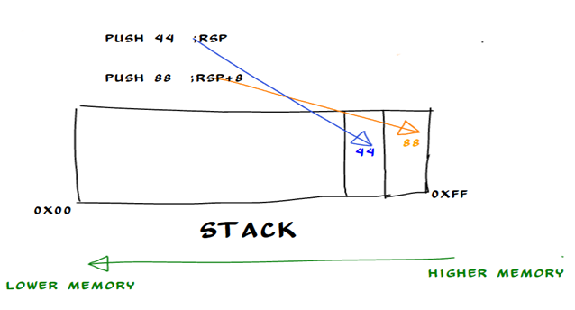
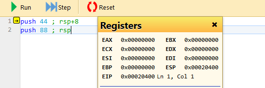
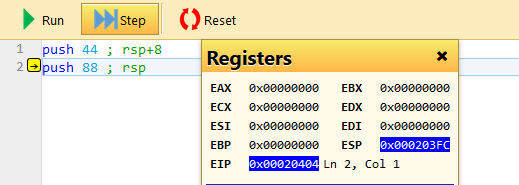
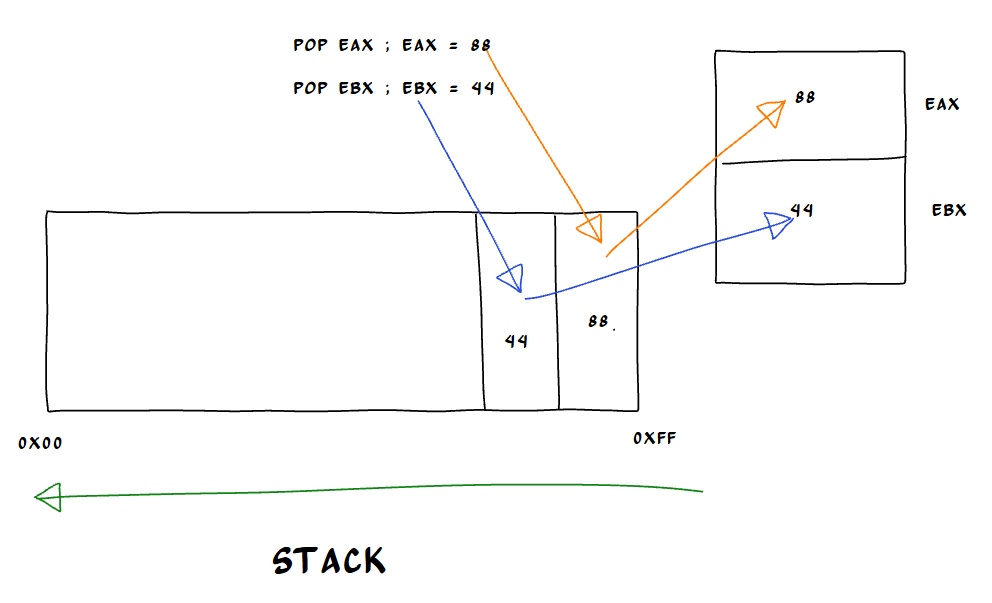
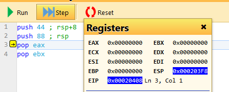
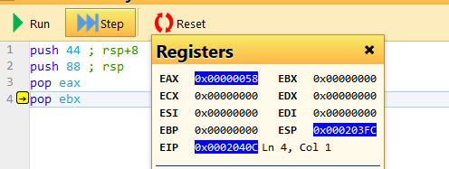

I fell in love of reverse engineering after watching a video of buffer overflow exploit explanation by computerphile. They have explained it very neatly, on that video first concept explained was a stack, so deriving my inspiration from it I will start this series to explain what stack actually is, anyway somebody has even said “Computer programming is nothing but a STACK”

To understand this concept of stack we need to understand the memory organization of computer. So any process of program which is loaded in to the memory of the computer is not loaded randomly it has some precise area dedicated in memory for its operations. For example, global hard code which is written for the program is resides at particular location and environmental variables have different location it memory lay out.

I won’t dive in to detail of memory lay out here instead I will try to explain a very simple overview of the memory layout here as per below image

*Basic memory layout*

So as you can see in figure 1 lower memory region of the program contains DATA section and HEAP section, while upper or higher memory region contains KERNEL and **STACK** section, Now let’s take a look of these each section briefly *(stack in detail of course….. -\_- )*

**DATA:** Also know and text section and code section where the actual text is copied in to the memory. It contains the all logic and the instruction for the code. It’s placed below heap to protect it from over-writing.

**HEAP**: Heap is a segment where the dynamic allocation of the memory take place. This region is managed by functions like malloc(),alloc() & free(). Its grows upward i.e. from lower memory to higher memory.

**KERNEL:** Now this area dedicated to the kernel of the operating system where command line arguments, thread and processes resides.

Now, after seeing this we know where exactly the stack is in the memory. Stack resides just below kernel segment and above the free area and stack always grow downward towards heap. Keep this in mind, stack always written from higher memory to lower memory

To write this computer take help of two 64-bit register BSS (Base Stack Segment) & RSP (Stack Pointer Register) in more precise way we can say that BSS manages the RSP. Two important instructions are use to manipulate stack are PUSH and POP. PUSH is use to put data in to the stack and POP is use to retrieve data from the stack.

Here we need to understand that last pushed values are always top of the stack like demonstrated in below image.

*PUSH operation on the stack*

Here we have two instructions

*PUSH 44*

*PUSH 88*

First push will put data 44 on the top of the stack at this time RSP is pointing at the highest location of the stack let say it’s just RSP+0 I have called it RSP, now as second push instruction is executed it put data 88 on the top of the stack and now is decremented by 8 bytes and new RSP will point at the RSP+8 which is now the top of the stack, here you can see stack is growing downwards and last pushed value is at top of the stack.

Now let’s take the real life example

*Push operation (PUSH 44)*

Here RSP is represented as ESP, anyway at the beginning our ESP is point at 0x20400 now we will execute step one and see what is the change

*PUSH operation (PUSH 88)*

After executing it ESP is 0c203fc now if you calculated difference between 0x20400 and 0x203fc you will get 0x4 since this simulator is of 32-bit environment, where is ESP is of 32-bit long.

Now let’s check what pop instruction do,

As explained above pop instruction just dump the value of the top of the stack to the destination.

Below figure explains POP operation.

*POP operation*

So as demonstrated in the figure pop instruction takes whatever is on the top of the stack and dump it on destination at the same time incrementing RSP by 8 bytes or 4 bytes depending on the architecture.

Let’s see how this code looks like in real life code.

*POP operation (pop eax)*

Now, this is what our code looks like , as its self-explanatory we have pushed two value on the stack in hex they are 0x2c (44d) & 0x58 (88d) on the stack since 0x58 is pushed later so its top of the stack and when our line 3 is executed POP should move this value in eax register.

*POP operation (POP ebx)*

This is what happened here now, value 0x2c will be moved on the ebx as it’s on the top of the stack now. It’s worth to notice how stack is changing here stack was 0x203f8 before first POP instruction is executed after executing this POP instruction it changes 0x203fc, its incremented by 4 bytes as expected in 32-bit environment.

### Conclusion

1.  We saw the basic memory layout of the programs

2\. We learn about basic architecture of the stack and its position on the memory layout.

3\. We briefly check basic stack manipulation operation using POP and PUSH instructions.
