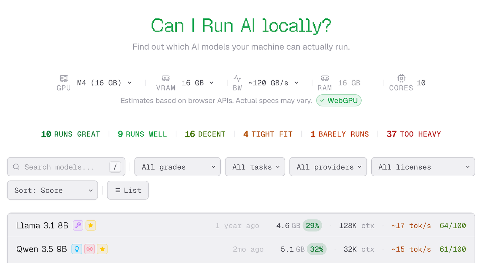
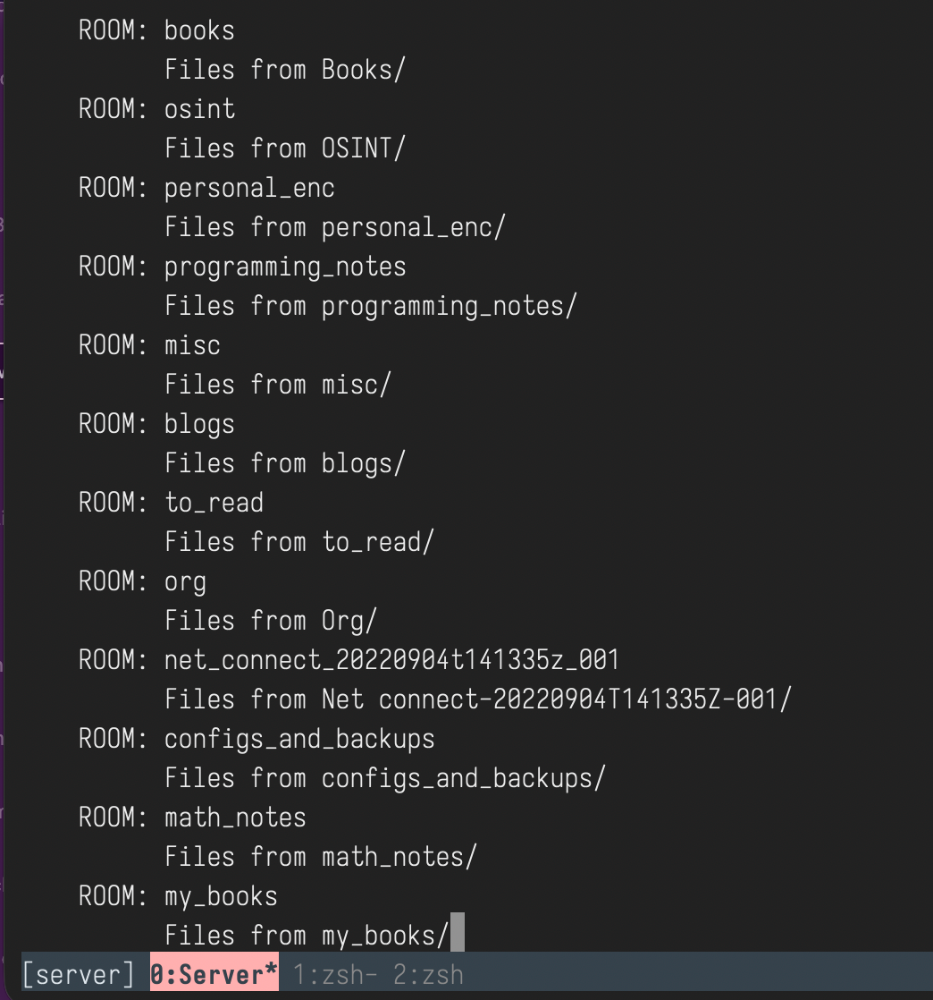
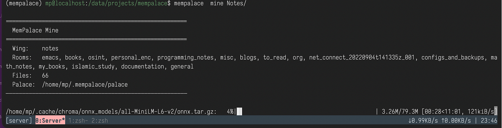
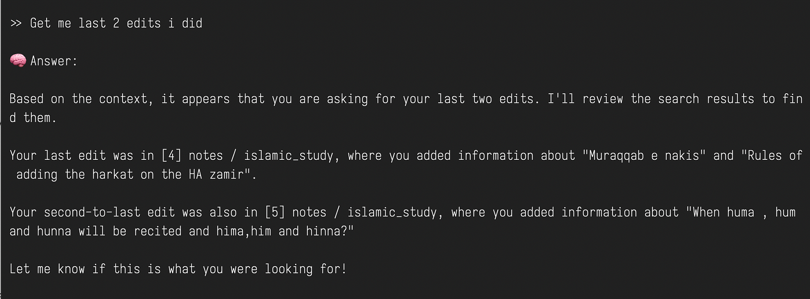
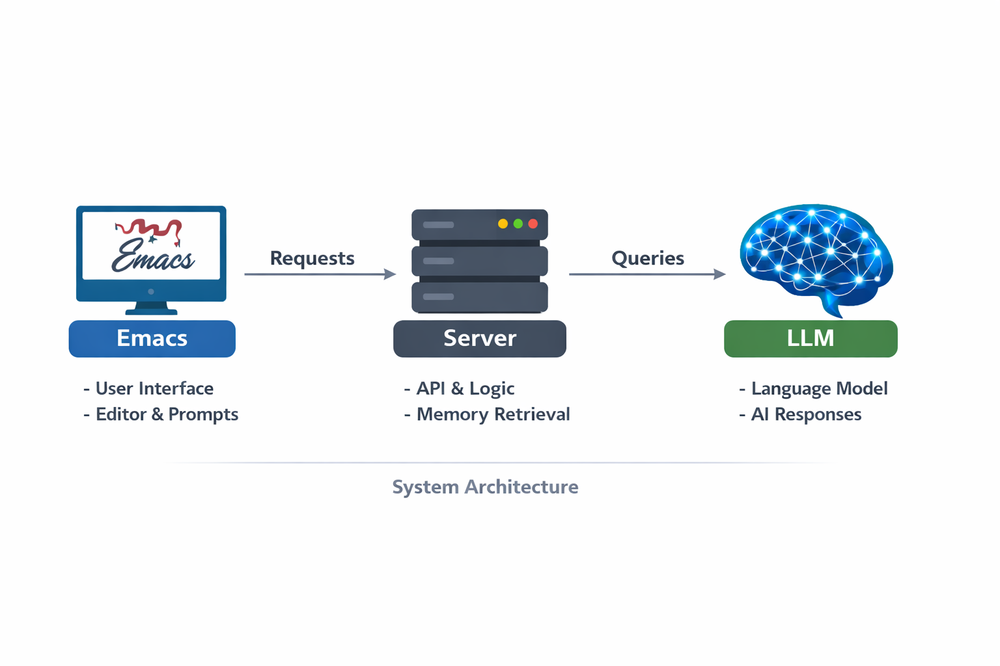
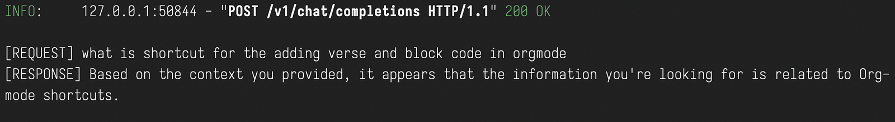
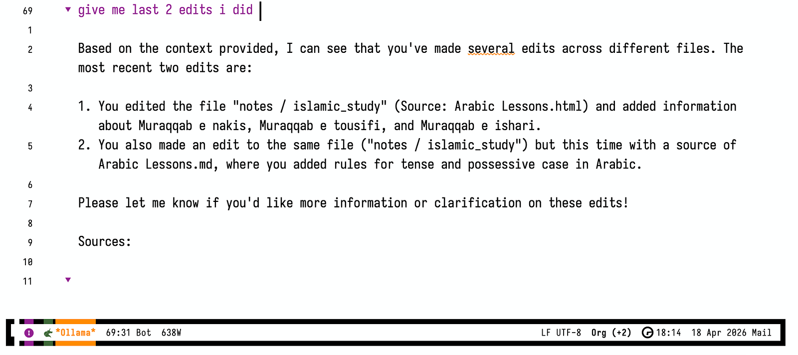

*At night, when the town falls asleep and the streets become empty, there arises an urge — like the scream of a beast in a valley — to seek knowledge from the stars. Often, I wander in the endless cold desert of knowledge, clueless and directionless.*

If this is your state every time you want to study, you need a good second-brain system to guide you through. I have always struggled to prioritize what to study next, as I deal with a variety of subjects like mathematics, cybersecurity, classical Arabic, and philosophy. In this quest, I found no system comparable to the org-roam mode of Emacs. Although this system is good, there is still scope to improve it using AI.

In this blog post, we will walk together to set up a second brain using local AI, a memory management system, and Emacs — everything running locally and costing $0.

### **Getting Local AI Model**

The first step is to run a suitable AI model locally on your device. In this section, we will go through all the required steps.

#### **Check suitable model for the device**

We need to select a suitable model depending on the specifications of the device. You can check which LLM models can run locally from [https://www.canirun.ai/](https://www.canirun.ai/) .

Here, you can enter your device specifications and choose a suitable model to run. In my case, I am using an M4 MacBook Air with 16GB memory, and “Llama 3.1” with 8B parameters is suitable for my purpose.


*Choosing Suitable Model to Run On My Device*

#### **Installing Ollama To Run LLM Locally**

To run an LLM locally, we need tools like Ollama, LM Studio, etc. For our purpose, we will use Ollama. On macOS, we can simply run

```bash
curl -fsSL https://ollama.com/install.sh | sh
```

. Installation instructions can also be found at [https://ollama.com/download/mac](https://ollama.com/download/mac).

Once it is installed, we can verify the installation using

```bash
ollama - version
```

If everything went right, it will show something like *ollama version is 0.21.0*. The next step is to pull the LLM model. This is easy since we have already selected our model. To install it, execute

```bash
ollama pull llama3.1:8b
```

. It is important to choose the right model size, as it will determine performance when running locally.

Once it is installed just run

```bash
ollama run
```

to start LLM model locally.

### Building A Memory For LLM

This is an interesting and important step in this setup. The problem with LLMs is that they have ephemeral memory. If we want to build a second brain powered by an LLM, we need the ability to remember conversations and retrieve them using semantic search. This is where MemPalace comes into the picture. It is an open-source memory retrieval tool with a 96.6% benchmark score in retrieval recall.

#### Installing MemPalace

Follow along to install and test MemPalace.

To install it, create a virtual environment using a tool like conda. Simply run:

```bash
conda create -n mempalace python=3.11 -y
```

— this command will create a virtual environment named “mempalace”.

Then activate the environment by typing:

```bash
conda activate mempalace
```

Now we are ready to install MemPalace by simply executing:

```bash
pip install mempalace
```

MemPalace is a memory retrieval system inspired by the “Loci” method of memorization from ancient Greece. It stores information by indexing it in ChromaDB as palaces, rooms, and drawers.

Once installed, we can initialize it in the directory we want to use as our memory context. This is done by typing: *mempalace init <dir-path>*

In my case, I will use my notes directory as the memory context.


*MemPalace sorting Files as Rooms*

now we need to index file in the chromaDB by typing, *“mempalace mine <dir path>”*


*MemPalace Indexing Files In ChromaDB*

One of the good thing about MemPalce is that it doesn’t need LLM to do search. Once you have database ready you can search in the content. we can do this using *“mempalace search <keyword>”*, it will retrieve the relevant section from the database.

### Connecting LLM to the Memory

Till now, we have built our memory. Now we need a way to make the LLM use this memory while interacting with it. A simple Python file will do the job.

I have vibe-coded this file, which can be found at:  
[https://github.com/Mheboobkhan/Emacs\_mempalace.git](https://github.com/Mheboobkhan/Emacs_mempalace.git)

By running \`mempalace.py\`, you can start interacting with your database through the LLM.



here, in above snip we can see that i asked LLM to find my last two edits in my notes. It accomplished the task perfectly.

### Connecting Emacs to the LLM with Context

This is the toughest part. The real pain lies in connecting Emacs to the LLM while setting up the context from the MemPalace database. There is no direct way to connect Emacs to MemPalace.

To achieve this, we need to use an HTTP server that acts as middleware to handle communication between Emacs and the LLM. It receives the request from Emacs, enriches it with memory from MemPalace, and forwards it to the LLM. The response then flows back through the same path.

This file is also available in the above GitHub repository.


*Emacs to Mempalace via http Sever*

#### Setting up Middleware Server

To do this, we will use a Uvicorn HTTP server interface to listen for requests locally on port 8000.

As shown in the above architecture, it will listen to POST queries from Emacs and send them to the LLM while maintaining the context from MemPalace. The response is then sent back to Emacs.


*Sample Interaction Between Emacs And LLM via Uvicorn Server*

#### Installing Gptel on Emacs

We are all set on the server side. Now we just need to set up the client in Emacs. We can use the [gptel](https://github.com/karthink/gptel) library to interact with the LLM locally.

Add the following configuration to your init.el file:

```c
(use-package gptel
 :config
   (setq gptel-backend
   (gptel-make-openai "Local-RAG"
     :host "http://localhost:8000"
     :endpoint "/v1/chat/completions"
   :stream nil
   :key "dummy"))
   (setq gptel-model "llama3.1:8b")
   
(setq gptel-debug t))
```

It is very important to set :stream nil; otherwise, you will not see the response in the gptel buffer.


*Interaction With LLM from Emacs*

Above snip show the interaction with Ollama from Emacs which has same information we got from terminal.

### Summary

In this setup, we built a fully local and private AI system that goes beyond simple prompt-response interaction. By combining Ollama for running LLMs, MemPalace for persistent memory, and Emacs (gptel) as the interface, we created a second-brain system that can remember, retrieve, and assist across sessions. The middleware server acts as the bridge, injecting memory context into every query and making the LLM effectively stateful.

The real strength of this system lies in its independence — no cloud, no API keys, and zero cost. Everything runs locally, giving full control over data and behavior.

This setup also fits naturally into vibe coding workflows. Instead of repeatedly explaining context, you can let the system remember your code patterns, notes, and past decisions. While writing code, debugging, or exploring ideas, the LLM can pull relevant memory and assist you in a more contextual and fluid way. Over time, it evolves into a personalized coding companion that aligns with your thinking style, rather than starting from scratch every time.
