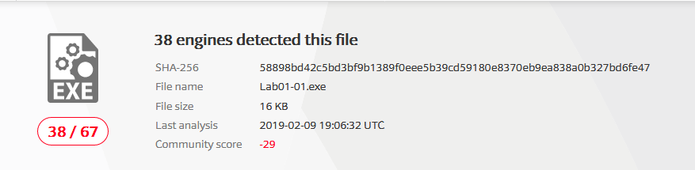
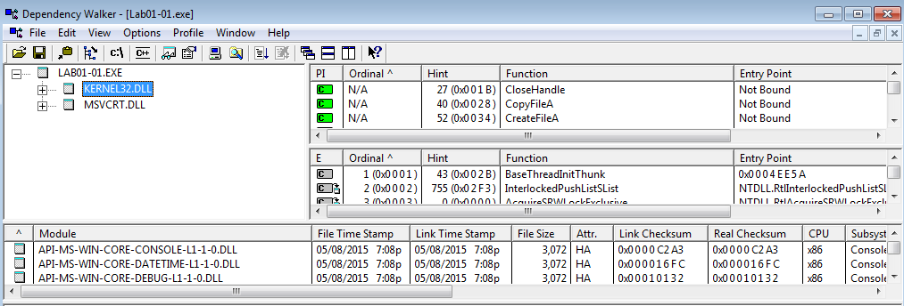
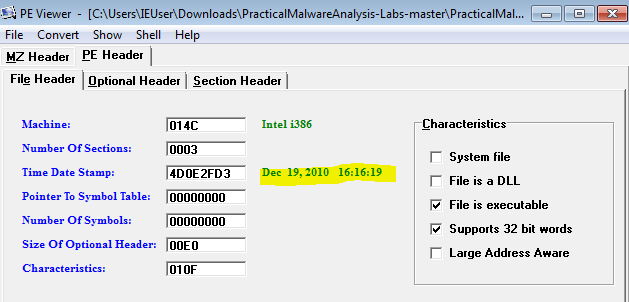
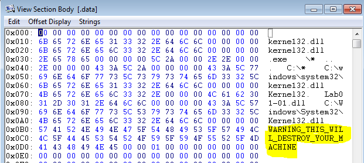
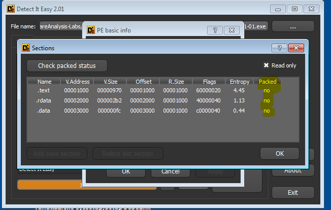

Malware's are the most fearful aspect for any security professional. Specially when your AV solutions are lame enough to release signatures after organisation is compromised . On the top of it we know than we cant have all systems of the company fully patched….but what is the relationship between malware analysis and this all . So lets see some statistic below

1.  Malware's are involve in almost 70–80 % of the Hacking events or system compromised.
2.  Almost 90% successful malware which infect the organisations are targeted malware( Recall the infamous Stuxnet attack on Iranian nuclear plants)

**Targeted malware** means , malware authors write malware only for selected organisation. This kind of malware's are very difficult to detect by an AV programs.At this point we need malware analyst .As an admin i know how much we do to keep our infra safe but at deepest i know this is not enough. Until and unless we understand our enemy we cant defeat him. This is why i recommend all security professional to know little bit about malware working .

In this series i will provide a malware analysis gimps from basic static to advance dynamic analysis. (*inshaALLAH)*

So lets dive on operation table ;)

**Scenario** : As an analyst you got one sample of file , you need to analyse it without running the sample and extract as much information we can.

So for this we will ask few questions to our self .

1.  **Is file really malicious ?**

This is the first question one may ask before starting analyzing any file. For this i am using very lame method , its so lame that i am embarrassed to write it but this is a process. In future i will share techniques to determine this manually. For now we will just upload file on VirusTotal.

*Virus total analysis of our file*

We can see the score of this file is showing that our file is malicious .So cool

**2.When the file is created ? Which dll’s does this file exports ? Is there any message in clear text in file?**

so for above question we will use two most awesome tools in static analysis.

*A. Dependency walker*

This will give use an idea which dll’s are being exported by the file. From this information we can make an educated guess of malware working.

*Dependency Walker O/P for our sample*

From above file we can understand that two dll’s are being imported by the files. KERNEL32.DLL and MSVCRT.DLL we can may conclusions of the working of the malware . KERNEL32.DLL is use to modify the system level changes that means this malware may be capable of making changes in our system environment like creating files ,deleting file etc. MSVCRT.DLL is use to import the C libraries of various kind . Now we now know the malware is written in C language.

*B. PE viewer*

To answer remaining questions we will use another tool called as PE viewer.This tool will provide us an internal view of this sample.With time stamp when this file was complied first , this could be a very helpful information for us.

*PE header Information of Sample file*

We can see in the PE header section that this file was compiled on DEC 19,2010 16:16:19 , this could be a clue to check reputation of the file. PE viewer also give us information of some clear text embedded in the file. Lets analyse it to find any suspicious content.

*String info in sample file*

In the DATA section of the this malware we can see “ THIS WILL DESTROY YOUR SYSTEM “ . Now point here to understand that you will never find such a warning by PE viewer in any advance malware unless and until author is very lame ans lousy , But strings can give you very well information about working of the malware.

**3.Is the malware is packed or obfuscated ?**

This questions are very advance for this simple malware sample but we will check this by new tool which i found on git-hub , This tool is really awesome and can replace both above tools. I mentioned above tools because they are very common and worth mentioning but this tool called as **Detect It Easy**, or simply **DIE** is very advance and cool , i will write a separate tutorial on this tool in future (*inshaALLAH) .*

There is an utility in this tool which detect the obfuscation or packing lets check on this sample file.

*Obfuscation detection in DIE*

As we can see in the Section sector of the DIE , Packed column is showing NO for all section that means this malware is not obfuscated. This was clear when we got the clear text threat message.

**Conclusion :**

We have successfully analyze sample and we can derive following conclusions from this

1.  This file is malicious.( VirusTotal analysis)
2.  We checked the DLL imports by Dependency walker .
3.  We successfully get the compilation details of the file and some clear text information from data section.
4.  We checked obfuscation details of the file by DIE.
