*Header Image*

In the world of cybersecurity, we have multiple Dimensions to deal with. Among this, there is a log analysis, which is a crucial part of threat hunting and incident response. While there are many tools available to do this, one expert analyst should keep a few manual methods to do it. Relying on our intelligence is way better than using some third-party tools, however, we should take the help of a professional tool to make our manual methods precise and more trustworthy.

In this blog post, I will share with you a few methods to analyze Bro logs. We are going to Use python and functionality of Pandas, Matplotlib, Numpy and Seaborn to understand traffic behavior.

Pre-requisites: Python, Jupyter Notebook, Bro-Cut *(I am going to consider readers already have all this pre-requisites done)*

**Creating .csv file from .log file to analyse**

We will create .csv file form .log files of bro, but lets first understand how to create .log file from .pcap file. In this exercise I will use ***traffic.pcap*** file for analysis. Below command converts .pcap into .log files

*bro -Cr <filename.pcap>*

Bro automatically converts .pcap file in multiple .log files like below

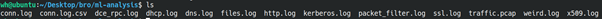
*Listing file in directory*

For sake of simplicity in the pandas, we will convert these .log files into .csv file using [bro2csv.py](https://github.com/geekscrapy/bro2csv)

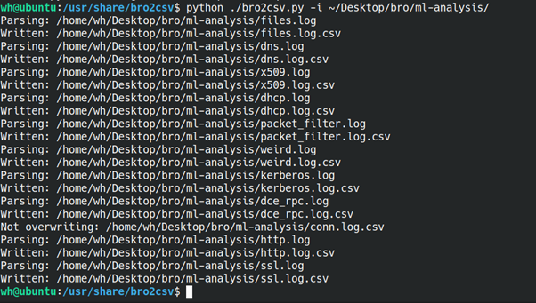
*bro2csv.py -i <.log files directory path>*

Now that we have multiple .csv files, I will choose **conn.log.csv** for our analysis.

**Starting analysis using Python**

Now, it’s time to start our Jupyter notebook and load **conn.log.csv** into Pandas for further analysis. For this, we will use the following libraries, which we will import at the start of our program

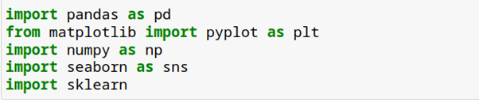
*Libraries to import*

Let’s read .csv in dataframe df

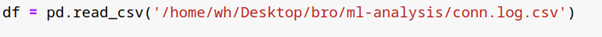
*reading .csv file*

**Understanding Data**

Before starting the analysis, we must understand the data to plan our next steps. We will use the **.info()** method to get an overview of the data.

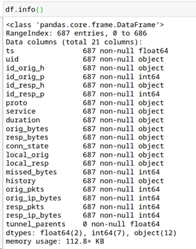
*Dataframe info*

Now we know there are a total of 21 columns and 687 rows. One more thing is worth to notice that column *tunnel\_parents* has no entry in it. This lead is us to our next move i.e. to eliminate unnecessary columns. If we see data carefully there are few columns which are not needed for our analysis or have no data to an analysis at all. Like below

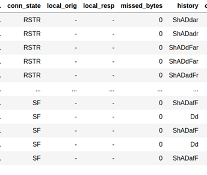
*Empty or useless columns*

Let’s drop these columns from the data

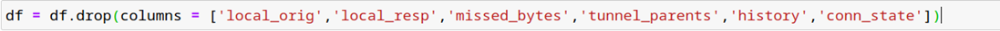

So, we are left with only 15 columns to analyze now. Hurray! 🎉🙌

**Looking for missing data**

One of the most critical tasks of any data analysis is to deal with missing data. We will use *count\_values()* and *isnull()* method to count missing data. *Isnull()* method provide an answer to simple question “*is data present?”* if the answer is **False** data is present if the answer is **True** data is missing. (one can use *notnull()* method, just meaning of False and True is get reversed)

The following block of code is used to count several missing data.

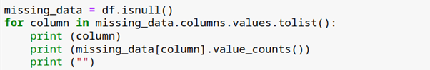

Regarding missing data, I found that most of it is in the **duration** column, where 30 data rows are blank.

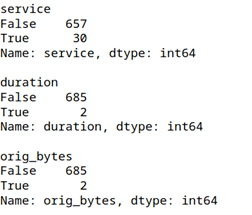

There are many ways to deal with missing data, such as replacing it with zero, the mean, or the most frequent value. Since the missing data is minimal, we can simply eliminate these rows.

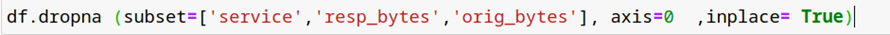

The above code drops all rows that have missing data in the specified columns.

**Replacing the ‘-‘ with NaN**

There are many rows in the data set having value as ‘-‘ but I will replace it with NaN (This will eliminate many errors in the future)

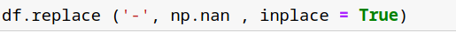

If you’ve noticed the output of **df.info()**, you may have seen different data types associated with the columns. We don’t always get the desired data types for analysis, but we can change them as needed using the **astype()** method.

I will change the data type of three columns from **object** (string) to **int64** or **float64**, depending on the analysis requirements.

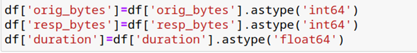

Now that we are done with data formatting and sanitization, let’s dive into the analysis.

**Looking for Beaconing**

Before we dive into the analysis, we need to know exactly what we are looking for. I will use one of the easiest and most reliable methods to check and detect malicious traffic. Whenever we have a compromised system with malware, it’s 99% certain that it will receive commands or payloads from a C2 server. But the question is: how can we detect this traffic when we are analyzing millions of outgoing connections at the same time?  
The answer lies in the fact that whenever malware communicates with a C2 server, it follows a predefined set of instructions. Therefore, there will be consistent packet sizes sent to the C2, and if the C2 has nothing to provide, it will also respond with predefined instructions, which would also be of the same size. Additionally, this communication must happen within a specific duration of time. So, we can look for these patterns to detect malicious behavior. This method is based on the typical behavior of idle malware, which beacons after a specific duration to the C2 server to get instructions about the next move

We do not expect this kind of behavior from normal users; hence, we can narrow down our search to look for possible compromises in the network. There may be false positives in this analysis, such as the NTP protocol or typical behavior of IoT devices, which we will address in further analysis.  
To check for beaconing in the network, we will use the scatter plot feature from the **pyplot** module of the **matplotlib** library to plot time vs. sent and received bytes.

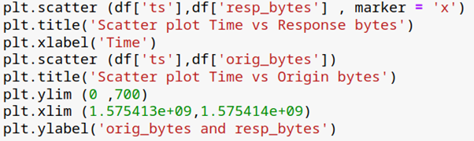

Above code will produce the below graph.

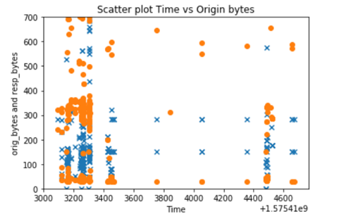
*Scatter plot to detect beaconing*

Remember you can always zoom in or zoom out using ylim and xlim methods. From the graph, it’s quite clear that there is some sort of beaconing happening in this traffic. Now to trace the source IP and eliminating false positives is a part of the deep analysis which we will deal with later.In graph blue ‘x’ represent response bytes and orange ‘o’ represent sent bytes and we can see some periodic relationship between them, as out Y-axis represents the number of bytes sent and X-axis is time.

**Heatmap Analysis**

**What is a heatmap?**

A heatmap is a graphical representation of data where the intensity of color indicates the value of the data. It’s an excellent way to observe the relationship between multiple variables in relation to a single variable. In the above scatter plot, we examined the relationship between time and the number of bytes sent or received.

While performing beaconing analysis, I mentioned that one possible source of false positives could be the NTP protocol.

In the following plot, we will examine how much duration each protocol utilized in the traffic. The duration will give you a clear idea of which protocols are in use. Detecting malicious traffic is easier when you can identify anomalies — for example, if port 80 is contributing more than 70% of the traffic time, it may be time to press the SOS button.

I will plot a heatmap of the remote port (**id\_resp\_p**) and service duration to check the contribution of each element to the traffic.  
The following code will create the data for our heatmap.

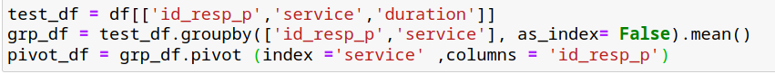

I have stored required columns in the *test\_df* . after this I have used *groupby()* method to group mean services and destination port according to mean of duration. Which produces below output.

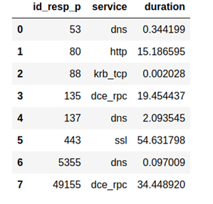

The third line of code prepares our data for the heatmap. It’s just like the pivot function in the excel. Which produces below output.

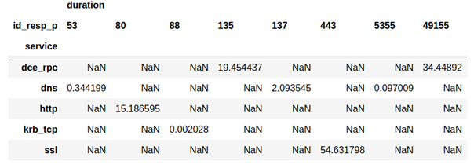

Now, we will visualize this in a graphical representation, using different colors to represent the magnitude of each value. This will help us read the data more easily. We will use the **seaborn** library in Python.

Which produce below map.

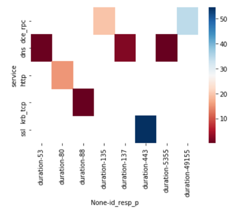
*A heatmap showing relationship between dest port and duration of connection*

Now, we can see that most of the traffic time was consumed by HTTPS over port 443, and the second highest was over port 49155 for the **dce\_rpc** service. This gives the analyst a clear indication that there is no NTP service in these logs, eliminating one possibility for a false positive.

One can do many variations according to his/her wishes to check other details, like whole contribution source IP to services like below.

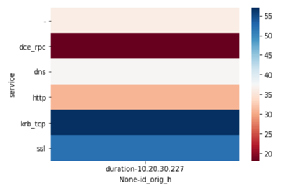

**Conclusion:**

We have analyzed few features of bro log.csv file using pandas to find beaconing and heatmap analysis of duration column
