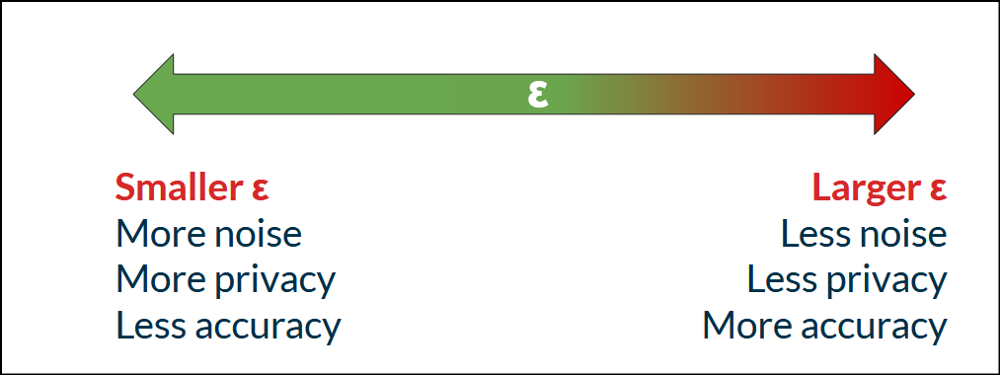

Learn about the fundamentals of LLM privacy.

### Introduction

LLM’s are the part of everyday life now and they are not limited to the individual chatting bot. The application of the LLM has been expanded from personal chat bot to the Agent that manages the sensitive employee data in the HR department. Having access to this data by default makes privacy a primary concern in the LLM design.

I believe it’s not just a requirement however it’s a need to know about LLM privacy to all cybersecurity personals including CISO’s and policy makers.

I am currently learning about LLM privacy and while going through different privacy mechanisms, one concept that caught my attention was **privacy budget**.

I found this concept interesting because we are already very familiar with the idea of security budget.

We have limited resources.

We have limited time.

We have limited risk appetite.

So can we think about privacy in the same way?

**How much privacy are we willing to spend?**

In this blog post I will try to cover few well known privacy concepts that can help us understand this question without going through all the mathy details before we can take the decision.

This is not intended to be a deep mathematical explanation of Differential Privacy. I am trying to understand the concept from a cybersecurity and CISO perspective and share what I have learned.

### LLM Privacy is not just Differential Privacy

Before going into the privacy metrics, I think there is one important distinction to make.

**LLM privacy and Differential Privacy are not the same thing.**

LLM privacy can include many different things such as:

-   What data is being sent to the model.
-   Where the data is stored.
-   Whether the provider uses the data for training.
-   How long the data is retained.
-   Whether sensitive information can be memorized by the model.
-   Can an attacker extract information from the model.
-   Can an attacker determine whether an individual’s data was part of the training set.
-   How access to the model and its data is controlled.

Differential Privacy is one of the techniques that can help provide a mathematical privacy guarantee.

This distinction is important because if somebody tells us:

> *“Our LLM uses Differential Privacy.”*

That does not automatically answer every privacy question about the LLM.It only answers one part of the larger privacy problem.So with that in mind, let’s look at some of the concepts.

### Privacy Metrics

### Differential Privacy

The *Differential Privacy* is a mathematical framework that provides a formal guarantee about the amount of information that can be learned about an individual from the output of a computation performed on a dataset.

The individual can be a person, device, or even something as simple as the number of pizza slices supposed to be eaten at a party.

The basic idea is quite interesting.

Suppose we have two datasets.

The first dataset contains Alice’s information.

The second dataset is exactly the same except Alice’s information has been removed.

If an algorithm produces almost the same output from both datasets, it becomes much harder for somebody looking at the output to determine whether Alice’s information was included.

This is one of the reasons Differential Privacy is interesting compared to traditional de-identification techniques.

The legacy mechanisms like de-identification which includes masking of the data can still be prone to attacks like “Linkage Attack” and “Reconstruction Attack”.

Differential Privacy takes a different approach.

Instead of trying to remove every possible identifier from the data, it introduces carefully controlled randomness into the computation so that the presence or absence of an individual’s data has a limited effect on the output.

This is where the idea of a **privacy budget** comes into the picture.

### What is the Privacy Budget?

The privacy budget is commonly represented using a parameter called **epsilon (ε)**. In simple words, epsilon tells us about the strength of the privacy guarantee.

Generally:

**Smaller ε → stronger privacy guarantee**

**Larger ε → weaker privacy guarantee**

NIST also describes ε as a privacy parameter or privacy budget. ([NIST](https://www.nist.gov/blogs/cybersecurity-insights/differential-privacy-privacy-preserving-data-analysis-introduction-our?utm_source=chatgpt.com "Differential Privacy for Privacy-Preserving Data Analysis: An Introduction to our Blog Series | NIST")) The formal definition of Differential Privacy can be written as:

**P\[M(D) ∈ S\] ≤ e^ε P\[M(D’) ∈ S\] + δ**

Don’t worry.

We don’t need to become mathematicians to understand the basic idea behind this formula.

Where:

-   **M** is the mechanism which produces the output.
-   **D** is the original dataset.
-   **D’** is the neighboring dataset.
-   **S** is a possible set of outputs.
-   **ε** is the privacy parameter.
-   **δ** is the probability represented by the additive relaxation in the guarantee.

The interesting part here is **e^ε**.

Let’s take two simple examples.

If:

**ε = 0.1**

Then:

**e⁰.1 ≈ 1.105**

If:

**ε = 5**

Then:

**e⁵ ≈ 148.4**

So we can see that a larger epsilon allows a much larger difference between the output distributions of the two neighbouring datasets.

But there is an important catch here.

**We should not look at epsilon alone and decide whether a system is private or not.**

The meaning of epsilon depends on what exactly we are protecting, how the neighbouring datasets are defined, which mechanism is being used, how many times the mechanism is run, and what utility we need from the system.

NIST specifically points out that selecting ε is challenging and there is no universal value that can simply be applied to every situation. ([NIST Publications](https://nvlpubs.nist.gov/nistpubs/SpecialPublications/NIST.SP.800-226.pdf?utm_source=chatgpt.com "Guidelines for Evaluating Differential Privacy Guarantees"))

And this is where I think the word **budget** becomes useful.

If an organization has a privacy budget, it needs to understand:

**What is the budget?**

**What does the budget apply to?**

**How much of it have we already spent?**

**How much is left?**

### A small Python example

We can see the relationship between epsilon and the multiplicative bound with a very small Python example:

```python
import math
epsilons = [0.1, 1, 2, 5]
for epsilon in epsilons:
    bound = math.exp(epsilon)
    print(f"epsilon={epsilon}, e^epsilon={bound:.2f}")
```

The output will look something like:

```ini
epsilon=0.1, e^epsilon=1.11
epsilon=1, e^epsilon=2.72
epsilon=2, e^epsilon=7.39
epsilon=5, e^epsilon=148.41
```

The code is not implementing Differential Privacy itself. It is only showing why the value of epsilon matters. A real Differential Privacy implementation needs much more than choosing an epsilon value.

For example, the mechanism, sensitivity, noise, sampling and composition all matter. This is important because we should not look at:

> *“ε = 1”*

and immediately conclude:

> *“This system is private.”*

We need to understand **what that ε actually represents**.

### Privacy Loss

Privacy Loss quantify the amount of information revealed about a specific individual when their data is included versus excluded from the dataset.

For a particular output, the privacy loss can be expressed as:

**L = log(P\[M(D)=o\] / P\[M(D’)=o\])**

Where:

-   **M(D)** = probability of getting output `o` when the individual's data is present.
-   **M(D’)** = probability of getting the same output when the individual’s data is absent.
-   **o** = observed output.
-   **L** = privacy loss.

Let’s take a simple example.

Suppose:

**P\[M(D)=o\] = 0.20**

and:

**P\[M(D’)=o\] = 0.10**

The privacy loss becomes:

**L = log(0.20 / 0.10)**

**L = log(2)**

**L ≈ 0.693**

So for this particular output, the presence of that individual’s data increased the likelihood of observing the output by a factor of two.

We can calculate this using Python:

```python
import math
prob_with_person = 0.20
prob_without_person = 0.10
privacy_loss = math.log(
    prob_with_person / prob_without_person
)
print(f"Privacy loss: {privacy_loss:.3f}")py
```

Output:

```yaml
Privacy loss: 0.693
```

Again, this is a very simple example.

In a real system there can be many operations and many releases.

This is where **privacy accounting** becomes important.

If the same data is used repeatedly, the privacy losses can accumulate.

For example, if a differentially private analysis uses an ε of 1 and the same analysis is released again, the basic composition can result in a combined ε of 2. ([NIST Publications](https://nvlpubs.nist.gov/nistpubs/SpecialPublications/NIST.SP.800-226.pdf?utm_source=chatgpt.com "Guidelines for Evaluating Differential Privacy Guarantees"))

So now our privacy budget starts looking much more like an actual budget. If we have:

**Privacy Budget = ε = 5**

and several operations consume parts of that budget, we need to keep track of what has already been spent.

The question is no longer just:

> *“Is this operation private?”*

It becomes:

> ***“How much of our privacy budget have we consumed?”***

### K-Anonymity

K-Anonymity is another well known privacy concept, but it approaches the problem differently.The basic idea is simple.

Suppose a dataset contains:

-   Age
-   Gender
-   ZIP Code
-   Disease

If a particular combination of attributes can identify only one person, then the data can potentially be used to identify that individual.

K-Anonymity tries to make every individual indistinguishable from at least **k-1 other individuals** based on selected quasi-identifiers.

For example:

```markdown
Age   Gender   ZIP       Disease
---------------------------------
31    Male     411001    Diabetes
32    Male     411001    Cancer
31    Male     411001    Asthma
```

We could generalize the data:

```markdown
Age     Gender   ZIP       Disease
-----------------------------------
30-35   Male     411***    Diabetes
30-35   Male     411***    Cancer
30-35   Male     411***    Asthma
```

Now the records are harder to distinguish from each other. If three records share the same quasi-identifier combination, we have:

**k = 3**

But K-Anonymity is not the same thing as Differential Privacy.K-Anonymity is mainly trying to make records indistinguishable within a group.

Differential Privacy instead provides a mathematical guarantee about how much the output of a mechanism can change when an individual’s data is added or removed.

This is an important distinction for the privacy budget.

K-Anonymity does not give us the same kind of composable privacy budget that Differential Privacy gives us. So if somebody tells us:

> *“Don’t worry, we anonymize the data.”*

That is not enough information to understand the privacy risk.

We need to understand what anonymization means, what information remains, and whether the data can still be linked with another source.

### So what is the Privacy Budget of an LLM?

Now let’s bring all these concepts back to the original problem. Imagine an organization deploys an AI agent inside the HR department.

The agent has access to:

-   Employee names
-   Salary information
-   Performance reviews
-   Leave records
-   Internal emails

The organization wants to use this data to improve the AI system.

The question should not simply be:

> *“Is our LLM private?”*

The better question is:

> ***“What is our privacy budget for this system?”***

And then we can start asking more questions.

**What data are we putting into the system?**

**Which data is sensitive?**

**Is the data being used for model training?**

**If it is being used for training, what privacy mechanism is being used?**

**What exactly does the privacy guarantee protect?**

**What is the value of ε and δ?**

**What is the unit of privacy?**

**How is privacy loss being calculated?**

**How is privacy loss accumulated across multiple operations?**

**How much of the privacy budget has already been consumed?**

**How much is remaining?**

**What happens when the privacy budget is exhausted?**

These questions are much more useful than simply asking a vendor:

> *“Is your LLM privacy compliant?”*

Because compliance and a mathematical privacy guarantee are not necessarily the same thing.

### Privacy vs Utility

There is another important part of this discussion.

Privacy comes with a trade-off.

If we keep increasing the privacy protection, we may reduce the utility of the model or the usefulness of the released data. For example, adding more noise can improve privacy but can also make the output less useful. NIST also highlights this privacy-versus-utility trade-off. ([NIST](https://www.nist.gov/blogs/cybersecurity-insights/differential-privacy-privacy-preserving-data-analysis-introduction-our?utm_source=chatgpt.com "Differential Privacy for Privacy-Preserving Data Analysis: An Introduction to our Blog Series | NIST"))

This creates a very familiar security trade-off. We can think about it like this:



There is no single perfect point on this graph.

The correct point depends on:

-   Sensitivity of the data
-   Threat model
-   Privacy requirements
-   Business requirements
-   Utility requirements
-   The mechanism being used

This is why I don’t think the question should be:

> *“What is the best epsilon?”*

The better question is:

> ***“What privacy budget is acceptable for this particular use case?”***

And that is ultimately a risk management decision.

### Privacy is not a checkbox

One of the biggest mistakes when discussing privacy is treating it as a binary property.

Something is either:

**Private**

or

**Not Private**

The reality is much more complicated. Privacy mechanisms provide different types and levels of protection. Differential Privacy gives us a mathematical framework to quantify privacy loss. K-Anonymity gives us another way to reason about the structure of a dataset.Privacy accounting helps us understand how privacy loss can accumulate. And the idea of a privacy budget gives us a useful way to communicate this to leadership.

But there is one important lesson here.

**A privacy budget is meaningful only when we understand what the budget actually applies to.**

An ε value without understanding the mechanism, unit of privacy, neighboring datasets and composition does not tell the complete story. NIST’s Differential Privacy guidance actually takes a similar approach: evaluating a DP guarantee requires looking beyond the ε value and considering the broader context in which the guarantee is provided. ([NIST Cybersecurity](https://csrc.nist.gov/pubs/sp/800/226/final?utm_source=chatgpt.com "SP 800-226, Guidelines for Evaluating Differential Privacy Guarantees | CSRC"))

### What should a CISO ask?

If I were evaluating an LLM system that has access to sensitive organizational data, I would start with a few simple questions.

**1\. What data is going into the model?**

**2\. Is that data being used for training?**

**3\. What privacy mechanism is being used?**

**4\. What exactly does the privacy mechanism protect?**

**5\. What are the values of ε and δ?**

**6\. What is the unit of privacy?**

**7\. How is privacy loss calculated?**

**8\. How is privacy loss accumulated across multiple operations?**

**9\. How much of the privacy budget has already been consumed?**

**10\. What happens when the privacy budget is exhausted?**

These questions don’t require the CISO to understand every mathematical detail of Differential Privacy.

But understanding the basic concept of the privacy budget makes it possible to have a much better conversation with the data science, ML and security teams.

### Summary

LLMs are moving from simple chatbots to systems that can access and process highly sensitive organizational data. Because of this, privacy can no longer remain only a concern for ML researchers. Security professionals and CISO’s need to understand at least the fundamentals of the privacy mechanisms being used to protect this data.

In this article I looked at three important concepts.

**Differential Privacy** provides a mathematical framework for limiting the impact that an individual’s data can have on an output.

**Privacy Loss** gives us a way to reason about how much an output can reveal about an individual.

**K-Anonymity** attempts to make individuals indistinguishable from a group of at least k people based on selected attributes, but it should not be confused with the formal guarantees provided by Differential Privacy.

But if there is one thing I want you to take from this article, it is not the equation. It is the concept of the **privacy budget**.

Privacy should not be treated as something that is simply “enabled” or “disabled”.

We should be able to ask:

**How much privacy do we have?**

**How much have we spent?**

**How much are we willing to spend?**

And most importantly:

**What are we getting in return for spending that privacy?**

I am still learning about LLM privacy myself, and this is one of the concepts that made the subject much easier for me to understand from a security perspective.

So the next time somebody tells you:

> *“Our LLM is private.”*

Maybe don’t ask only:

> *“How?”*

Ask:

> ***“What’s your privacy budget?”***

### References

1.  NIST SP 800–226, *Guidelines for Evaluating Differential Privacy Guarantees*.
2.  NIST, *Differential Privacy: Privacy-Preserving Data Analysis*.
3.  Dwork et al., foundational work on Differential Privacy.
