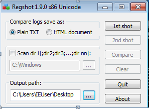
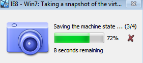
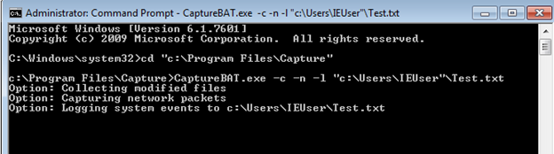
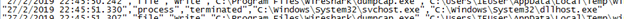
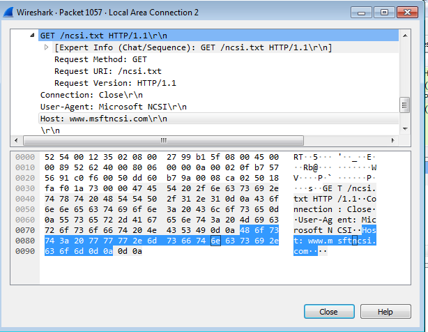
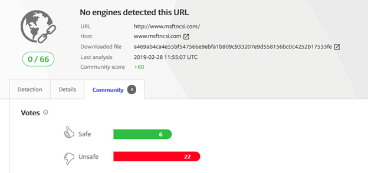
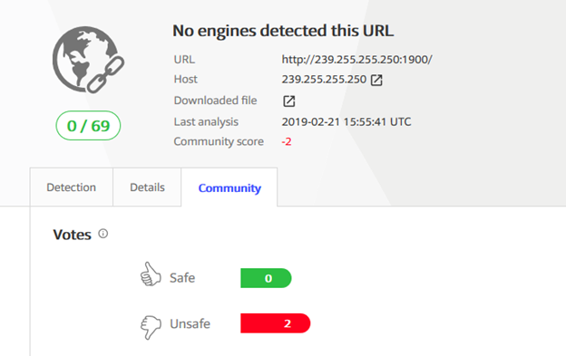
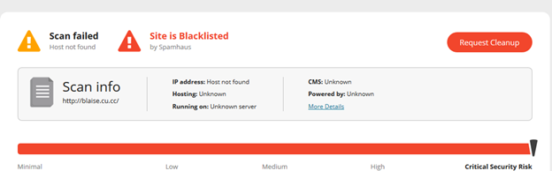

In my hunt of malware i accidentally come across the the file called as **Watchdog.exe** . I decided to dissect this file to uncover it. At the beginning i had no idea what this file actually is, but after doing some study i knew that i got some thing to make my day happier. so lets dive in

### **\[+\]Before starting a dynamic analysis.**

Well its obvious that before starting dynamic analysis, we do some basic static analysis of the file. You can find my blog about static analysis [here](https://advance-malware-analysis.blogspot.com/2019/02/basic-static-malware-analysis-pe-viewer.html). Another thing to keep in mind before starting dynamic analysis is that you have an isolated environment to run malware’s . You can set up your lab by following this [article.](https://advance-malware-analysis.blogspot.com/2019/02/dynamic-malware-analysis-lab-setup.html)

### **\[+\]Setting Up an environment.**

Before starting our analysis we have to set up few things i have assumed that you have set up the lab as mentioned article above hence i am skipping that part , also i am skipping static analysis since aim of this blog is to show dynamic analysis. So we need few things before we dive in to it as follow .

1.  **Regshot**

Registry shot aka **Regshot** is the simple tool which take two snaps of the registry entries before and after malware execution and then compare both,and provide us changed entries in the windows system registries. So make sure you are taking regshot 1 before running malware.


*Regshot 1 before malware execution*

**2.Snap shot of VM.**

Taking a snap shot of the stable VM state is a lifesaver for any analyst. Simple go to machine and take snapshot in Vbox .


*VBox snap shot*

**3.CaptureBAT.**

CaptureBAT is an utility that monitors the all network and registry changes in the environment. You just need to install it and navigate to installation folder by CMD. To capture network changes you need Wcap installed in system if you are using the wireshark for it then you may skip this step.To start capturing via CaptureBAT just type following command in CMD.

*#Capturebat.exe -n -c -l <path of output file>*

-   n is used to capture network activity (Wincap require), -c is for changed if registry , -l is to specify o/p file.


*CaptureBAT configuration*

**4.Wireshark**

To monitor network behavior of the malware we will use wire-shark.

### **\[+\]Analysis and IOC extraction**

1.  **Local IOC extraction**

We will first check changes this malware makes to local environment. First thing i noticed is this malware is terminating and creating a dllhost.exe , which has been associated with many trojan viruses.


*dllhost.exe process terminated*

```
"27/2/2019 22:38:39.949","process","created","C:\Windows\System32\svchost.exe","C:\Windows\System32\dllhost.exe"
```

But wait it was just a beginning, we still do not know exact purpose of this malware. So lets dig further.

On further looking in to the logs i noticed two suspicious entries ***ehrecvr.exe*** and ***ehsched.exe*** . Hmmmm what are they ?? after googling it i found that these to services are responsible to turn on-off PC cameras and mikes.So this explains the name of this file “**watch**dog”. So i conclude that this malware can be use to spy over victim via his/her webcam.

```
"27/2/2019 22:39:15.613","registry","SetValueKey","C:\Windows\System32\services.exe","HKCR\Local Settings\MuiCache\39\52C64B7E\@%SystemRoot%\ehome\ehrecvr.exe,-102""27/2/2019 22:39:15.663","registry","SetValueKey","C:\Windows\System32\services.exe","HKCR\Local Settings\MuiCache\39\52C64B7E\@%SystemRoot%\ehome\ehsched.exe,-102"
```

I was not able to find any more clues more than this, because i forgot to save regshot comparison…..:(( but its not an end lets check network activities.

**2.Network IOC extraction.**

I found many interesting clues in the network log analysis of this sample. I found that this watchdog is creating ***NetCfgLockHolder*** entry in the registry , which i believe is to write network sheet , that will allow computer’s to configure domain, gateway and IP to connect. This also solidify our previous assumption about this malware.

Following logs explain the entries made by this malware in the registry.

```
23:18:31.105","registry","SetValueKey","C:\Windows\System32\dllhost.exe","HKLM\SYSTEM\ControlSet001\services\Tcpip\Parameters\Interfaces\{53152A2F-39F7-458E-BD58-24D17099256A}\NameServer"
"27/2/2019 23:18:31.105","registry","SetValueKey","C:\Windows\System32\dllhost.exe","HKLM\SYSTEM\ControlSet001\services\Tcpip\Parameters\Interfaces\{53152A2F-39F7-458E-BD58-24D17099256A}\Domain"
"27/2/2019 23:18:31.105","registry","SetValueKey","C:\Windows\System32\dllhost.exe","HKLM\SYSTEM\ControlSet001\services\Tcpip\Parameters\Interfaces\{53152A2F-39F7-458E-BD58-24D17099256A}\RegistrationEnabled"
"27/2/2019 23:18:31.105","registry","SetValueKey","C:\Windows\System32\dllhost.exe","HKLM\SYSTEM\ControlSet001\services\Tcpip\Parameters\Interfaces\{53152A2F-39F7-458E-BD58-24D17099256A}\RegisterAdapterName"
"27/2/2019 23:18:31.105","registry","SetValueKey","C:\Windows\System32\dllhost.exe","HKLM\SYSTEM\ControlSet001\services\{53152A2F-39F7-458E-BD58-24D17099256A}\Parameters\Tcpip\EnableDHCP"
"27/2/2019 23:18:31.105","registry","SetValueKey","C:\Windows\System32\dllhost.exe","HKLM\SYSTEM\ControlSet001\services\{53152A2F-39F7-458E-BD58-24D17099256A}\Parameters\Tcpip\IPAddress"
"27/2/2019 23:18:31.105","registry","SetValueKey","C:\Windows\System32\dllhost.exe","HKLM\SYSTEM\ControlSet001\services\{53152A2F-39F7-458E-BD58-24D17099256A}\Parameters\Tcpip\SubnetMask"
"27/2/2019 23:18:31.105","registry","SetValueKey","C:\Windows\System32\dllhost.exe","HKLM\SYSTEM\ControlSet001\services\{53152A2F-39F7-458E-BD58-24D17099256A}\Parameters\Tcpip\DefaultGateway"
"27/2/2019 23:18:31.105","registry","DeleteValueKey","C:\Windows\System32\dllhost.exe","HKLM\SYSTEM\ControlSet001\services\Tcpip\Parameters\Interfaces\{53152A2F-39F7-458E-BD58-24D17099256A}\ActiveConfigurations"
"27/2/2019 23:18:31.105","registry","SetValueKey","C:\Windows\System32\dllhost.exe","HKLM\SYSTEM\ControlSet001\services\Dhcp\Configurations\Options"
"27/2/2019 23:18:31.105","registry","SetValueKey","C:\Windows\System32\dllhost.exe","HKLM\SYSTEM\ControlSet001\services\Tcpip\Parameters\Interfaces\{1CA3EFB2-A7C2-46D1-94BC-BCCE96807B12}\EnableDHCP"
"27/2/2019 23:18:31.105","registry","SetValueKey","C:\Windows\System32\dllhost.exe","HKLM\SYSTEM\ControlSet001\services\Tcpip\Parameters\Interfaces\{1CA3EFB2-A7C2-46D1-94BC-BCCE96807B12}\NameServer"
"27/2/2019 23:18:31.105","registry","SetValueKey","C:\Windows\System32\dllhost.exe","HKLM\SYSTEM\ControlSet001\services\Tcpip\Parameters\Interfaces\{1CA3EFB2-A7C2-46D1-94BC-BCCE96807B12}\Domain"
"27/2/2019 23:18:31.105","registry","SetValueKey","C:\Windows\System32\dllhost.exe","HKLM\SYSTEM\ControlSet001\services\Tcpip\Parameters\Interfaces\{1CA3EFB2-A7C2-46D1-94BC-BCCE96807B12}\RegistrationEnabled"
"27/2/2019 23:18:31.105","registry","SetValueKey","C:\Windows\System32\dllhost.exe","HKLM\SYSTEM\ControlSet001\services\Tcpip\Parameters\Interfaces\{1CA3EFB2-A7C2-46D1-94BC-BCCE96807B12}\RegisterAdapterName"
"27/2/2019 23:18:31.121","registry","SetValueKey","C:\Windows\System32\dllhost.exe","HKLM\SYSTEM\ControlSet001\services\{1CA3EFB2-A7C2-46D1-94BC-BCCE96807B12}\Parameters\Tcpip\EnableDHCP"
"27/2/2019 23:18:31.121","registry","DeleteValueKey","C:\Windows\System32\dllhost.exe","HKLM\SYSTEM\ControlSet001\services\Tcpip\Parameters\Interfaces\{1CA3EFB2-A7C2-46D1-94BC-BCCE96807B12}\ActiveConfigurations"
"27/2/2019 23:18:31.121","registry","SetValueKey","C:\Windows\System32\dllhost.exe","HKLM\SYSTEM\ControlSet001\services\Dhcp\Configurations\Options"
"27/2/2019 23:18:31.121","registry","SetValueKey","C:\Windows\System32\dllhost.exe","HKLM\SYSTEM\ControlSet001\services\Tcpip\Parameters\Interfaces\{DC453363-AF0D-4637-88FD-2315ACF42AD1}\EnableDHCP"
"27/2/2019 23:18:31.121","registry","SetValueKey","C:\Windows\System32\dllhost.exe","HKLM\SYSTEM\ControlSet001\services\Tcpip\Parameters\Interfaces\{DC453363-AF0D-4637-88FD-2315ACF42AD1}\NameServer"
"27/2/2019 23:18:31.121","registry","SetValueKey","C:\Windows\System32\dllhost.exe","HKLM\SYSTEM\ControlSet001\services\Tcpip\Parameters\Interfaces\{DC453363-AF0D-4637-88FD-2315ACF42AD1}\Domain"
```

After this i moved to the wire shark , and i found some important details.First thing i found that this malware is trying to connect [***http://msftncsi.com.***](http://msftncsi.com.) which i found to be ill reputed on virus total.


*Malware trying to connect msftncsi*


*Community rating of the msftncsi on virus Total*

Another suspicious IP i found is [***http://239.255.255.250:1900***](http://239.255.255.250:1900) after checking this IP i found that this is a blacklisted IP, It could be a C2 server of this malware. Which is corresponding to [**http://blaise.cu.cc**](http://blaise.cu.cc) ,which is black listed.


*VirusTotal analysis*


*Site is classified as black listed*

### **\[+\] Conclusion**

So we have analysed the watchdog.exe , and found out some entries it make in registry and connections which it make to some malicious sites. Based on entries we classified this sample as spyware.

***Note: I have done this analysis which can be subjected to error.***
