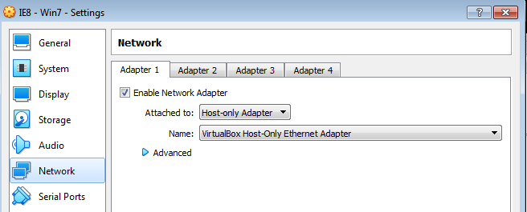
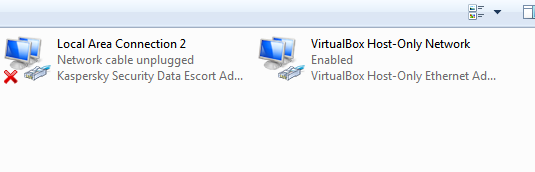
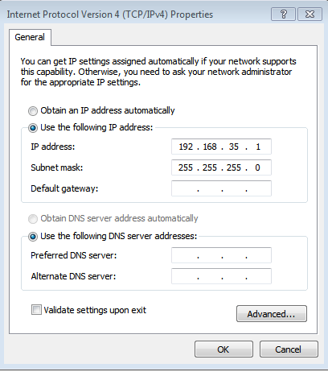
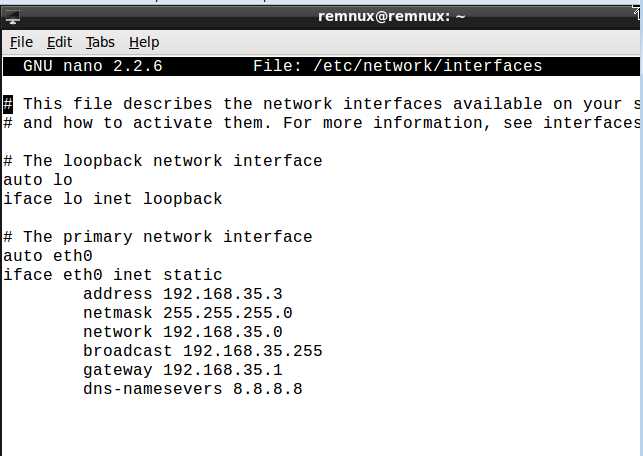
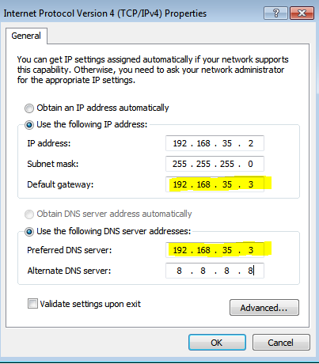
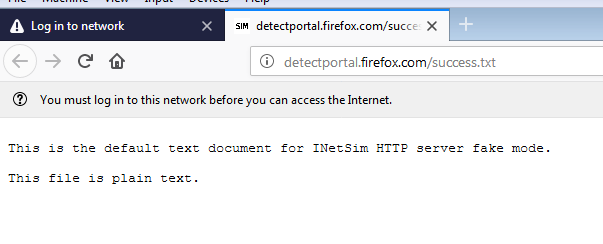

Malware analysis is tricky business . If you do not take care of how we are analyzing our malware samples then we might ended up in damaging our main workstation, even worse we may launch virus in the wild if it has an internet access.

Today i will share how to setup a lab for dynamic malware analysis.We will use win7 as our victim system and REMnux linux as a gateway for win7 pc.

**Tools And Goal**

1.  Virtualization software like VM ware , Virtual Box etc.
2.  Virtual win 7 PC .
3.  Virtual REMnux linux pc

Our aim in this set up is to configure our victim machine to connect our REMnux machine as a gateway and DNS server to capture traffic from the victim machine and fool malware’s to think that they are connecting to the real internet by simulating **inetsim** and **fakedns.**

**STEP 1: Installing OS in Vbox.**

I will use the virtual box for this set up since its opensource and easy to use we can download this setup from [https://www.virtualbox.org/wiki/Downloads](https://www.virtualbox.org/wiki/Downloads) I am considering that you already know how to install ISO files in the virtual box hence skipping this steps.we will directly jump on the configuration part.

**STEP 2: Network setup of the VM’s.**

Since we need to isolate our victim machine from an internet access we will configure it to communicate to our REMnux machine, which will act as an gateway in which we will simulate INETSIM and FAKEDNS to fool malware's as they are communicating to the internet. To achieve this we will select ***Host-only Adapter*** setting in the network tab of the virtual box control panel.

*Network configuration of Victim VM.*

Remember this configuration is same for both Win 7 and REMnux virtual machine.

**STEP 3: Host machine network configuration.**

As we choose the ***Host-only Adapter*** setting we need to configure the our host network so that our VM’s do not connect to our Host machine. As we choose the ***Host-only Adapter setting*** we will find new network configuration on our network adapters. We will find ***VirtualBox-Host-Only-ethernet Adapter***.

*Vbox adapter*

Now, we will configure this adapter setting by going ***Control Panel\\Network and Internet\\Network Connections.*** Right click on the adapter and go to properties then set the static IP. Make sure this IP should not be in the subnet range of your host IP subnet range. For my set up i have set IP 192.168.35.1

*Host machine adapter setting*

**STEP 4: REMnux machine configuration.**

First we will configure our gateway and then we are going to configure our victim machine to communicate with our REMnux machine as a gateway.Boot up our REMnux Ubuntu machine and run following commands on shell

**\# sudo nano /etc/network/interfaces**

This will open the config file for REMnux machine. In this file you will see the

**iface eth0 inet dhcp**

Now change this to

**iface eth0 inet static**

This will tell REMnux machine to use static IP rather than taking an IP from DHCP. Now configure file as shown in below image. Remember that this is my configuration change your configuration according to your environment.

*REMnux network configuration*

After this save it by pressing ctr+x and y, then reboot the machine.

**STEP 5: Victim machine configuration.**

Now boot up the WIN 7 victim machine, and go to network and sharing center of the machine. Now we need to configure it to communicate with our REMnux machine as the gateway. So in the default gateway we will put the IP of our REMnux machine i.e. 192.168.35.3 also we will set this IP as the DNS IP for the victim machine. Our REMnux machine will act as a gateway as well as DNS server for Win 7 machine.

*Victim machine configuration*

**STEP 6: Test an environment**

So its time to get our hands dirty. Lets test our environment. Go to REMnux machine and open terminal and type below command

**#inetsim**

On another terminal type this..

**#fakedns**

This will start internet simulator and fake dns server on our testing machine.To check this setup is working go to working machine and start browser to browse [www.google.com](http://www.google.com) . If all goes right you may get response like below image.

*Browser response of the victim machine*

Hurrayyyy !!!! we have successfully setup our malware analysis lab .

Happy analyzing :)
