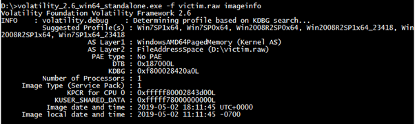
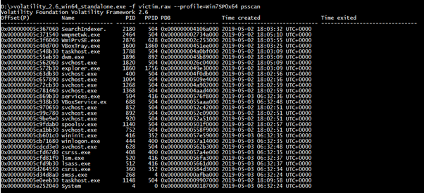
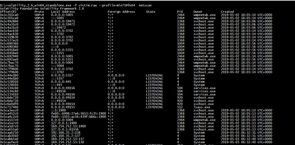
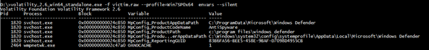

In my last [blog](https://advance-malware-analysis.blogspot.com/2019/04/emotet-file-less-malware-basic-analysis.html) I have shared some behavioural analysis of emotet malware sample, perhaps we concluded that given sample is emotet sample from one of the IOC we found in analysis. Today is will share the memory dump analysis of the same infected machine and try to find more about how actually this malware works.

**Why memory analysis?**

In real life cases we rarely find or work with live systems infected with malwares. Most of the time researcher take sample of compromised systems RAM memory to analyze further, also memory analysis is one the essential skill that malware analyst should learn. Apart from this all it’s a lots of fun XD.

**Extraction of memory dump**.

This is an obvious step in memory analysis, depending on the conditions this step could be vary. Like if you are working with main machines which are compromised or you have doubt that they are compromised you will need third party tools for extracting the memory dump or you can use some Microsoft’s in build utilities and methods to dump kernel memory described in this [article](https://support.microsoft.com/en-in/help/972110/how-to-generate-a-kernel-dump-file-or-a-complete-memory-dump-file-in-w).

There are also many tools available for this task like DumpIt.exe. I will not be going to details of this instead I will share you a method to extract a memory dump of the VBox RAM.

There are two stages of extracting RAM of VBox, first is to extract it in .elf and directly from running system and next is to convert it into .raw,.dmp or .vmem format to be able read from common analysis tools like Volatility or Mimiktaz. To extract the .elf format we will need Vboxmanage utility of VBox. It’s generally resides in the installation folder of the VBox. For me it’s in D:\\VBox\\. You can refer this [article](https://www.andreafortuna.org/2017/06/23/how-to-extract-a-ram-dump-from-a-running-virtualbox-machine/) to learn more.

***Note: You can find this memory dump on*** [***www.tryhackme.com***](http://www.tryhackme.com) ***in my room.***

***Room code : Forensics***

**Analyzing victim.raw**

**Volatility**

Volatility is an advance memory forensics open source framework. It was launched in 2007 publicly at BlackHat DC. Now its supported by the Volatility foundation. We will use this single most on the time of analysis. Its supported on all major OS platforms wiz Windows, Linux and Mac OS.

**Basic steps**

Before moving further in analysis we need to give a suitable profile name to this dump so the volatility can understand how to deal with parameters we are going to pass in future. So let the Volatility choose a great profile for her to our memory dump.

*./vol.py –f victim.raw imageinfo*

*Volatility suggesting imageinfo*

This command will suggest suitable profiles for the file, in fact it check for the OS of the dump to parse it properly and shorten the list on arguments. In our case we got this…

So it’s clear that this is a dump of the windows OS. It has also given server OS as a guess but we will stick with no-server OS. So we got a profile as Win7SP0x64. Now we are ready to dig into this machine.

**Listing all processes**

So our first step will be to check all processes which were running on the machine, there are two arguments which we can pass to Volatility for this *pslist* & *psscan.* Difference between these two parameters is that *pslist* only shows active processes whereas *psscan* shows all terminated or hidden processes also. To reduce our time and make our search efficient we will use *psscan.*

*./vol.py –f victim.raw –profile=* *Win7SP0x64 psscan*

*All processes listed by Volatility*

By looking at all processes I am only suspicious about one process, i.e. explorer.exe with PID 1860 since its PPID 1756 is nowhere in the list. I don’t know how valid this guess is but at this moment I have nothing else to be suspicious on. Next step should be looking at memory dump of our suspicious process but before this I would like to look at all active connection of this dump. There are different parameters for different OS for this task like *socket, connscann & connections* for WinXP or Win2003 for Win2007 and above we have *netscan.*

*./vol.py –f victim.raw — profile=Win7SP0x64 netscan*

*Active connections shown by Volatility*

By looking at this list of our suspicious process is increased as we can see PID 2464 is opening many unknown and malicious ports on the machine. There are another processes also 1004 but if you carefully look both processes share same PPID so I will just add one of them. One which has too many open connections i.e 2464.

As per best of my knowledge I have shortlisted two suspicious processes till now. While doing my research I come to know about one method of identifying the malicious process by checking environmental variable associated with the processes. The idea behind this is same as **DLL order hijacking**, malwares modifies the environmental variable to change the search order for known programme and try to invoke malware instead of legitimate software’s. But there is also an another purpose for which malwares uses environmental variables i.e **Coreflood presence marking.** Name given is a name of technique in which malwares associate an unique environmental variable to process in which code is injected to make sure code doesn’t get injected again. So that narrows down our search a lot only thing we need to do is to search all unique environmental variables of processes. Volatility do this for us

*./vol.py -f victim.raw — profile=Win7SP0x64 envars –-silent*

*Unique env variabls*

Boom!!! We got another suspicious process having PID 1820. Also there is our previously detected process 2464.

**DLL hunting**

As we have narrowed our search to only three PID’s its worthy to look at what kind of DLL they are loading. As I checked I found many unusual DLL’s being loaded by these processes such as *gameux.dll, RcpRtRemote.dll,* *GrooveIntlResource.dll* and so on…

Although dump of these DLL files were not detected on the VirusTotal but I am pretty sure that these DLL loading is normal. For example, PID 1820 is a process for one media player file but it is loading some strange DLL’s like *SXS.dll, ieproxy.dll, gdiplus.dll* this is suddenly not a normal behaviour.

**Some Automated Tasks**

Although we have created our list of suspicious processes from our manual efforts which is certainly a good skill to possess in arsenal, but it’s really weary work, also time consuming. To avoid all this headache, we have inbuilt utility in volatility that automates this manual work for us.

**Malfind** plugin of volatility detected the malicious processes or processes where malicious code may be injected based on multiple criteria VAD criteria. Like VADS tag and READ\_WRITE\_EXECUTE protection, these are strong indicators of the malicious processes. So we will run below command to find it

*./vol.py –f victim.raw — profile=Win7SP0x64 malfind*

And…………Again BOOM!!! We got exactly those PID’s which we are searching for.

**Conclusion:**

In this part of analysis, we learn how to extract memory dump and do Volatility kung-fu to determine the malicious processes and DLL’s both manual and automated way. In next part we will learn how to extract C2 domains and other IOC (iA).
