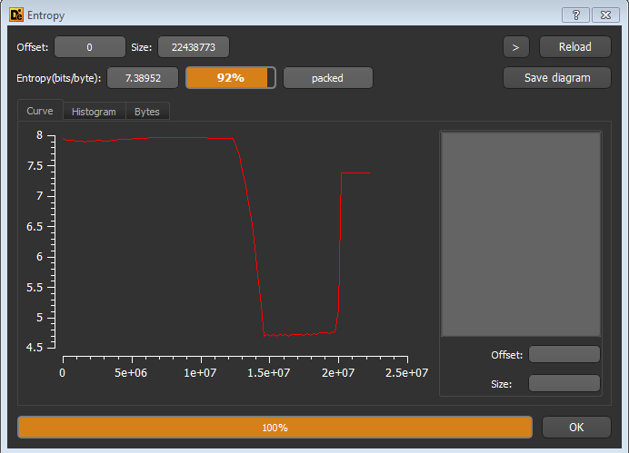
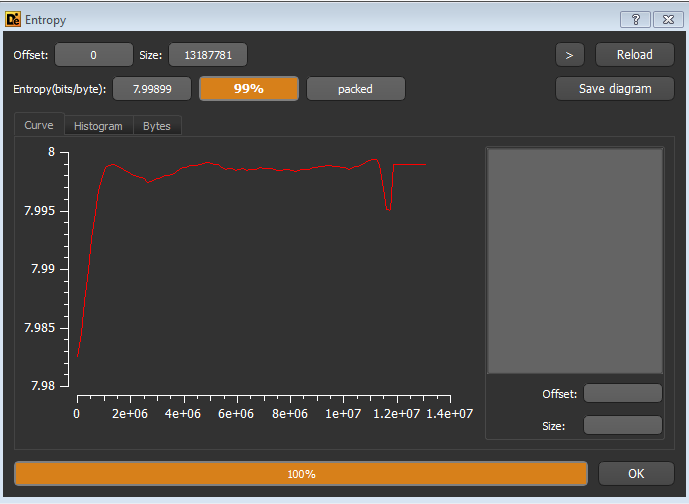

while working on *Detect it easy* or simply DIE I noticed one tab of this tool called as Entropy. This tab was simply design to show an entropy graph to an analyst, but it was just a tip of an Ice berg . Developer of this tool knew very well what does this feature means since they have another button embedded on graph page i.e save image. I found its real use after reading several articles and papers .

**What the hell *entropy* is ?**

Right before we move ahead we must know what the heck entropy is. In simple language entropy is nothing but an amount of information present in the message (In communication terminology). Entropy actually is a measure of randomness of data in the file. Beware that here we are talking about **Shannon Entropy** named after a great mathematician Shannon Claude. He was an amazing guy, anyway so technically entropy is just probability of finding data in the file.

**Okay….So, what it has to do with malwares ?**

Wow you are really thinking like an analyst . nice question. Now let us unfold a relationship between malware's and entropy. Once you know this and you become skilled enough to understand the difference between genuine and malicious file just at looking at its entropy graph it will help you to decide the methods to deploy for analysis(Given you have samples of both files to examine ). Entropy has a very clear relationship to malware's, more the entropy more is likely its obfuscated or encrypted data and more likely its to be a malicious file.

We all know that malware authors are very clever and advance now they do many things to hide malware from the sight of AV and other security software’s such as IPS & IDS. Primary techniques for this are obfuscation and encryption, once malware is encrypted its almost impossible for an AV to detect it, But at the same time since author is compressing the data as well as adding some malicious code in the original file author is decreasing the randomness of data hence increasing the entropy and here we can catch the file based on the entropy value.

**Why do we need entropy when we have IOC and other hash values ?**

Correct !!! if file is classified as the virus then it may have the hash values from which we can identify the file, but there is a catch we can only know the hash or IOC of the file which is identified, but what about the latest viruses in the wild? Entropy analysis do not only identify the threat it can prevent it well in advance by identifying and studying the entropy pattern of the malware's. Nowadays this technique is widely used in the machine learning av detection.

As an analyst point of view we can quickly check the entropy pattern and decide weather file is obfuscated or not this can save time and help us to choose the methodology to analyse the sample.

**Examples**

I am going to use to simple files to check the the entropy differences between these files before and after compression .

*Entropy of PDF file before compression*

*Entropy of PDF file after compression*

Note that entropy is increased after compression from 92% to 99%,since the randomness of data is decreased.
