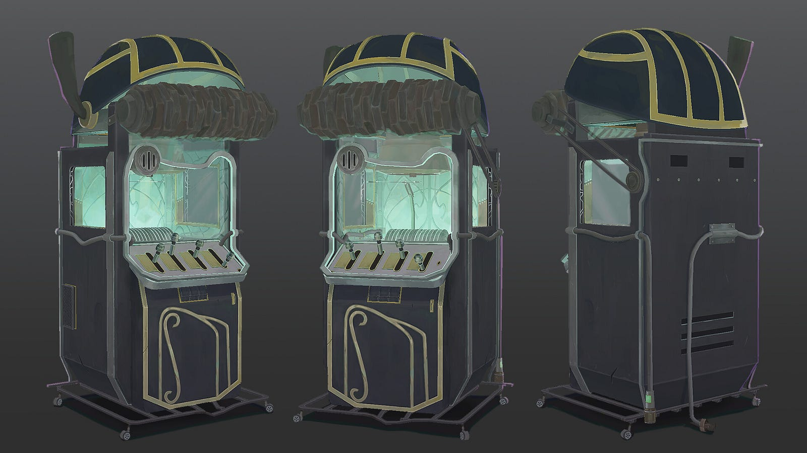

A strange individual approaches Dr. Tenma to inquire about the recent murders. He introduces himself as Inspector Lunge from the BKA. During their conversation, the detective moves his fingers in a peculiar way, as if he were typing on an invisible keyboard — and indeed, he was.

*Detective Lunge, Typing in His Mind*

That was a scene from well-know anime “Monster”, despite being one of the best anime, I was more curious about the method employed by detective Lunge than plot. While my struggle to remember the part of the book i read last night and my urge to achieve a super-power like memory came together to test this “Typist” method of remembering everything.

#### The Typist

While i was aware of a few tricks to remember the contents I read or remember the contact numbers and dates like “Loci” method, linking things together and creating a visual story. Most of these methods are not useful when it comes to recalling technical details such as file descriptors table architecture on Linux. They are either not useful at all or takes lots of efforts to create suitable image to store in mind and often slow and confusing. For example, in order to remember relationship between File descriptors, System wide file table and Inode using Loci’s method i need to create three abstract entities which are somehow connected together, of course I can add as many details as possible, but creating an image of the file descriptors is a task itself even if you already have palace in your mind to place it.

The “Typist” approach, on the other hand, is easy to understand and requires that you simply “write” the information straight into the hard drive of your brain. Even though the concept seems intriguing, I can’t trust it until I’ve given it a try.  
We must first precisely define the technique and comprehend how it operates if we are to use it to actually create a super-memory.

### The Typist Method

From my own experience, I’ve developed a personal method to simulate this “mental typewriter” inside my brain.

**Step 1: Visualize Your Storage System**

It’s the first and most important step because not visualizing vividly will prevent you from retrieving and saving files. There is no particular storage type, you can use anything you want. It can be simply a huge library where books are arranged on the shelves, and you can open and read any book and place in back where it belongs to, or it can be a simple old-fashioned file storage cabinet to sophisticated file storage in your computer. For me, it's an arcane style vinyl record player which has lots of papers in a rotating shaft. If i need to write , read or edit anything, i just imagine retrieving the paper from shaft.

*Vinyl Record Player from Arcane*

You are only limited by imagination while creating the storage “everyone has different and unique mind” so everyone will have different type of storages. The following points, you might need to keep in mind while constructing your own storage.

1.  *Keep it big and accessible:* By making it big i mean keep the storage capacity to infinite, it can be a simple box of paper which can hold any number of papers.
2.  *Keep it dynamic:* Static storage might put you on disadvantage, keep it dynamic. For example, if you are selecting Linux shell as your storage to access a file, keep bock cursor blinking on it. It will provide stimulus to your brain whenever you are doing operation.
3.  *Keep it bright:* It's hard-to-access things in dark for me, I personally prefer lighter themes whenever I visualize anything. However, it's an optional step if you are comfortable with dark themes you can keep it.

#### Step 2: Typing material

Although the original inspiration to this method types in his brain using a mnemonic device which is a typewriter, it's not necessarily needs to be a typewriter. It can be a simple terminal of your desktop where you type or vim editor in your mind. In fact, my first attempt to remember using actual typewriter like device was failed due to the fact that i was too much focus about simulating actual typewriter and not focusing on what i am typing.

So a rule of thumb is “Focus on what you type, not how you type”.

#### Step 3: Selecting pages

I am not sure which step is more curial, step 1 or this step. At the end, the heart of this method is pages where you type information. When you are typing the information in, the goal is to retrieve it at will at any given time with very minimum efforts. One question come in mind immediately, how would you distinguish between two pages? This is where “typist” method surpasses “Loci” method. In Loci method, you need to store information in the structure you know very well, which is not a challenge. However, challenges arises when you are dealing with multiple subjects such as finance, theology, mathematics, cybersecurity etc. For the indoor person like me pool of structures is limited, so I need to store different kind of information using same structure which is confusing.

In the typist method, you don’t rely on any external source. Since pages, you will be using to type in are readily available in your mind. For example, when taking notes on the book I am reading about recession, I can create a simple page which is yellow because the book cover is yellow too. Now, when I am typing the information from the book about “rootkits”, I imagine a red octopus spreading his tentacles on the top of the page. The red octopus is somehow I relate with rootkits. Now, when I want to read or recall the indicators of recession, I simply search for the yellow margin page and pick it using my automatic vinyl record player and start reading it. The same I do when I need to read about the anti-forensics methods from my rootkit page, I simply grab the page with “red octopus”.

It is very important to keep the unique identifier to each page to avoid confusion. The page can have the themes related to the subject you are storing information about. Following is guideline while selecting pages

1.  *Different page for different subject:* Create a separate page for each subject or topic.
2.  *Make a visually appealing identifier*: To identify the pages from a plethora of other pages, you need to create a unique identifier for that page which is visible when you are looking at the storage.
3.  *Use paper like pages*: Well, this might be the only mandatory point i would like you to consider. Do not use digital equivalent of pages or even if you want to use digital pages, add an ability to sketch and insert images in your notes. Using the static notes will not help in the long run.

#### Step 4: Taking Notes

After having all the essential set, we can move to the most fun part of the process. Note-taking process is very straight forward, it's simply taking the notes on the pages.

However, the effectiveness of this method depends on how notes are typed. First step is not select the appropriate pages as discussed above. Then you can use this page to type down whatever you want. While typing you need to keep following things in the mind.

1.  *Type clearly*: Do not just think you have typed information, type it as you will actually type in real world. Imagine a cursor is typing each word with correct spelling with meaningful sentence.
2.  *Use text rich format*: While typing, make sections using headlines with bigger fonts. You can add table, lists and also highlight important word using the bold or italics. I generally imagine using Markdown format highlighter to emphasize on important information in the sentence.
3.  *Use margins*: Use an entire space in the page more compact, much better. Add important information in the margin section.
4.  *Sketch and add photos*: For this step, we need to imagine our page as real paper pages where we can sketch and also and photos. For instance, while travelling i come across a very beautiful place, perfect to visit in monsoon. I wanted to note down the building names to trace it back later as I was in a moving bus. So, pulled out a page which has raining clouds on the top and pasted images of two structure with their names. Surprisingly, it wasn’t a first time I am traveling this route and my previous attempt to remember the resort name “*Lagoona*” was failed. This time I captured the name with its beautiful picture in my mind. Similarly, you can sketch arrows to connect two paragraphs or sections to point out the relationship between them. It’s very important to create a knowledge base of related information in your mind.

#### Step 5: Read Notes

The final step of this process is to revisit what you have typed. Visiting notes repeated after some intervals and trying to recall everything will make it permanently craved on your mind. Repeating is as important as writing.

### Advantages of “Typist Method”

Typist method is simple and easy for anyone to practice and improve retention. Since the method use active role of visualization, it improves the concentration on the material at the hand. The active process of typing information eliminate the possibility of false impression of remembering, which our brain like to do.

To practice this you don’t need anything except creativity and imagination, like other methods that needs external entities to be used in order to tie information to places, stories or events.

### Flaws of “Typist Methods”

Like any other method of remembering information, this method is also not flaw-less. Major flaw of the system is that practitioner does not have any aid to recall topics in sequential manner. You might miss the very important piece of information, and you will not know about it. Unless you validate your mind notes with real material.

### Perfecting “The Typist”

To overcome the flaw mentioned above, we can combine typist method with association method. Let say you have typed notes with 5 major headings, and you need to make sure you have all available whenever you open the page.

In this situation, you can associate the page with some indicator that tells you how many sections this page suppose to have. For simplicity, if i have 5 section on my rootkit page i can imagine octopus i holding number five in one of the tantacle.

Secondly we can use validation strategy to make it perfect. Do the simple excersize as follow. Create page in your mind for your todo list, also write todo on paper page. Do not use your real list instead try to read from mind page. If you are able to recall all items , congratulations!!! . If you dropped some items, try it again improve your note taking.

### Final Thoughts

The method i proposed above is just a prototype for you create your own. Every mind is different and everyone is unique. You can be creative with this method and remeber as much as possible. For me its works 90% of time, with the practice one can train mind to be an ultimate Typist.
