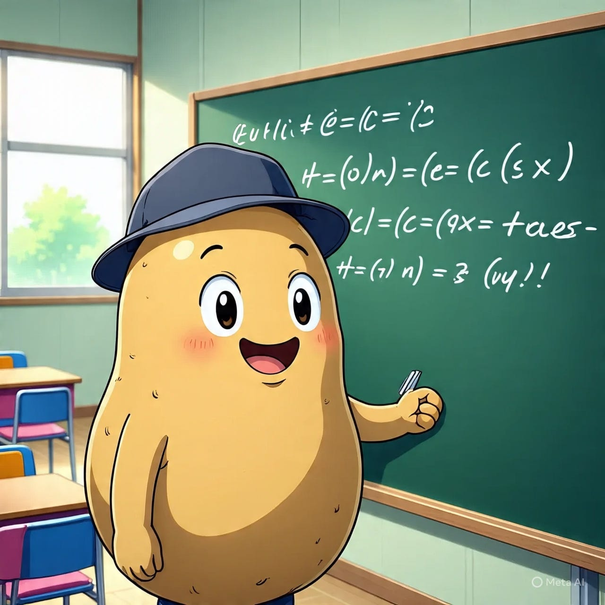
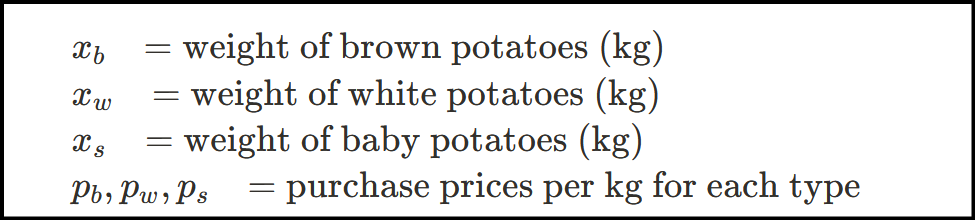
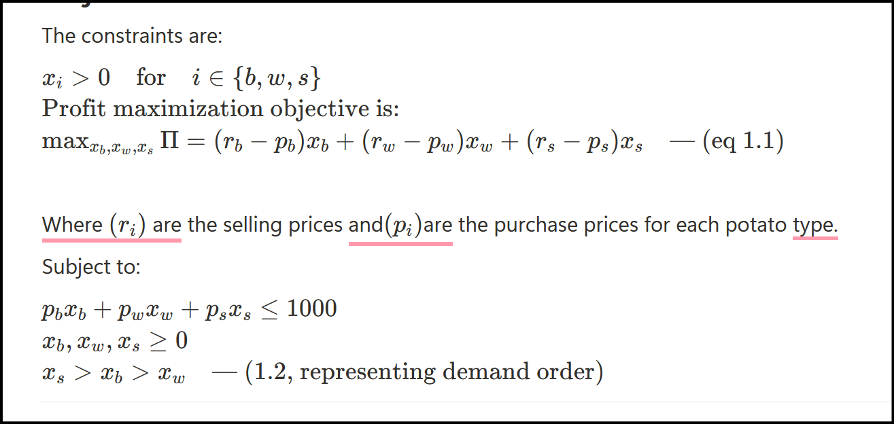
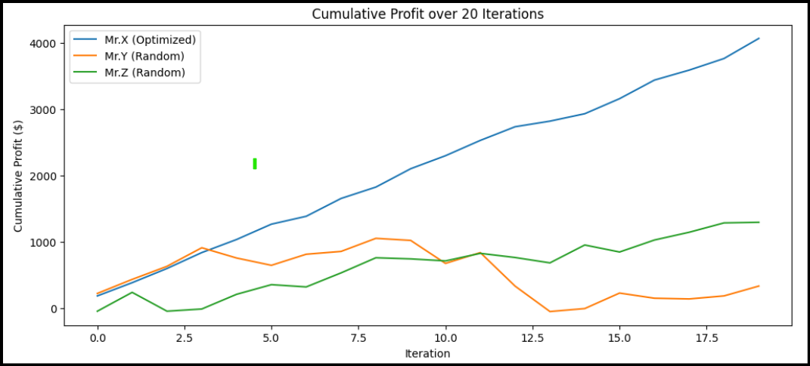
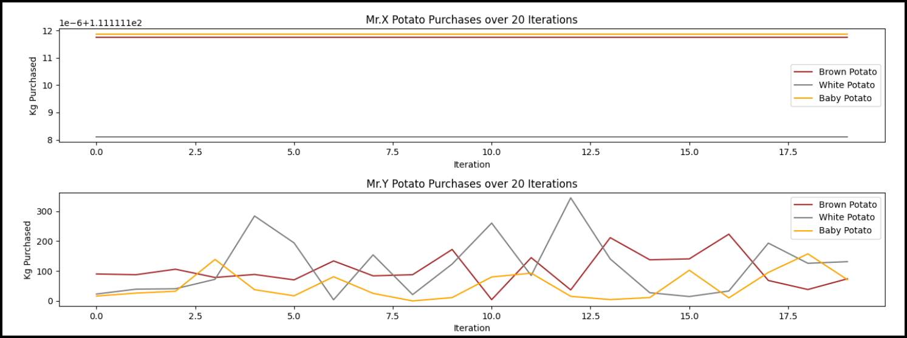

In this universe of billions of stars and planets, Mr.X is only concerned about one thing — how to increase the sale of his potatoes.

Mr.Y and Mr.Z give him a hard time using their communication skills and charm. Mr.X, an introvert, lacks the ability to engage in long dialogues, but beware — he is not without cards up his sleeve. Mr.X is a keen observer and a hobbyist mathematician.

One day, he decided to use his superpowers to surpass his competitors in the business. But how? asked Mr.X’s brain. The answer came later: *“If I can somehow transform the potato selling problem into a mathematical optimization model, I can do well in the business. At least theoretically.”*

So begins the quest to create a mathematical model for selling potatoes.

---

### Mathematical Model Components

To create a mathematical model for any problem, we need three components:

1.  Decision variable
2.  Objective function
3.  Constraints

The local population has the highest demand for baby potatoes and the least for white potatoes.

Given that Mr.X only has $1000 to buy potatoes from the farmer, he needs to find the optimal solution for the distribution of potatoes he will purchase. The aim is to maximize profit.

Potatoes are sold at the following prices per kg:

-   Brown: $5
-   White: $3
-   Baby: $5

Farmers sell potatoes at different prices per kg:

Kind Price ($/kg)

-   Brown: $3
-   White: $2
-   Baby: $4

After thinking a lot Mr.X identified that, the solution lies in the amount of potato he will purchase from the farmer’s and its kind. So the decision variable here will be weight of purchased potatoes. As demand is not uniform the purchase should also not be random. If he is able to optimize the purchase he can make more profit as others might run out of stock of high demanding kind of potato.

---

### Decision Variables

The **decision variables** are defined as:

> *Variables that decide the state of the model and can be tuned for optimal results under constraints.*



Here, the decision variables are the weights of potatoes Mr.X will purchase:

### Objective Function and Constraints

The constraints are:



---

Until the demand remains same, and Mr.X is able to purchase potatoes as per `1.1` with constraints of `1.2` he should be making profit in business.

### Simulation

To verify if our shy seller is making a profit, let’s simulate the cumulative profit of three sellers over 20 days using Python.

```python
import cvxpy as cp
import numpy as np
import random
import matplotlib.pyplot as plt
# Parameters
p_b, p_w, p_s = 3, 2, 4    # purchase prices ($/kg)
r_b, r_w, r_s = 5, 3, 5    # selling prices ($/kg)
B = 1000                   # budget
num_iterations = 20        # number of days
max_stock_b, max_stock_w, max_stock_s = 1000, 1000, 1000
```

### Optimized Purchase Model for Mr.X

```scss
def optimize_purchase():
x_b = cp.Variable(nonneg=True)
x_w = cp.Variable(nonneg=True)
x_s = cp.Variable(nonneg=True)
profit = (r_b - p_b)x_b + (r_w - p_w)x_w + (r_s - p_s)x_s
constraints = [
p_bx_b + p_wx_w + p_sx_s <= B,
x_s >= x_b,
x_b >= x_w
]
problem = cp.Problem(cp.Maximize(profit), constraints)
problem.solve()
if problem.status in ["infeasible", "unbounded"]:
return (0, 0, 0)
return (x_b.value, x_w.value, x_s.value)
```

### Random Purchase Model for Mr.Y and Mr.Z

```lua
def random_purchase():
    while True:
        x_b = random.uniform(0, max_stock_b)
        x_w = random.uniform(0, max_stock_w)
        x_s = random.uniform(0, max_stock_s)
        cost = p_b*x_b + p_w*x_w + p_s*x_s
        if cost <= B:
            return (x_b, x_w, x_s)
```

### Demand Generator

```ruby
def generate_demand():
    demand_b = random.uniform(80, 150)    # medium demand for brown
    demand_w = random.uniform(20, 80)     # low demand for white
    demand_s = random.uniform(150, 300)   # high demand for baby potato
    return (demand_b, demand_w, demand_s)
```

### Simulation Loop

```python
profits_x, profits_y, profits_z = [], [], []
purchases_x, purchases_y, purchases_z = [], [], []

for i in range(num_iterations):
    x_stock = optimize_purchase()
    y_stock = random_purchase()
    z_stock = random_purchase()
    demand = generate_demand()
    profit_x = calculate_profit(x_stock, demand)
    profit_y = calculate_profit(y_stock, demand)
    profit_z = calculate_profit(z_stock, demand)
    profits_x.append(profit_x)
    profits_y.append(profit_y)
    profits_z.append(profit_z)
    purchases_x.append(x_stock)
    purchases_y.append(y_stock)
    purchases_z.append(z_stock)
```

### Results

Below is an example of profit outcomes from 20 iterations:

```python
Iteration 1: Mr.X Profit=$182.33, Mr.Y Profit=$219.99, Mr.Z Profit=$-48.31
Iteration 2: Mr.X Profit=$199.17, Mr.Y Profit=$211.10, Mr.Z Profit=$284.31
Iteration 3: Mr.X Profit=$214.25, Mr.Y Profit=$197.47, Mr.Z Profit=$-283.76
Iteration 4: Mr.X Profit=$239.81, Mr.Y Profit=$280.10, Mr.Z Profit=$32.77
Iteration 5: Mr.X Profit=$197.06, Mr.Y Profit=$-155.20, Mr.Z Profit=$221.82
Iteration 6: Mr.X Profit=$231.34, Mr.Y Profit=$-109.87, Mr.Z Profit=$145.09
Iteration 7: Mr.X Profit=$118.62, Mr.Y Profit=$166.91, Mr.Z Profit=$-34.09
Iteration 8: Mr.X Profit=$268.70, Mr.Y Profit=$42.46, Mr.Z Profit=$211.56
Iteration 9: Mr.X Profit=$171.21, Mr.Y Profit=$197.06, Mr.Z Profit=$227.97
Iteration 10: Mr.X Profit=$276.81, Mr.Y Profit=$-31.04, Mr.Z Profit=$-16.90
Iteration 11: Mr.X Profit=$196.51, Mr.Y Profit=$-346.77, Mr.Z Profit=$-30.49
Iteration 12: Mr.X Profit=$230.38, Mr.Y Profit=$163.16, Mr.Z Profit=$113.90
Iteration 13: Mr.X Profit=$206.20, Mr.Y Profit=$-505.72, Mr.Z Profit=$-62.79
Iteration 14: Mr.X Profit=$84.15, Mr.Y Profit=$-382.62, Mr.Z Profit=$-80.69
Iteration 15: Mr.X Profit=$111.92, Mr.Y Profit=$44.58, Mr.Z Profit=$269.52
Iteration 16: Mr.X Profit=$226.83, Mr.Y Profit=$233.86, Mr.Z Profit=$-105.77
Iteration 17: Mr.X Profit=$279.99, Mr.Y Profit=$-78.04, Mr.Z Profit=$180.48
Iteration 18: Mr.X Profit=$150.55, Mr.Y Profit=$-10.69, Mr.Z Profit=$117.09
Iteration 19: Mr.X Profit=$174.95, Mr.Y Profit=$45.83, Mr.Z Profit=$141.40
Iteration 20: Mr.X Profit=$302.98, Mr.Y Profit=$148.39, Mr.Z Profit=$8.94
```

### Cumulative Profit over 20 Iterations



This graph shows the cumulative profit of the Mr.X over 20 iterations



The graphs shows the strategy of buying potatoes of Mr.X and Mr.Y.

We can see by following the model. Best purchasing strategy is to not purchase white potatoes at all.

### Conclusion

This exploration demonstrates how mathematical modeling and optimization can provide a significant competitive advantage in business decisions, even in simple scenarios like purchasing potatoes. By formulating Mr.X’s problem as a linear program with real-world constraints and demand patterns, we see that optimized purchasing strategies consistently yield positive profits over random buying behaviors.
