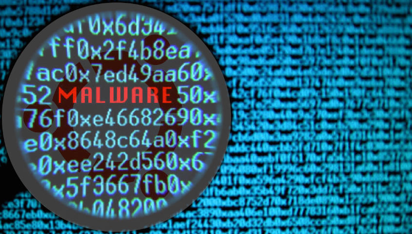

It’s been a very hot week for Malware industrie from Locker Goga to the Shadow Hammer. Let’s take a look of latest updates in the world of malwares.

### 1\. LockerGoga

Early on this week world was shook by the comprised aluminum industry firm of Norway named as NORSK HYDRO. The ransomware which compromised this firm is come to fame (defame) by the name of Locker Goga. As early and multiple analysis of the experts its clear that Locker Goga wasn’t a typical ***Wannacry*** like ransomware, rather it was a crafted and targeted ransomware.The first version has the digital certificate issued to ‘ALISA LTD’, which was revoked after the discovery of the attack. Other versions of LockerGoga were supplied with the certificates issued to Alina Ltd, Kitty’s Ltd., Mikl Limited, and AB Simba Limited.

#### \[+\]Working

During the infection process, the executable copies itself to the %TEMP% directory.Upon execution it deletes the windows logs by executing following command.

*C:\\Windows\\system32\\wevtutil.exe” cl Microsoft-Windows-WMI-Activity/Trace*

Execution then creates a ransom note and start encryption using multiple encryption processes. encrypted files are replaced with *.locked* extension.

One notable behaviour of this ransomware is that it doesn’t use windows crypto API, instead it use *cryptopp+* boost library. This may be to avoid detection. This ransomware is kind of unusual and shows many weird behaviour. Lets check some important features of the crimeware.

#### \[+\]Features

1.  **No sign of self propagation**, as per expert they have not seen any sign that this ransomware attempt to propagate through network of connect to the C2 server, rather authors starts mail conversation with victims demanding for ransom.
2.  **Changes the local user password,** apart from encrypting the files this malware also changes the local user or logged users password making non technical user completely helpless.
3.  **No obfuscation, encryption or packing** of code. Rather author is lazy enough to do this but its unusual to find malware without packing or obfuscation.
4.  **Crashes by invalid link file**, LockerGoga crashes if it find corrupted .lnk file during the execution process. LockerGoga first scan for various file and then proceed to the encryption. In this process if it encounters any corrupted .lnk file all execution stops. It’s a bug in bug ….LOL.

### 2\. Firefox 65 AV incompatible bug.

If you have updated to Firefox 65 latest release then you might have problem in accessing HTTPS traffic if any third party AV is installed in the system.

This was due to AV certificate incompatibility of the firefox latest reales, to verify the connections AV programs push their own certificates in browser to which Firefox denied and labelled all HTTPS connection as ***insecure.***

However if we enable the windows root certificate flag in the browser this issue gets resolved.Firefox revealed this bug in its own security bulletin and come with the patch in Firefox 67 latest update.

### 3.ASUS Shadow Hammer backdoor

Asus get severely damaged its reputation and users security due to ***Shadow Hammer*** backdoor distributed and masqueraded as Asus UEFI and BIOS updates. Worst thing is this backdoor was distributed on the official Asus site with legitimate digital certificate.

As per Kaspersky report more than 57,000 users of Kaspersky Lab’s products have installed the backdoored utility, but they estimate it was distributed to about 1 million people total.

After its revelation Asus immediately released the security patches.

### 4.Hacked Sites distributing Ransomwares.

Researchers at threatlabZ have discovered malicious campaigns built on the vulnerabilities of wordpress and joomla engine. They have placed the dangerous softwares in service directories to send Shade/Troldshed ransomware.

The attacks are directed to HTTPS sites with SSL certificates running Automatic certificate Management Environment(ACME) protocol.

According to analysts, over the past month, phishing activity from infected WordPress and Joomla sites accounted for about 28% of incidents, and Shade / Troldesh attacks — 14% of cases. Previously, in addition to the cryptographer, criminals actively distributed hidden crypto miners, adware, and means of forcing users to be forwarded. Primary infection occurs through [gaps in third-party products](https://threatpost.ru/2018-triples-wordpress-vulnerabilities/30480/) : plug-ins, design themes and extensions. The attackers exploited the vulnerabilities of these components in order to gain access to the /.well-known folder and place malware in it. In this directory, the attackers placed phishing pages disguised as Office 365, DHL, Bank of America, Yahoo, Gmail, and malicious work files.
