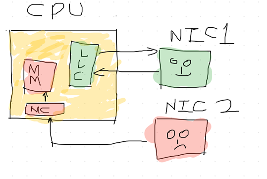
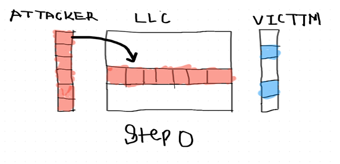
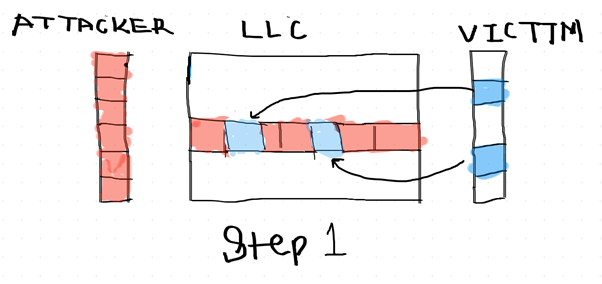
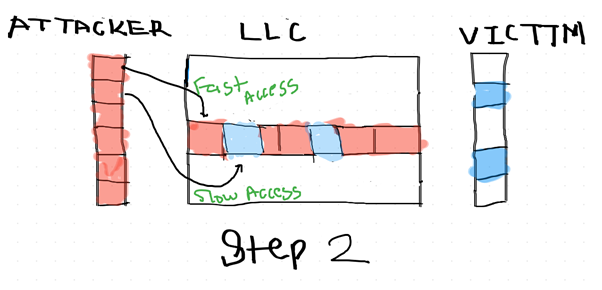
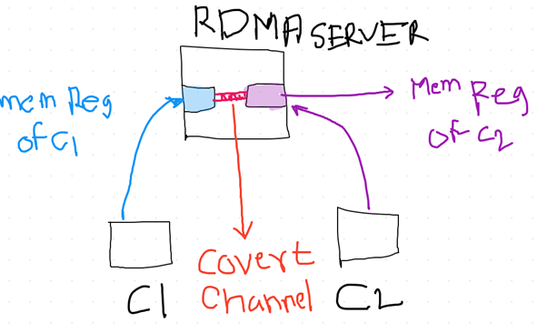
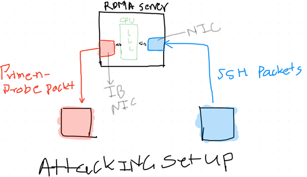

Cache attacks are one of the most formidable attacks ever developed againts any system, recent progress In this class of attacks made it even more scary. In this article we will try to understand what it actually looks like on abstarct level and what is a NetCat attack.

I would like to apperiate efforts of Vrije University Amsterdam, The Netherlands Department of Computer Science and for publishing and team awesome [paper](https://www.cs.vu.nl/~herbertb/download/papers/netcat_sp20.pdf) to demonstrate this attack .

To understand working on this attack we require to know two concepts, **DDIO** and **Prime + Probe**

Let’s start with DDIO first.

### **DDIO**

*DDIO Basic architecture*

**DDIO** stands for Data Direct I/O which is an optimization for memory access resulting in fast operation at chip level hardware. Above figure can explain this concept in helpful manner, here we have two NIC cards one of which is accessing Data using DDIO method and other one is using old method to access a data. The green NIC looks happier than Red one since he can really access data very fast through the LLC or Last Level Cache. While The red one is reading data directly through MM i.e. Main Memory and also need pass through MC which is an integrated Memory controller which makes read lot slower than DDIO method.

This explains the real working of the DDIO, in traditional architecture NIC’s used to work on DMA (Direct Memory Access) to talk directly with Main Memory which can cause the bottle neck situation once traffic rate is exceeded. (GB/s). To avoid this bottleneck situation Intel developed DDIO which allow peripherals to directly interact with memory cache (LLC). Keep this point in the mind that data access from main memory is slower that data access from LLC, this very fact will lead use develop this exploitation technique.

### **Prime + Probe**

Prime + Probe is a technique which leverage the fact that cache of that cache of the memory can be written and and later on inspect for guessing which data was accessed by another process by calculating data access time in order to leak information form CPU.

This technique mainly have three phases as described below.

**Step 0: Attacker fills the cache (Prime)**

*Attacker fills the cache (Prime)*

The prime phase is the most important and time consuming where attacker need to prime his own eviction set in to the cache memory. This step requires an extraordinary amount of efficiency and skill to reduce eviction set as much smaller as possible and as much efficient as possible, since there is a limitation to writing space in cache in order to avoid thrashing caused by I/O operations.

As figure explains attacker’s eviction set shown in red is transferred to LLC, now attacker waits victim to evict the data from this set which lead us to next step of this attack.

**Step 1: Victim evicts cache lines while encryption**

*Victim evicts cache lines while encryption*

This is step in which DDIO comes in to the picture, let’s say there is process which is process which is encrypting the password of the victim user. Let’s say password is **ABPQ** for simplicity. Now attacker who has done lots of recon on this system by implementing ***forward and backward slicing*** and other optimization techniques comes with eviction set of “ACBCXPTOHBZTFEWRLOTNVSYTOPQSHVXT” which he is successfully put in to the cache buffer. Now once the encryption is started process will look for ABPQ in cache and evict it, after completion of this process eviction set would look like “\_C\_CX\_TOHBZTFEWRLOTNVSYTOP\_SHVXT” this will complete the second phase of this attack.

**Step 2 : Attacker probes data to determine data is accessed or not**

*Attacker probes data to determine data is accessed or not*

This is now finale stage of this attack now attacker again probes its own Eviction set by keep in mind that data read form main memory is slower than data read from LLC. While probing its own eviction set its obvious that data which is evicted by the host process must be read from Main Memory hence we can jump on conclusion that this data is used by host process. Depending on this time analysis attacker can guess that which data was accessed and reconstruct at his own end ending up to leaking the secret information victim.

In example demonstrated above its oblivious that time taken to read **ABPQ** is greater than any other data set, hence attacker can easily guess password encrypted by the process.

### **NetCat Attack**

Above explained attack method is known long time as we know many infamous attacks like ***Meltdown and Spectre*** but beauty of **NetCat** is that it can be done over the network on the clients which has no physical connectivity but accessing same RDMA server by deploying the covert channel between them.

*Basic NetCat attack architecture*

As shown in the above RDMA server is serving the shared cache region. Which is accessible the network card now in above scenario we have two clients C1 and C2 which are physically separated networks that means there is no communication between them, But they are accessing same RDMA server. Now considering above scenario we can build a covert channel between these to clients to know each other’s activity. Like one let’s say becomes a sender and write a buffer on RDMA server and C2 is doing some operation on RDMA at a same time but by probing the buffer C1 can easily guess what C2 is doing its an unidirectional covert channel created by leveraging this vulnerability by using Prime and Probe method.

**Attacking set up**

*NetCat attacking set up*

Above is the attacking set up explained and used in POC of this attack by ***VUSEC*** team. The figure illustrates blue box as a victim and red box as an attacker. Victim is connected to the RDMA server on which attacker is also connected.

Now special thing here is that victim has SSH session established with RDMA server. However, RDMA server is using DDIO enabled on it which has shared resources between CPU core and NIC’s which allow attacker to read packet timing coming from victim machine. So if victim machine types anything in secure encrypted SSH session which can be reconstructed by attacker easily by deploying machine learning and effective eviction set timing analysis
