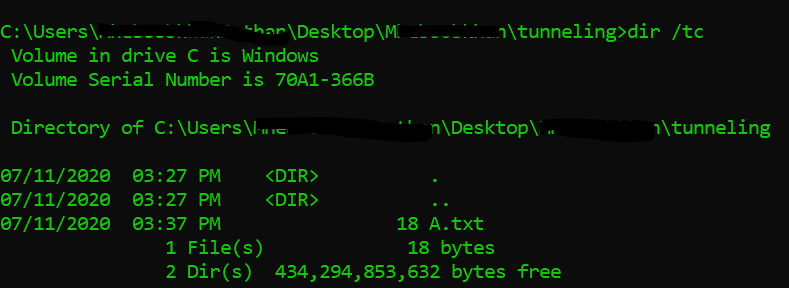
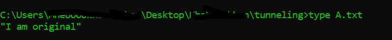
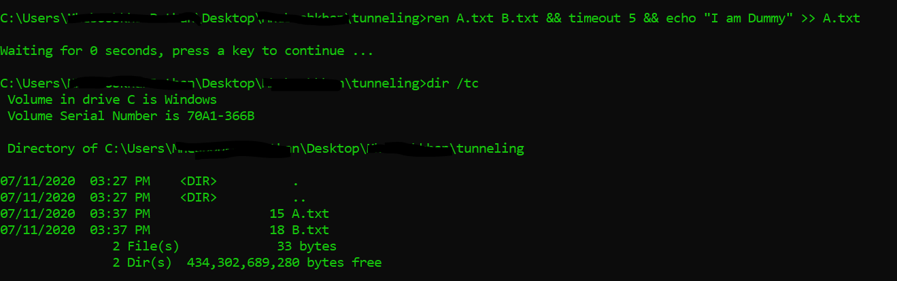
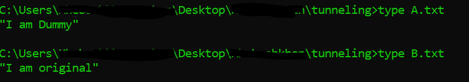

Hello, every one writing after a long time . This time i have decided to brief you all about interesting concepts of the DFIR and TH very quickly. So today we will be looking at what is File System Tunneling its demonstration

### Concept in nut shell

In windows every file has the meta data associated with it which hold some information about the file as name implies. Windows cache the metadata even after the file is deleted or rename , this cache duration is by default 15 seconds. In this period if new file is created with same name, new file will acquire the metadata of the old file.

This can be abused by an attacker by deleting the original file and replacing new files with dummy data without altering the creation date and etc .

### Demonstration

#### step1 : checking over target file

*A.txt create on 3:37*

lets check the content of the A.txt

*I am original ;)*

now we know what our original file contains

#### step2: Create new file with out modifying the creation date

Now our task is to abuse the file system tunneling and delete original file and replacing it with dummy file with dummy data and not modifying the creation the date to evade detection or making the life of forensics guy miserable. Buhahahahaha!!!

To this i will rename the A.txt with B.txt and then instruction the system to sleep for 5 seconds and then i will create new file with dummy data and same name as A.txt

*A.txt created with new data with out changing the creation time*

now lets check what B.txt and A.txt holds now

*See!!! Data is altered*

Now if attacker wants to delete file without altering the metadata its that easy for them

That’s it for today , meanwhile you can try

del A.txt && timeout 5 && echo “windows is joke” >> A.txt

:)
