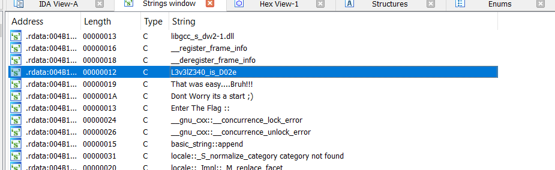
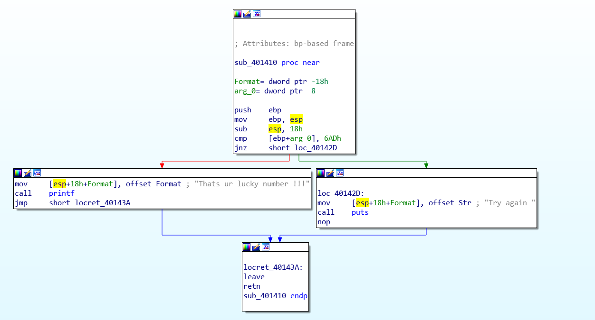
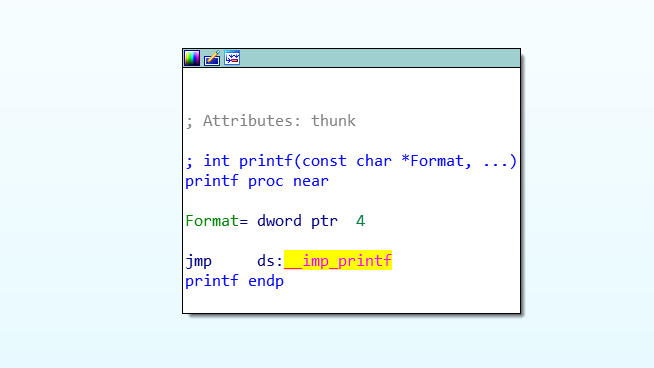
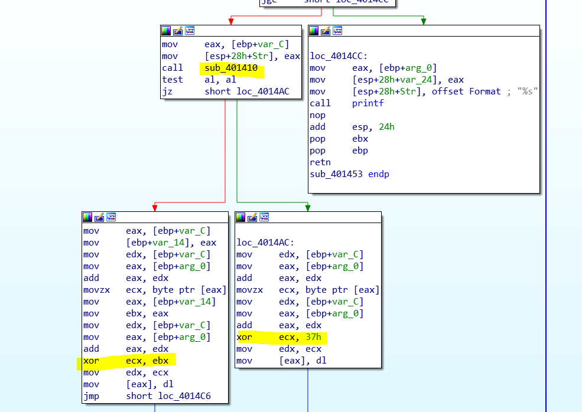
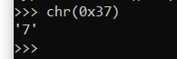
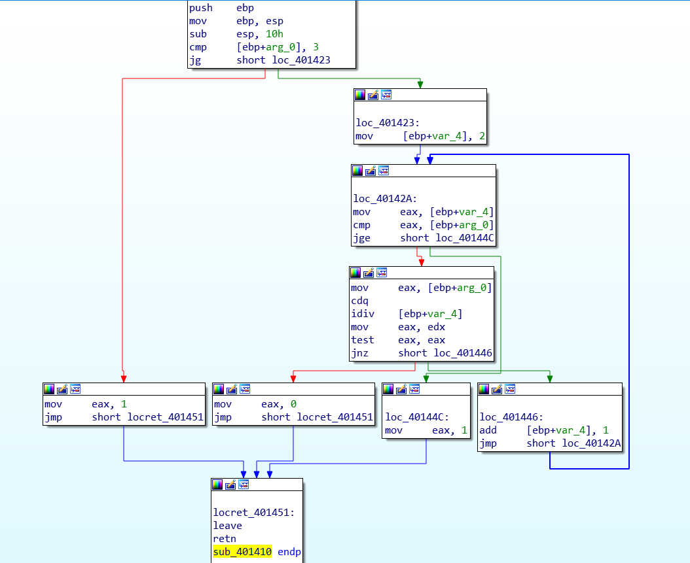
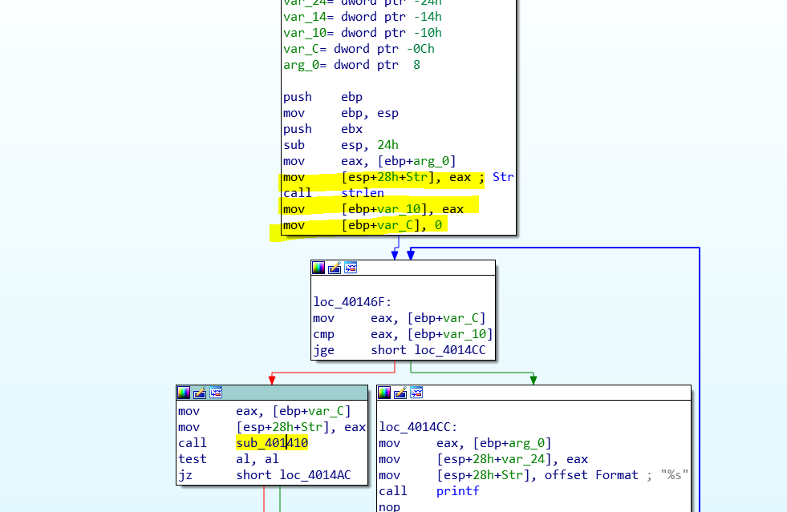

Hi Folk i have created room for zero-hero RE challenge room on THM. Currently room is hosting on 4 challenges, I will add more challenges as per the response. Bear In mind i have created this room by keeping in mind that challenge gradually increase and each binary teach something new/ one new concept of RE. There could be more that one way to solve challenges, but this is what was in my mind when i was writing this binaries.

Level 0

*L-0*

This is very easy challenge. Which aims to teach beginner how to enumerate binary and get important details. This is also important since next 3 challenges will by started from this technique only .   
So we are basically looking for password in the strings. You can use strings utility in Linux, but i used IDA. After loading Binary in IDA press Shift + f12 and you will get all strings in binary.

Level 1

*L-1*

This is stripped binary so you wont get the flag in string. Idea behind this challenge is to understand how to view binary in disassembler. So again i boost up IDA and look in to the code, But where to look ?Again string is to rescue us. Strings are very good pivot point for such challenges. After pivoting and doing some cross reference you will get below code   
   
Look at the cmp Instruction. its a comparison to 6ADh, yes thats the flag.   
I wont provide any spoiler for next 2 challenges. Please do it your self. Only look hint if require.

Level 2  
This binary is design to teach you how you can patch program to bypass authentication. you need to find a correct instruction to patch and you will get the flag. (There is one more way to solve it)

Level 3  
This is a real deal, you need to recover the password from app. Set a breakpoints at appropriate location and check registers you will get it ;)

Level 4   
This is the deal, Really i am thrilled what kind of unique ways people will come up with solution of this problem.Here is mine, This binary just provide us the encrypted string. Our task is to build the algorithm to decrypt it . Wow!!!  
But before building a crack we need to understand algorithm.   
lets fired up IDA. After checking here and there i could not found anything. Nothing at all. only option in-front of me was to look every function until something makes sense or try to find something in strings.   
I love strings, so i decided to press shift+f12 again. It was a huge disappointment for a while, only thing i can look for was function that deals with printing the string. I got printf function.

after doing xref over printf i landed in function which seems to be a the heart of this encryption algorithm.

after analyzing this function is clear that function is performing XOR encryption. Based of the result of sub\_401410. If sub\_401410 gives true as o/p then some encryption is taking place other with key for XOR is 0x37h which is 7

so i need to check what sub\_401410 is doing then i can write decryption algorithm for this binary

so look at this function , its first checking is if arg\_0 is greater than 3 or not if arg\_0 is less than 3 then its providing return as 1 i.e true . if arg\_0 > 3 then ebp+var\_2 is now equal to 2 . Now we are checking is arg\_0 is greater than or equal to 2 . If then we can see cdq instruction which is typical instruction befor idiv since this is 32 bit binary, OS converting to QWORD and then performing operation of division.   
After this we can see var\_4 is dividing value in EAX and then TEST eax is performing. In this step program is checking for reminder, if reminder is not zero then function returning EAX as 0 that is flase. Else its incrementing var\_4 by one.   
So i think this function is checking if var\_4 is prime or not.  
XOR encryption is based on the value of var\_4. which i think a counter value started at 2. Thats clear then we are checking if value is prime or not here.   
But what is this value? lets analyse previous func, press esc.

answer is here, here we can see the call to strlen function, i believe value is being stored in var\_10, and var\_c is being initialized to zero, I think its a counter.At loc\_40146F our counter is being compared with string length. so its a string length counter. if its not greater than string length then value of counter is passed to sub\_401410.  
So i am deducing that value which we are checking is index of the string character.   
Coo!!! from all above we come to know that. XOR is being done with key as index of string or value 7 , if index is prime number then index is the key else key is 7.   
from above algo we can write decryptor function as below.

> #include<iostream>  
> #include<stdio.h>  
> #include<cstring>  
> using namespace std;  
> bool Is\_prime(int k)  
> {  
>  if (k < 4)  
>  {return true;}  
>  else  
>  {for (int j = 2; j < k; j++)  
>  {if (k % j == 0)  
>  return false;  
>  }  
>  return true;  
>  }  
> }  
> void decy()  
> {  
>  char flag\[\] = “AmcmQBu^YP+\`lDV1pvY^BdR”;  
>  int key;  
>  for (int i = 0; i < strlen(flag); i++)  
>  {  
>  if (Is\_prime(i))  
>  {  
>  key = i;  
>  flag\[i\] = flag\[i\] ^ key;  
>  }  
>  else  
>  {  
>  flag\[i\] = flag\[i\] ^ ‘7’;  
>  }  
>  }  
>  printf(“%s”, flag);  
> }

> int main()  
> {  
>  decy();  
>  return 0;  
> }

so we got flag.  
Please pardon my spelling mistake in flag.
