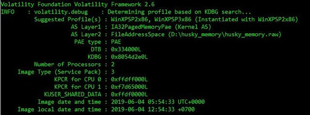
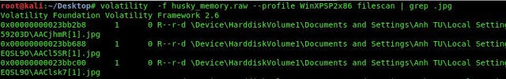
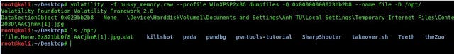
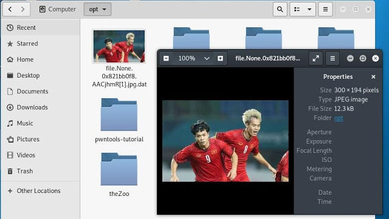

That’s gonna be short, but I think you’ll enjoy it. 😜

One of my friends stumbled upon a CTF challenge where he needed to retrieve a **.rar** file from a memory dump. After some research, I came up with the following solution:

1\. Image info from Volatility

First and most obvious step for any Volatility analysis is to check image info of the given file.

./vol.py –f <Path of File> imageinfo

### 2\. File Scan

Next, I’ll perform a **filescan** to check all file entries in the memory. For simplicity, I’ll use **grep** to filter the output for `.jpg` files—time to retrieve some funky images (hopefully, it’s not +18 content, LOL).

### 3\. Analyze the Output

Take a look at the output screen: Volatility conveniently provides the **Offset**, which reduces half of our work moving forward.

### 4\. Select the Offset

I’ve chosen the offset address `23bb688`.

### 5\. Dump the Content

In the next step, we’ll dump the content at this offset location to disk using Volatility’s **dumpfiles** utility

6\. I have dumped this file in **/opt/** folder, by checking the content of **/opt/** folder we can see a file with **.jpg.dat** extension.

7\. **Boom!!!** We got an image in the `/opt/` folder. Unfortunately, it’s not funky at all. 😅 Anyway, we accomplished our objective! 🎉

### Real CTF problem.

Although we learned how to extract or retrieve an image from memory, we noticed that it wasn’t in the proper format. In the CTF challenge, the goal was to recover a **.rar** file. The main challenge was to format it correctly. I came up with the following possible solutions to address this issue

Using “**xdd**” command

-   I dumped the `.zip` file using the above method, which resulted in a `.dat` extension.
-   Next, I converted it into a `.rar` file using the following command:
-   < <file\_name> -xxd -p -c1 | tac | xxd -p -r > file.rar

4\. The `file.rar` is now created in the folder. By executing the following command, we retrieve the `flag.txt` in the same folder, which reveals the flag.
