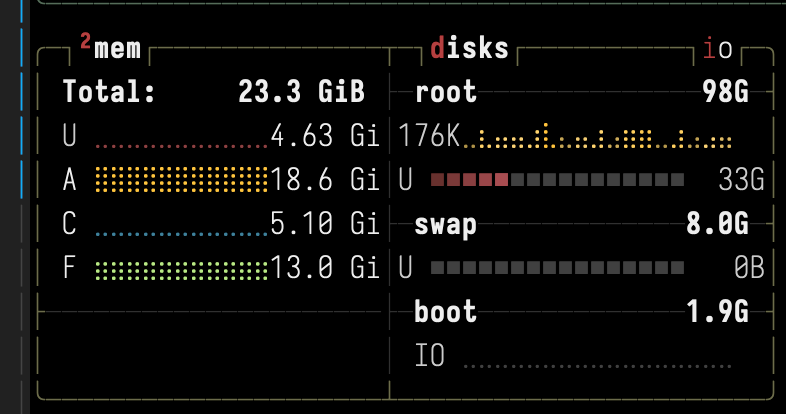
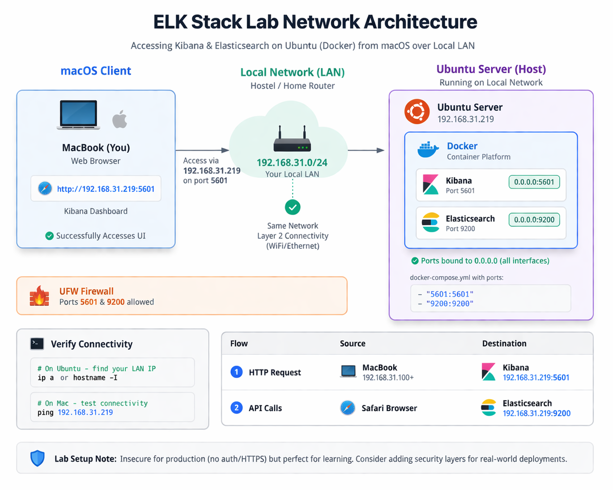
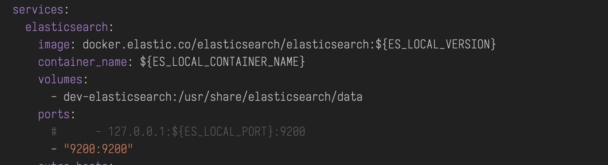
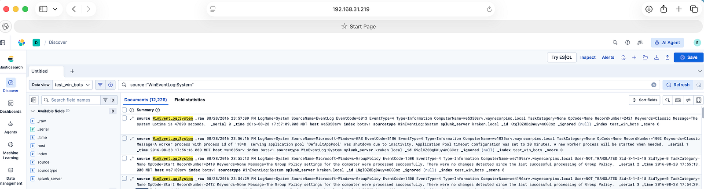

It’s been almost a decade since I started working in the cybersecurity industry, and one question I keep getting asked is:

> “How do I practice threat hunting?

It’s a very valid question.

Unlike red teamers — who have platforms like HTB, THM, and VulnHub to sharpen their skills — blue teamers often struggle to find hands-on environments to practice effectively.

While some of these platforms do offer blue team exercises, **having your own lab setup is a completely different experience**. It gives you the freedom to experiment, break things, and truly understand how systems behave.

In this short blog post, I’ll walk you through a **simple log monitoring setup** that you can use to start your journey as a SOC analyst or threat hunter.

### Components

To get started, you don’t need anything fancy.

-   A Linux or Windows machine
-   At least **16 GB RAM** (recommended)
-   At least **100 GB** free space
-   If using Windows → **WSL support is required**

In my case, I used an old laptop running Ubuntu Server, accessible over my local network and via SSH (through Tailscale).

This setup detail is optional unless you want remote access over the internet.


*Stats of my server*

Following is the architecture diagram for my setup:


*AI Generated Image of my Lab Architecture*

### Let’s Get Started

#### Installing Docker Compose

This setup uses Docker Compose to run all services, so we need it installed first.

You can follow the official documentation [here](https://docs.docker.com/compose/install/linux/]), or if you’re on Ubuntu, follow along:

1.  **Install prerequisites**

```bash
sudo apt-get update
sudo apt-get install ca-certificates curl gnupg lsb-release
```

2\. Add Docker’s official GPG key

```bash
sudo install -m 0755 -d /etc/apt/keyrings

curl -fsSL https://download.docker.com/linux/ubuntu/gpg \ | sudo gpg --dearmor -o /etc/apt/keyrings/docker.gpg

sudo chmod a+r /etc/apt/keyrings/docker.gpg
```

3\. Add Docker repository

```bash
echo "deb [arch=$(dpkg --print-architecture) \signed-by=/etc/apt/keyrings/docker.gpg] \
https://download.docker.com/linux/ubuntu \$(lsb_release -cs) stable" \
| sudo tee /etc/apt/sources.list.d/docker.list > /dev/null
```

4\. Install Docker Engine + Compose

```bash
sudo apt-get install docker-ce docker-ce-cli containerd.io docker-buildx-plugin docker-compose-plugin
```

Verify installation:

```bash
docker compose version
```

### Installing Elasticsearch and Kibana

This part is surprisingly simple.

Just run:

```bash
curl -fsSL https://elastic.co/start-local | sh
```

That’s it — your instances will be up and running.

After installation, you’ll receive:

-   Credentials
-   API key

👉 Make sure to store them securely.

> **Note:** This script is intended for local/lab use only and is not suitable for production environments.

### Accessing Your Dashboard

By default, services run inside Docker with:

-   Elasticsearch → [http://localhost:9200](http://localhost:9200)
-   Kibana -> [http://localhost](http://localhost):5601

However, to access from another device on your network, you need to expose these services.

#### Accessing Dashboard Over Local Network

By default, Docker binds services to `127.0.0.1` (localhost), making them inaccessible from other machines.

To expose them:

1.  Open your `docker-compose.yml` file
2.  Locate the `ports` section

Change:

```bash
127.0.0.1:5601:5601
```

to:

```bash
5601:5601
```


*Original Line commented out and new line added in yml file*

Do the same for port `9200`

Restart services:

```bash
docker-compose down
docker-compose up -d
```

Verify:

```bash
ss -tulnp | grep 5601
```

you should see \`0.0.0.0:5601\`

Now you can access Kibana from any device on your LAN: http://<your-server-ip>:5601


*UI Accessed From Mac Host*

### Datasets

This is setup is not meant to ingest the data from endpoints, since the that would require more complex design . It meant to work on dead data. Here are few resources i recommend to look for data to start with

-   [https://github.com/0x4D31/awesome-threat-detection?tab=readme-ov-file#dataset](https://github.com/0x4D31/awesome-threat-detection?tab=readme-ov-file#dataset)
-   [https://github.com/OTRF/Security-Datasets.git](https://github.com/OTRF/Security-Datasets.git)
-   [https://www.secrepo.com/](https://www.secrepo.com/)
-   [https://github.com/sbousseaden/EVTX-ATTACK-SAMPLES](https://github.com/sbousseaden/EVTX-ATTACK-SAMPLES)
-   [https://log-sharing.dreamhosters.com/](https://log-sharing.dreamhosters.com/)
-   [https://github.com/splunk/attack\_data](https://github.com/splunk/attack_data)

### Summary

In this post, we built a simple yet practical **threat hunting home lab** using **Elasticsearch** and **Kibana**, powered by Docker.

We started by understanding the gap in hands-on practice for blue teamers and then moved on to setting up a minimal environment that allows you to explore and analyze logs in a controlled setup.

By exposing the services over the local network, we made the lab more flexible — allowing access from multiple devices, which is closer to how real-world environments are accessed and monitored.
