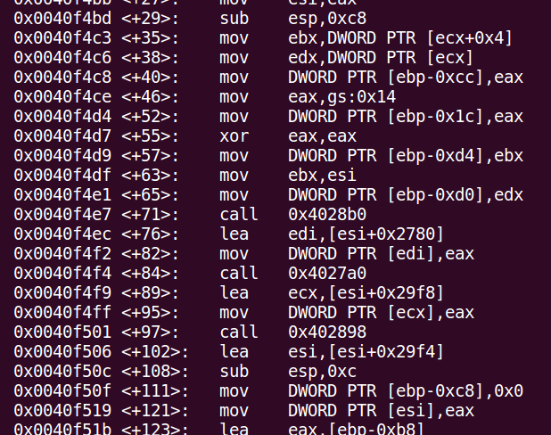
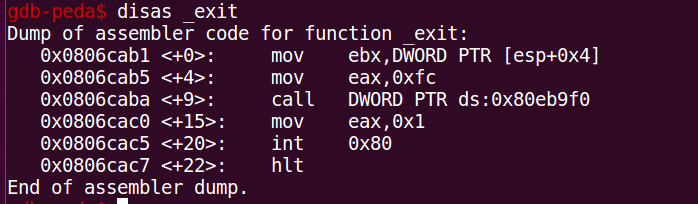
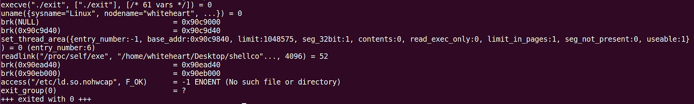
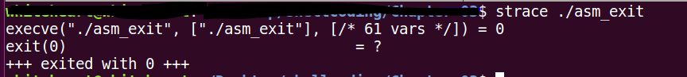
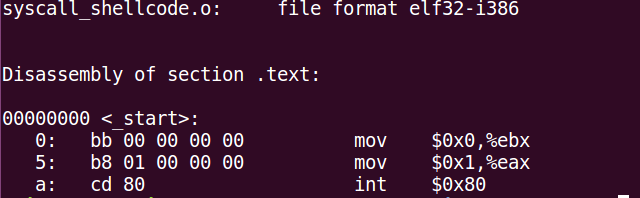

*Header Image*

Shellcoding or simply exploit writing depends heavily the on syscall or system call for their success. OS architecture is designed in such way that it mainly divided in to two section firstly as User Mode and Second one is \[Protected\] kernel mode.

Normal user is forbidden to talk to kernel directly, and here syscall comes in to the picture. Since user can not talk directly to the kernel, user mode programs are depended on the syscall to talk with kernel hence, we as an attacker/hacker/shellcoder/purple rabbits need to know about syscalls and how one can utilize them in hacking and where not to use syscall. In this small article i will tell you about basic shellcode writing for making syscall to kernel and major difference between windows syscall and Linux syscalls

#### Why writing the shellcode to use syscall directly in windows is bad practice ?

There are mainly two reasons for above question. In windows and Linux *syscall numbers* are utilized when the calling the syscall, these *syscall numbers* are nothing but *an index into array which contains pointers to the function.* This indices are not common in windows different versions. Where as they are rock solid constant in Linux OS.

Another problem with windows is that, windows does not support socket API via syscall interface. Which made it impossible to write remote exploit for windows by calling syscalls directly.

This is why we will focus on the Linux syscalls hence forth in this blog.

#### How we can perform syscall?

There are two main methods to do syscall in OS, firstly is directly writing an assembly while manipulating appropriate registers to execute syscall and secondly using libc wrappers of C to do syscall.

#### How syscall is executed?

Syscall execution in Linux is goes through mainly five stages as listed below (Wear mask please….)

1.  Syscall number is saved in EAX register .
2.  Arguments to the syscall are saved in other registers (Syscall can not have more that 6 arguments, if there are they need to be fed as data structure of first argument).
3.  int 0x80 is getting executed.
4.  OS switches from user mode to kernel mode
5.  And at last our syscall is executed.

#### How to write shellcode for simple syscall program ?

Lets check above steps by writing simple syscall program in C.

> int main ()  
> {exit(0);}

Note: while compiling above program with -static switch to retain the syscall while compiling.

above program do nothing but call exit syscall in Linux and exit lets check its assembly and verify above steps

*Assembly Of Exit function Syscall*

So here we can see that 0xfc is loaded in to EAX which is the syscall number for group exit function and then at line +15 we have our exit function loading in to the EAX and finally a call to INT 0x80.

so far so good but there but above program is calling group exit instead of exit function and we can check that using **strace**

*Group exit is utilized instead of exit*

let us go on some primitive way of writing this program and extract the shell code from assembly directly.

as we know how our syscall is executed we can write a simple assembly for it as below.

> MOV EBX,0  
>  MOV EAX,1  
>  int 0x80

so its simple isn’t it ? we are simple storing the argument in EBX register and then moving the identifier for our syscall in EAX and calling int 0x80

lets compile this using **nasm** and **ld** and save it as asm\_exit

*strace of asm_exit*

so here we can see our exit function syscall here.

#### Extracting shellcode

so lets get the shellcode using **objdump** from object file.

from above output we get this **“\\xbb\\x00\\x00\\x00\\x00\\xb8\\x01\\x00\\x00\\x00\\xcd\\x80” .**

### conclusion

In this article we saw the difference between windows and Linux syscall and why windows syscall can not be called directly . We also wrote simple ptogram to analyze the execution of the syscall in linux using strace and other tools.
