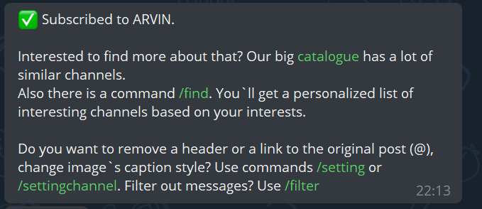
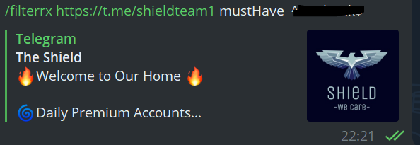
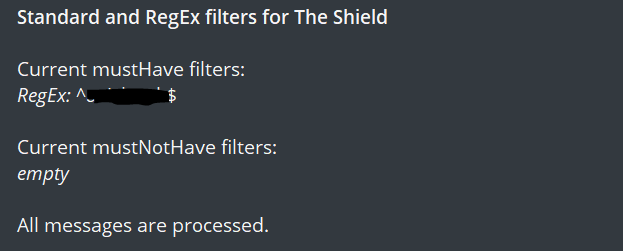

One of the aspects of threat hunting is to look for data breaches and leaks that happen on the dark web. Good threat hunter keeps looking for such leaks for clients it supports.

There are many ways to look for data leaks via darknet monitoring, but it’s very tedious to keep track of all leaks. To solve this problem we need an alert or some mechanism that provides us alert(in the form of the message) only when breach news contains a specific word. A telegram is an excellent place for such news. let’s see how we can create a channel that will provide us an alert(kind of) only when a specific name or word is contained in the message.

### pre-requisite

To implement this alert system only pre-requisite is a list of data breach leak posting channels of telegram. Which you can find [here](https://github.com/fastfire/deepdarkCTI/blob/main/telegram.md).

### WorkFlow

We will achieve our goal in 3 steps

1.  Get the link or channel name of dark web channels. (Which we have already done)
2.  Forward messages from these channels to our channel.
3.  Setting up the filter to receive only specific messages.

As we already have the list of channels now the only thing we need to set up is our channel which will receive messages and only deliver specific messages to us.

We can do this by using a special telegram bot called a [junction bot](https://t.me/junction_bot?start=docs-main). This bot basically subscribes to the various channels and relays the messages to our channel. This bot can also forward the messages to the other channels too. Forward functionality is available under the paid account, for our purpose we don’t need it.

To subscribe to the channel in this bot we just need to send the link or channel name to the bot, in the free version we can subscribe up to 7 feeds. Successful subscription is shown with the below message.

Now we need to set up the filters to receive the specific messages only. This bot provides multiple options for filtering like *mustHave, mustnotHave* . We need to specify the filter in the following syntax */filter <channel\_name> mustHave/mustnotHave <Keyword>*

The filter also supports the RegEx for switch */filterrx*

Let set up the filter for only receiving the messages which contain specific names. I have set up a filter with the client’s name which I support.

If everything goes well we get the message our filter is successfully set.

Happy hunting!!!
