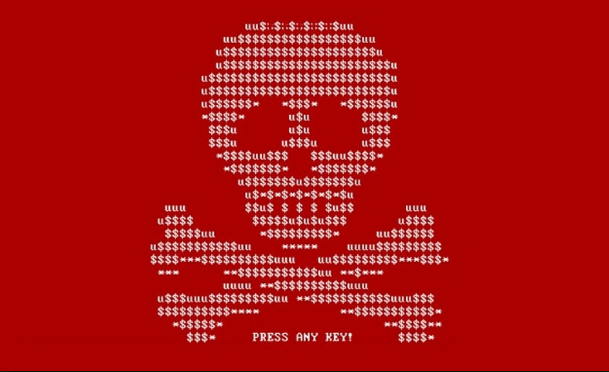
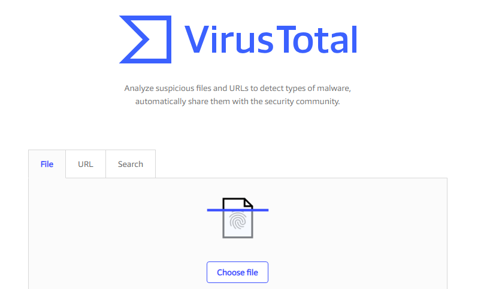
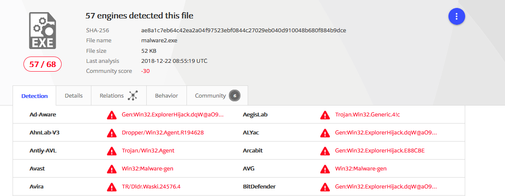
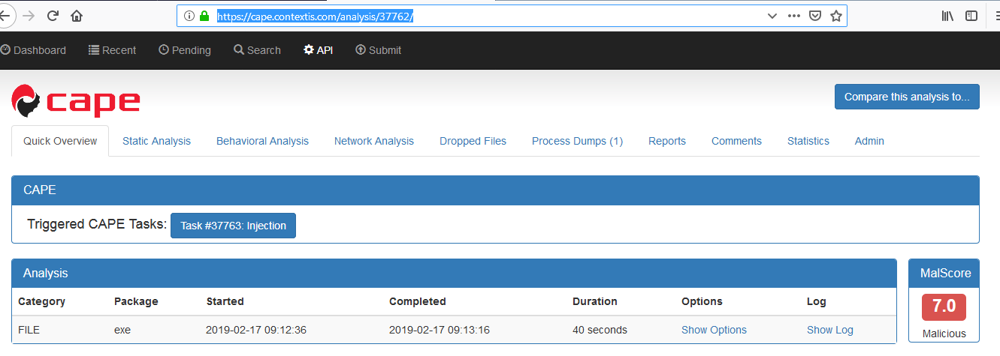

If you are not security professional and no idea what malware's can do to you and how you can tell if the file is malicious or not this is an article for you. You may have an AV solution installed in your machine but there may be situation when don’t have an AV in your machine and you are suspicious about an attachment you recently got through an email or in worst case your AV is not capable to detect file may be because signature pattern are not update or any other reasons. To know how to classify file into malicious or good category is skill everyone should know. Following are the top 10 ways to determine it by your own without help of an any third party application. So lets go !!!

#**Number 1: Virus Total**

Who don’t know about virus total? who? Its an open source platform which cross check your file and do some automated analysis to determine weather file is good or malicious. Its simple and easy just visit [https://www.virustotal.com/#/home/upload](https://www.virustotal.com/#/home/upload) and upload your file and wait.

*Virus Total file uploading portal*

After analyzing the file virus total show the result , we can quickly know about the status of the file. Following is the result of malicious file i have uploaded on portal

*Malicious file result on Virus Total*

Its good idea to check any file before you download or open on virus total if you are in doubt.

**#Number 2: Sandboxing**

Sandboxing is an quick and easy approach to check the internal working of a malware. Many organisation today have there own sanboxing solution but if your not fortunate enough then don’t be sad. There are many open source sandboxing services which do it for you free. Like Anibus , anyrun , Cuckoo sandboxing . You can find more list here [**https://zeltser.com/automated-malware-analysis/**](https://zeltser.com/automated-malware-analysis/)

For me i am using CAPE sandbox services its again easy like a virus total you just need to visit [**https://cape.contextis.com**](https://cape.contextis.com/analysis/37762/) and click on analysis followed by uploading your file. After an analysis complete you will have your case ID , after clicking on the ID you will be redirected to the result section when you can see result of your file. It will look like this if file is malicious .

*CAPE sandbox result of malicious file*

**#Number 3: HASH Value check**

Another way to check your file is to compare the hash values of two file. It may be possible that software or file you are downloading come from the legitimate site but in between if some has changed the code of the file then hash value will also change , so by quickly comparing it with original file hash value you can detect a tampering.

For widows system there is an awesome utility in command line called as ***certutil*** wich can be use to determine hash values.

**certutil -hashfile <file path> <Hash algoritham>**

You may get any hash you may wish by putting right algorithm.

**#Number 4: Unusual Desktop behavior**

If your system is already compromise then first visual signs can be found on your desktop environment. There was a rootkit virus recently discovered has a very specific behavior in the desktop environment, infected users has a small black dot on left of their screen. That dot was nothing but a command prompt, and scripts were running in it to download additional payloads. following could be an indications that your system may be infected by malware’s.

1.  Multiple shortcut creation on desktop
2.  Sudden blink of command prompt or powershell after reboot or once connected to network.
3.  Some unusual icons.
4.  Delay in your typing response (may be an indicator of key-logger)

**#Number 5: Processes, Registries And Netstat**

Once malware is installed in the system first thing it attempts to start its process and hide it under name of legitimate windows process by technique called ***Process replacement .***Many process with same name can be sign of the virus infection. It take little bit more to tell which process is genuine and which is not. There is a tool written by *mark russinovich* called as Process explorer, you can download it from [***https://docs.microsoft.com/en-us/sysinternals/downloads/process-explorer***](https://docs.microsoft.com/en-us/sysinternals/downloads/process-explorer) is very helpful in analysis of process. There are many criteria’s on which we can check the process is malicious or legitimate, for example CPU utilization. A typical Cryptominer will utilize your CPU to its limit if you notice that your CPU is utilization is too high abnormally it could be a sign that there is a cryptominer in your browser cookie or installed on your system.

Checking registry values can be give clue about file being malicious many virus put the file in auto run section of registry to trigger the virus once system is up.

Netstat is a windows utility use for checking network status along with open or listening port . One of the behavior of malware is to connect back to C2 server to download a payloads . You can try command ***netstat -anb*** which will show you open ports and destination IP’s along with which file is resposible for a connection.If your suspected file or software is connecting some unknown IP then this could be a sign of danger .
