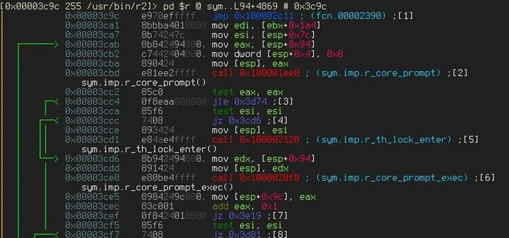

*TOP Linux utilities for Reverse Engineering*

Forensics and reverse engineering all is about learning how the code works.To understand the inner workings of the code we first should know, “How to know”. Well to do this we need tools to understand and analyze these binaries. Here is a list of basic Linux utilities every reverse engineer should be aware of, I have only listed utilities which are present in the Linux kernel.

### 0x00 file

File is an inbuilt utility of Linux which tell us about the type of binary provided as an argument. Best part of this utility is that it doesn’t make a decision based on an extension of binary rather it check the header of the file to make decisions as mentioned in man [documentation](https://linux.die.net/man/1/file) of this command.

*“The filesystem tests are based on examining the return from a* [*stat*](https://linux.die.net/man/2/stat)*(2) system call. The program checks to see if the file is empty, or if it’s some sort of special file. Any known file types appropriate to the system you are running on (sockets, symbolic links, or named pipes (FIFOs) on those systems that implement them) are intuited if they are defined in the system header file* “

### 0x01 xxd

xxd another utility which used to convert the file or any other standard input to its hexadecimal dump and vice versa.this utility is worth of mastering due to its wide range of functionality. Especially in the scenario where we need to read hex values of binary without tampering it.

### 0x02 strings

Strings are good reconnaissance tool for any binary as the name suggests it provides an any plain text strings in .text and other sections, of at least 4 characters long (This is default behavior that can be changed by -n parameter). This utility support variety of arguments which you can check with its man pages. One of my favorites is -e or — encoding which Select the character encoding of the strings that are to be found.Its always a good idea to look into the strings of binary before analyzing it, this can narrow down the effort areas your looking for.

### 0x03 dd (Disk Destruction)

Whoaaa!!! Why do we need to destroy a disk? No we aren’t destroying anything but this utility is fabulous when you want to extract a file inside the file.I mean if there is a stenographic image you have provided and you come to know that there is an elf file inside it not you need to extract it how you are gonna do it? Answer id “dd” (You can also use the binwalk to do that for you automatically, but you cant rely on third party tool always) it’s a simple all you need to know is offset how where the header of elf file is starting and size of the file, Once we have this information we can extract this as below

$ dd skip <Number of bytes where elf header starting -1> <size of file> -if

<inputfile> -of <outputfile> -bs=1

Note: Use this utility with caution it can damage original file permanently.

### 0x04 objdump

This tool dumps information about object files like headers, sections and even reallocation information about binary . objdump provides the plethora of information about binary it depends on the user how to utilize it for her objective. This tool is worth of some practice and understanding its output.

### 0x05 nm

When you are dealing with un stripped binaries there might be a chance of the mangled function name resolution. Mangled functions are just a name of the functions given by the linker to the two same named functions for identifying which function is to call without conflicting.Only problem is that this information is not revealed if the binary is stripped. Well, as we aret alking about unstripped binaries we can use nm utility to list symbols in binary — demangled Decode(demangle) low-level symbol names into user-level names.This info can drastically help to understand the code working.

### 0x06 readelf

One of the questions which bugs to beginners is that “why we need objdump and readelf,since both do the same thing?” the answer is simple “No, they ain’t same”. OK they explain how? The reason behind it that how these two tools sees binary, objdump look at binary with perspective of BFD ([Binary File Descriptor Library](https://en.wikipedia.org/wiki/Binary_File_Descriptor_library))whereas readelf looks at the binary in its own way independent of the BFD, hence this tool provides a way to verify working of the BFD itself. Also readelf can provide more detailed analysis of the elf file that the objdump. Like [DWARF](https://en.wikipedia.org/wiki/DWARF) debugging information. There is an unwritten rule is that if you are dealing with PE file format use objdump, if you are dealing with elf file format use readelf.

### 0x07 ldd

ldd utility provides the shared library details of the binary. It prints all shared libraries required to run the program or specified in the command line.ldd has some security issue while using it we might need to keep in mind as described in man pages as follow “In the usual case, ldd invokes the standard dynamic linker with the LD\_TRACE\_LOADED\_OBJECTS environment variable set to 1, which causes the linker to display the library dependencies. Be aware, however, that in some circumstances, some versions of ldd may attempt to obtain the dependency information by directly executing the program. Thus, you should never employ ldd on an untrusted executable, since this may result in the execution of arbitrary code. A safer alternative when dealing with untrusted executables is: $ objdump -p /path/to/program | grep NEEDED”

But if you are sure that binary is trusted you can use this utility for saving little time.
