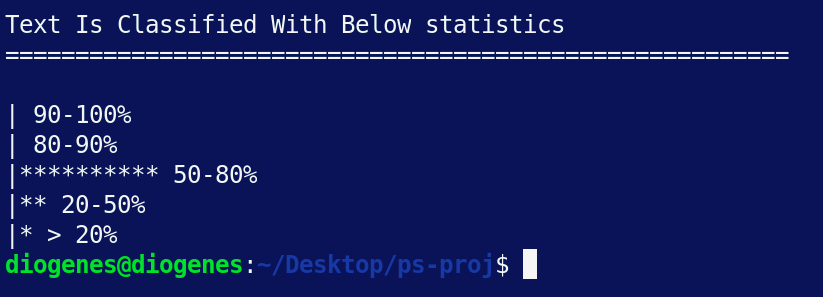
*Title Image*

Text classification or analysis is a rapidly growing field in the IT world, with Cyber Security being no exception, especially in Threat Hunting. Understanding the infrastructure and log sources is crucial before beginning the hunting process.

As part of understanding data and log sources, we need to perform base-lining. While this could be done through manual analysis by the hunter, leveraging the power of text classification algorithms allows us to automate this process efficiently.

### Why PowerShell?

One might wonder why I’m using PowerShell when there are many other tools better suited for this task, with support from a vast collection of specialized libraries. The short answer is that PowerShell is ubiquitous.

The long answer is that many organizations have strict policies against installing third-party software, and some don’t allow hunters to take data out of their network for analysis. In such situations, one might not have access to Python but will always have PowerShell at their disposal.

### Main Idea

The main idea behind this exercise is to feed the data to the algorithm and the algorithm should classify the text into 5 groups. Group\_0, Group\_A, Group\_B, Group\_C, and Group\_U. The below table provides the details about what these groups are.

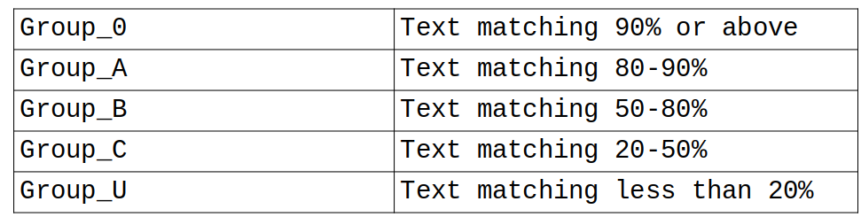
*Text Classification Groups*

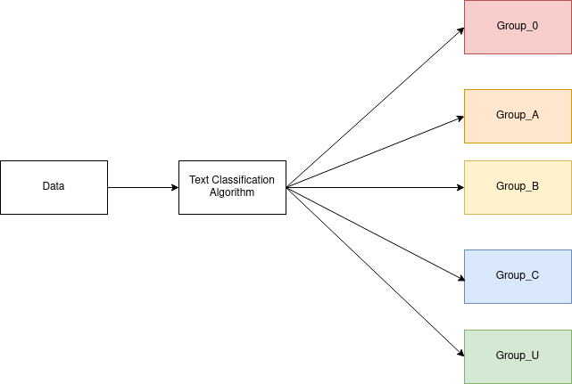
*Main Idea workflow*

### Mathematical Model

To implement the above idea, we need a mathematical model to classify the text. In this article, we will use NLP’s cosine similarity model. The author of this [blog](https://towardsdatascience.com/nlp-text-similarity-how-it-works-and-the-math-behind-it-a0fb90a05095) has explained this model very well.

To save time, I’ll skip some parts and move on to the workflow for our algorithm.

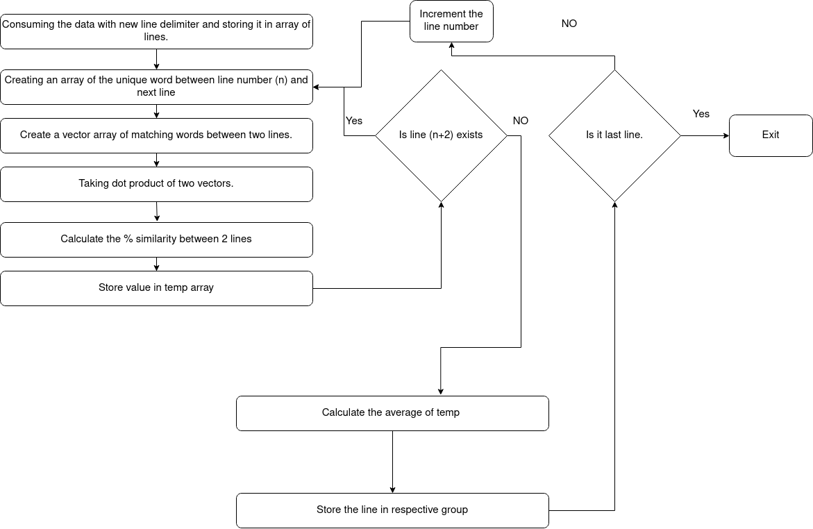
*Work Flow*

so let's write the code for the above workflow

**Consuming the data with a new line delimiter and storing it in an array of lines.**

It’s quite easy in PowerShell

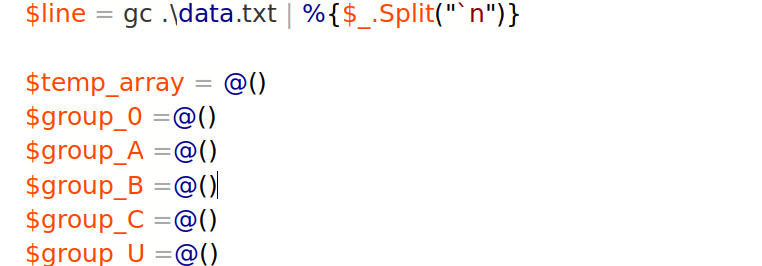

Here I am storing an array of the lines in $line array, also I am defining arrays as per our base idea. In the end, we will have these arrays populated with similar text.

**Creating an array of the unique words between line number (n) and next line**

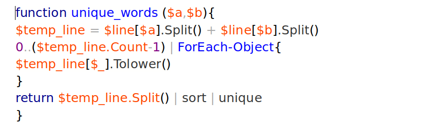

This is a simple function that concatenating the line (n) and line (n+1). Then returning the unique words from both the lines

for this exercise we are using below dummy data with only 13 lines.

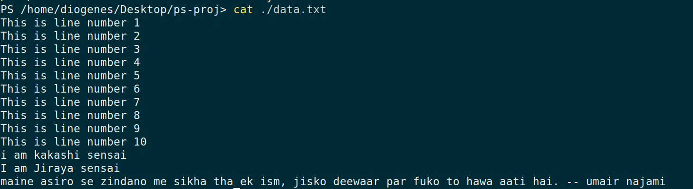

As you can see, there are 10 lines similar to each other that constitute the majority of the data. However, there are also 2 similar lines in the minority and one unique line at the end.

We can access the lines from $line as follows:

Now, since we can access lines we can also access the words of each line like this.

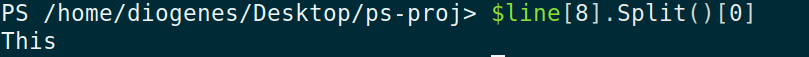

When we call the unique\_words function for line 1 and line 2, we get output like this:

`**1,2,is,line,number,This**`

These are the unique words from each line.

**Create a vector array of matching words between two lines.**

Now, this is the tricky part. We need to create an array of vectors such that when we have a matching word from the “unique\_word” array, the value of the vector is 1; otherwise, it’s 0.

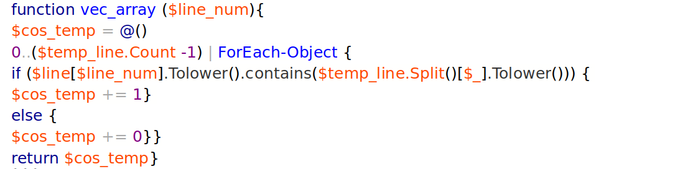

Here, I am calculating an array for each line we need to compare. Notice I’ve used the .contains() method instead of the .equal() method. One might argue that this selection is erroneous — and they’d be right.

Consider the following case: we’re checking for the word “word” in a line, and that line happens to contain the word “s**word**”. The vector will be 1 instead of 0. However, this is acceptable for our purposes, as we’re not aiming for an exact, rigid mechanism to check words.

Additionally, I’ve converted all text to lowercase. This approach yielded better detection results compared to when I was considering the case of words.

Let’s see what is output for our line 1 and 2 for this vector

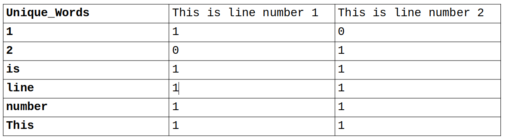

### Unsupervised Text Classification in Powershell :Part 1

Text classification or analysis is a rapidly growing field in the IT world, with Cyber Security being no exception, especially in Threat Hunting. Understanding the infrastructure and log sources is crucial before beginning the hunting process.

As part of understanding data and log sources, we need to perform base-lining. While this could be done through manual analysis by the hunter, leveraging the power of text classification algorithms allows us to automate this process efficiently.

### Why PowerShell?

One might wonder why I’m using PowerShell when there are many other tools better suited for this task, with support from a vast collection of specialized libraries. The short answer is that PowerShell is ubiquitous. The long answer is that many organizations have strict policies against installing third-party software, and some don’t allow hunters to take data out of their network for analysis. In such situations, one might not have access to Python but will always have PowerShell at their disposal.

### Main Idea

The main idea behind this exercise is to feed the data to the algorithm and the algorithm should classify the text into 5 groups. Group\_0, Group\_A, Group\_B, Group\_C, and Group\_U. The below table provides the details about what these groups are.

Text Classification Groups

Idea Workflow

### Mathematical Model

To implement the above idea, we need a mathematical model to classify the text. In this article, we will use NLP’s cosine similarity model. The author of this [blog](https://towardsdatascience.com/nlp-text-similarity-how-it-works-and-the-math-behind-it-a0fb90a05095) has explained this model very well.

To save time, I’ll skip some parts and move on to the workflow for our algorithm.

Algorithm

so let’s write the code for the above workflow

**Consuming the data with a new line delimiter and storing it in an array of lines.**

It’s quite easy in PowerShell

Here I am storing an array of the lines in $line array, also I am defining arrays as per our base idea. In the end, we will have these arrays populated with similar text.

**Creating an array of the unique words between line number (n) and next line**

This is a simple function that concatenates line (n) and line (n+1), then returns the unique words from both lines. For this exercise, we are using dummy data with only 13 lines, as shown below.

As you can see, there are 10 lines similar to each other that constitute the majority of the data. However, there are also 2 similar lines in the minority and one unique line at the end.

We can access the lines from $line as follows:

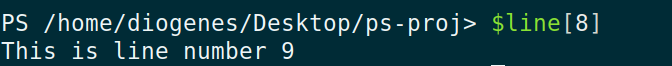

Now that we can access individual lines, we can also access the words within each line as follows:

When we call the unique\_words function for line 1 and line 2, we get output like this:

`**1,2,is,line,number,This**`

These are the unique words from each line.

**Create a vector array of matching words between two lines.**

Now, this is the tricky part. We need to create an array of vectors such that when we have a matching word from the “unique\_word” array, the value of the vector is 1; otherwise, it’s 0.

Here, I am calculating an array for each line we need to compare. Notice I’ve used the .contains() method instead of the .equal() method. One might argue that this selection is erroneous — and they’d be right.

Consider the following case: we’re checking for the word “word” in a line, and that line happens to contain the word “s**word**”. The vector will be 1 instead of 0. However, this is acceptable for our purposes, as we’re not aiming for an exact, rigid mechanism to check words.

Additionally, I’ve converted all text to lowercase. This approach yielded better detection results compared to when I was considering the case of words.

Let’s see what is output for our line 1 and 2 for this vector.

This is the output of our vec\_array.

**Taking the dot product of two vectors**

Now that we have two arrays:

$line1 = @(1,0,1,1,1,1)

$line2 = @(0,1,1,1,1,1)

We need to calculate the dot product of these two arrays. I’ve borrowed the function for this calculation from [here](https://rosettacode.org/wiki/Dot_product#PowerShell).

**Calculating the percentage similarity between two lines**

Next, we need to determine how similar line 1 is to line 2. To do this, we’ll implement the following mathematical formula:

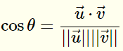

which I have implemented in the below function

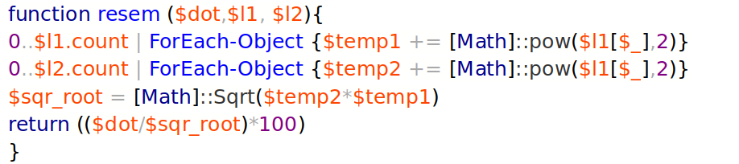

which takes the output of dot-product and vector array of both lines.

**Store value in temp array**

This is essentially the final step of our program. Here, we store the similarity of line 1 with all other lines. At the end, we calculate the average similarity and then categorize the line into a particular array based on the following logic:

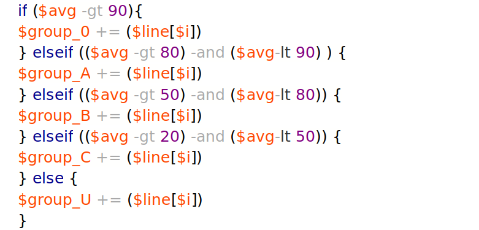

same steps are repeated until the similarity of all line are calculated. The final output looks like this.

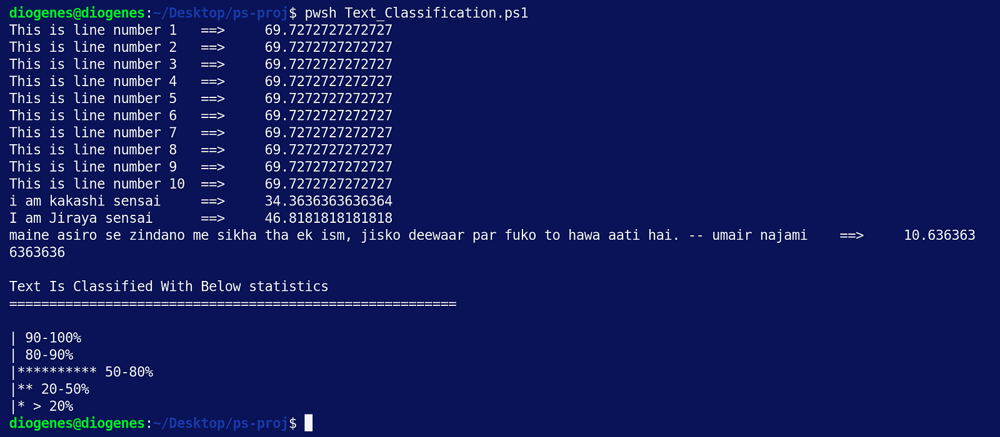

As expected, we have populated three groups: Group\_B, Group\_C, and Group\_U. Notably, Group\_U contains only one line, which is the unique text.

You can find the source code [here](https://github.com/Mheboobkhan/threathuntingwithpython/blob/master/Text_Classification.ps1). In the next blog post, we’ll optimize this algorithm for practical use.

Ref

[**What Are Word Embeddings for Text? - Machine Learning Mastery**  
*Word embeddings are a type of word representation that allows words with similar meaning to have a similar…*machinelearningmastery.com](https://machinelearningmastery.com/what-are-word-embeddings/ "https://machinelearningmastery.com/what-are-word-embeddings/")

[**NLP Text Similarity, how it works and the math behind it**  
*Have a look at these pairs of sentences, which one of these pairs you think has similar sentences?*towardsdatascience.com](https://towardsdatascience.com/nlp-text-similarity-how-it-works-and-the-math-behind-it-a0fb90a05095 "https://towardsdatascience.com/nlp-text-similarity-how-it-works-and-the-math-behind-it-a0fb90a05095")

[https://rosettacode.org/wiki/Dot\_product#PowerShell](https://rosettacode.org/wiki/Dot_product#PowerShell)
